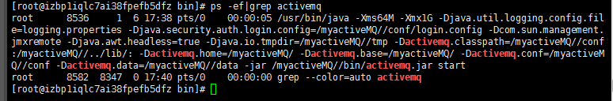

# 入门概述

## 解耦,消峰,异步

面向消息的中间件( message- oriented middleware)MOM能够很好的解决以上问题。是指利用高效可靠的消息传递机制进行与平台无关的数据交流,并基于数据通信来进行分布式系统的集成。通过提供消息传递和消息模型在分布式环境下提供应用解耦、弹性伸缩、冗余存储、流量削峰、异步通信、数据同步等功能。大致的过程是这样的:
发送者把消息发送给消息.服务器,消息服务器将消息存放在若干队列/主题中,在合适的时候,消息服务器会将消息转发给接受者。
在这个过程中,发送和接受是异步的,也就是发送无需等待,而且发送者和接受者的生命周期也没有必然关系;
尤其在发布pub/订阅sub模式下,也可以完成一对多的通信,即让一个消息有多个接受者。

## 下载与安装

去官网下载安装包:记录liunx下的安装:

1. 将安装包上传到opt目录下
2.  `  tar -xzvf apache-activemq-5.15.10-bin.tar.gz`
3. `  cp -r apache-activemq-5.15.10 /myactiveMQ/`

## 使用

### 普通启动/关闭

`./activemq start/stop` 

查看是否启动成功 ps -ef|grep activemq|grep -v grep

### 带日志的启动

`./activemq start> /myactiveMQ/run_activemq.log`

## 控制台启动

访问的路径是http://127.0.0.1:8161/admin/   (默认账号和密码都是admin)