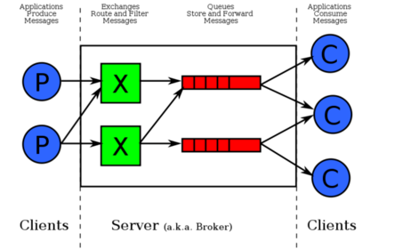

# RabbitMQ

## 一.概念

​	Rabbitmq是一种开源的实现AMQP(高级消息队列协议)的消息中间件,最初起源于金融系统,用于在分布式系统中存储转发消息, Rabbitmq主要是为了实现系统之间的双向解耦而实现的。当生产者大量产生数据时,消费者无法快速消费,那么需要一个中间层,保存这个数据。

### 作用

消息队列MQ,主要是用来实现应用程序的异步和解耦,同时也能起到消息缓冲,消息分发的作用。

## 二.应用场景

### 1.异步处理

不同进程（process）之间传递消息时，两个进程之间耦合程度过高，改动一个进程，引发必须修改另一个进程，为了隔离这两个进程，在两进程间抽离出一层（一个模块），所有两进程之间传递的消息，都必须通过消息队列来传递，单独修改某一个进程，不会影响另一个；

不同进程（process）之间传递消息时，为了实现标准化，将消息的格式规范化了，并且，某一个进程接受的消息太多，一下子无法处理完，并且也有先后顺序，必须对收到的消息进行排队，因此诞生了事实上的消息队列.
## 三.结构和作用

​	通常我们谈到队列服务, 会有三个概念： 发消息者、队列、收消息者，RabbitMQ 在这个基本概念之上, 多做了一层抽象, 在发消息者和 队列之间, 加入了交换器 (Exchange). 这样发消息者和队列就没有直接联系, 转而变成发消息者把消息给交换器, 交换器根据调度策略再把消息再给队列。



那么，*其中比较重要的概念有 4 个，分别为：虚拟主机，交换机，队列，和绑定。*

- 虚拟主机：一个虚拟主机持有一组交换机、队列和绑定。为什么需要多个虚拟主机呢？很简单， RabbitMQ 当中，*用户只能在虚拟主机的粒度进行权限控制。* 因此，如果需要禁止A组访问B组的交换机/队列/绑定，必须为A和B分别创建一个虚拟主机。每一个 RabbitMQ 服务器都有一个默认的虚拟主机“/”。
- 交换机：*Exchange 用于转发消息，但是它不会做存储* ，如果没有 Queue bind 到 Exchange 的话，它会直接丢弃掉 Producer 发送过来的消息。 这里有一个比较重要的概念：**路由键** 。消息到交换机的时候，交互机会转发到对应的队列中，那么究竟转发到哪个队列，就要根据该路由键。
- 绑定：也就是交换机需要和队列相绑定，这其中如上图所示，是多对多的关系。

### 1.交换机(Exchange)

交换机的功能主要是接收消息并且转发到绑定的队列，交换机不存储消息，在启用ack模式后，交换机找不到队列会返回错误。交换机有四种类型：Direct, topic, Headers and Fanout

- Direct：direct 类型的行为是”先匹配, 再投送”. 即在绑定时设定一个 **routing_key**, 消息的**routing_key** 匹配时, 才会被交换器投送到绑定的队列中去.
- Topic：按规则转发消息（最灵活）
- Headers：设置 header attribute 参数类型的交换机
- Fanout：转发消息到所有绑定队列

####  1).Direct Exchange

Direct Exchange 是 RabbitMQ 默认的交换机模式，也是最简单的模式，根据key全文匹配去寻找队列。


第一个 X - Q1 就有一个 binding key，名字为 orange； X - Q2 就有 2 个 binding key，名字为 black 和 green。*当消息中的 路由键 和 这个 binding key 对应上的时候，那么就知道了该消息去到哪一个队列中。*

Ps：为什么 X 到 Q2 要有 black，green，2个 binding key呢，一个不就行了吗？ - 这个主要是因为可能又有 Q3，而Q3只接受 black 的信息，而Q2不仅接受black 的信息，还接受 green 的信息。

#### 2).Topic Exchange

*Topic Exchange 转发消息主要是根据通配符。* 在这种交换机下，队列和交换机的绑定会定义一种路由模式，那么，通配符就要在这种路由模式和路由键之间匹配后交换机才能转发消息。

在这种交换机模式下：

- 路由键必须是一串字符，用句号（`.`） 隔开，比如说 agreements.us，或者 agreements.eu.stockholm 等。
- 路由模式必须包含一个 星号（`*`），主要用于匹配路由键指定位置的一个单词，比如说，一个路由模式是这样子：agreements..b.*，那么就只能匹配路由键是这样子的：第一个单词是 agreements，第四个单词是 b。 井号（#）就表示相当于一个或者多个单词，例如一个匹配模式是 agreements.eu.berlin.#，那么，以agreements.eu.berlin 开头的路由键都是可以的。

具体代码发送的时候还是一样，第一个参数表示交换机，第二个参数表示 routing key，第三个参数即消息。如下：

```
rabbitTemplate.convertAndSend("testTopicExchange","key1.a.c.key2", " this is  RabbitMQ!");
```

topic 和 direct 类似, 只是匹配上支持了”模式”, 在”点分”的 routing_key 形式中, 可以使用两个通配符:

- `*`表示一个词.

- `#`表示零个或多个词.

  

#### 3).Headers Exchange

headers 也是根据规则匹配, 相较于 direct 和 topic 固定地使用 routing_key , headers 则是一个自定义匹配规则的类型. 在队列与交换器绑定时, 会设定一组键值对规则, 消息中也包括一组键值对( headers 属性), 当这些键值对有一对, 或全部匹配时, 消息被投送到对应队列

#### 4).Fanout Exchange

Fanout Exchange 消息广播的模式，不管路由键或者是路由模式，*会把消息发给绑定给它的全部队列*，如果配置了 routing_key 会被忽略。

## 四.Spring Boot整合RabbitMQ

### 1.AmqpTemplate与AmqpAdim

在spring boot中当你引入了rabbitmq所需的依赖之后就可以自动注入,AmqpAdim和AmqpTemplate,如果定义了MessageConverter的bean那么它会自动注入配置到AmqpTemplate;

### 2.RabbitListener

如果没有配置RabbitListenerContainerFactory(监听器工厂)的bean则会使用默认 `SimpleRabbitListenerContainerFactory`

你可以在方法上添加RabbitListener注解来让方法变为一个接受方法

``` java
@Component
public class MyBean {

	@RabbitListener(queues = "someQueue")
	public void processMessage(String content) {
		// ...
	}

}
```

如果你想使用其他的RabbitListenerContainerFactory,springboot内置了

`SimpleRabbitListenerContainerFactoryConfigurer` 和`DirectRabbitListenerContainerFactoryConfigurer` 

你可以在configuration类中配置相应的bean;在RabbitListener中也可以指定相应的Factory

``` java
@RabbitListener(queues = "someQueue", containerFactory="myFactory")
```

https://www.jianshu.com/p/95bb760512ba


