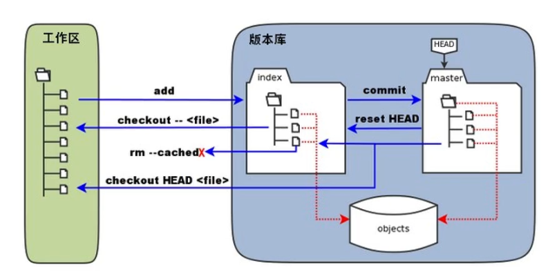

# Git

## Git的概念



1. 工作区:就是你在电脑里能看到的目录。
2. 暂存区:英文叫 stage,或ndex。-般存放在"git目录下"下的 lindex文件( git/index)中,所以我们把暂存区有时也叫作素引( index)
3. 版本库:工作区有一个隐藏目录git,这个不算工作区,而是Git的版本库。

## git仓库的创建和克隆

​	在gitHub中创建一个仓库,然后在要克隆的电脑中添加上sshkey;这样该电脑就可以对仓库进行操作了;

``` git
 #生成key
 $ ssh-Keygen -t rsa -b 4096 -C "你的邮箱"
 #将key复制到剪切板中
 $ clip < ~/.ssh/id_rsa.pub
```

## git的基本命令

### 1.克隆

``` shell
$ git clone git@github.com:syang1997/study-notes.git
```

将指定的仓库中的项目克隆到现在的路径下;

### 2.状态

``` shell
$ git status
```

查看现在路径下的文件中被git追踪的状态;

### 3.添加

```shell
$ git add
```

将指定文件添加到本地仓库中;

### 4.提交

```shell
$ git commit
```

将现在仓库中的提交为一个版本,可以-m"msg"来添加上commit的信息;

### 5.日志

```shell
$ git log
```

查看本仓库的commit日志;

### 6.推送

```shell
$ git push
```

将现版本推送到github中的远端项目;


