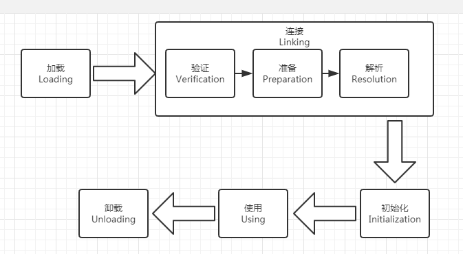

# 类加载

# 一.类加载的时机

**注: 解析阶段不一定遵循以上顺序,是为了支持Java语言中的运行时绑定;类的加载没有进行强制得到约束,而初始化有5种情况下必须立即进行,而加载和准备阶段自然在这之前** 

## 二.初始化时机(主动引用)

### 1.new,getstatic,putstatic,invokestatic

**注:以上三个指令都是对static字段的调用和赋值**

### 2.Java.lang.relect反射

**注:使用反射也可以获得到对象的实例,要获取到对象的实例当然要对其进行初始化1**

### 3.初始化时,对其父类的初始化

**注:对一个类的初始化之前要去初始化其父类**

### 4.main

### 5.JDK1.7中java.lang.invoke.MethodHandle实例最后的解析结果REF_getstatic,REF_putstatic,REF_invokestatic的方法句柄

