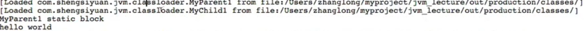

# 类加载

- 在Java代码中,类型的==加载==、连接与初始化过程都是在程序运行期间完成的
- 提供了更大的灵活性,增加了更多的可能性

------------------

注:类型是代表的class,比如int类型,object类型而不是new一个对象

-------------------

## 一.Java虚拟机与程序的生命周期

在如下几种情况下,Java虚执机将结束生命周期

1. 执行了 System.exit0)方法
2. 程序正常执行结束
3. 程序在执行过程中遇到了异常或错误而异常终止
4. 由于操作系统出现错误而导致Java虚拟机进程终止

## 二.类的加载,连接与初始化

- 加载:查找并加载类的二进制数据
- 连接
  - 验证:确保被加载的类的正确性
  - 准备:为类的==静态变量==分配内存,并将其初始化为==默认值==
  - 解析:==把类中的符号引用转换为直接引用==
- 初始化:为类的静态变量赋予正确的初始值

### 1.Java程序对类的使用方式

主动使用

被动使用

**所有的Java虚拟机实现必须在每个类或者接口被Java程序==首次主动使用==时才初始化它们**

#### 1).主动使用

- 创建类的实例
- 访问某个类或者接口的静态变量,或者对 该静态变量赋值
- 调用类的静态方法
- 反射
- 初始化一个类的子类
- Java虚拟机启动时被标明为启动类的类
- JDK1.7开始提供的动态语言支持java. langinvoke. Method Handle'实例的解析结ERREF getstatic, REF putstatic,REF invoke Static句柄对应的类没有初始化,则初始化

#### 2).被动使用

除了上述的情况,其他使用Java类的方式都被看做是对类的被动使用,都不会导致类的初始化

### 2.类的加载

类的加载指的是将类的. class文件中的二进制数据读入到内存中,将其放在运行时数据区的方法区内,然后在内存中创建一个jva. lang Classx对象(规范并未说明 Class对象位于哪里, Hotspot虚拟机将其放在了方法区中)用来封装类在方法区内的数据
结构

**类的加载的最终产品是位于内存中的Cass对象**

Class对象封装了类在方法区内的数据结构并且向Java程序员提供了访问方法区内的数据结构的接口

#### 1).加载class文件的方式

- 从本地系统中直接加载
- 通过网络下载class文件
- 从zip,jar等归档文件中加载class文件
- 从专有的数据库中提取class文件
- ==将Java源文件动态编译为class文件==

#### 2).类加载器的类型

**两种类型的类加载器**

- Java虚拟机自带的加载器
  -  根类加载器( Bootstrap)
  - 扩展类加载器( Extension)
  - 系统(应用)类加载器( System)

- 用户自定义的类加载器
  - Java.lang. Classloade r的子类
  - 用户可以定制类的加载方式

### 3.类的链接时间

JVM规范允许类加载器在预料某个类将要被使用时就预先加载它,如果在预先加载的过程中遇到了 class文件缺失或存在错误,类加载器必须在程序首次主动使用该类时才报告错误( LinkageError错误),如果这个类一直没有被程序主动使用,那么==类加载器就不会报告错误==

### 4.类的初始化

#### 1).初始化的步骤

- 假如这个类还没有被加载和连接,那就先进行加载和连接
- 假如类存在直接父类,并且这个父类还没有被初始化,那就先初始化直接父类
- 假如类中存在初始化语句,那就依次执行这些初始化语句

#### 2).接口的初始化

当Java虚拟机初始化一个类时,要求它的所有父类都已经被初始化,但是这条规则并不适用于接口。

- 在初始化一个类时,并不会先初始化它所实现的接
- 在初始化一个接口时,并不会先初始化它的父接口

**因此,一个父接口并不会因为它的子接口或者实现类的初始化而初始化。只有当程序首次使用特定接口的静态变量时,才会导致该接口的初始化。**

## 三.VM options使用方式

1. -XX: +<option>  表示开启option选项
2. -XX: -<option>   表示关闭option选项
3. -XX: <option>=<value>   表示给option选项赋值


----------------------------------

# 案例和分析

第一例

```java
public Mytest {
    public static void main(String[] args){
        System.out.println(MyChild.str);
    }
}
class Myparent{
    public static String str="hello world";
    static {
        System.out.println("Myparent static block");
    }
}
class MyChild extends Myparent{
    public static String str2="welcome";
    static {
        System.out.println("MyChild static block");
    }
}
//打印结果
Myparent static block
hello world
```

第二例

```java
public Mytest {
    public static void main(String[] args){
        System.out.println(MyChild.str2);
    }
}
//结果
Myparent static block
MyChild static block
welcome
```

**原因:** 对于静态字段而言,只有定义了该字段的类才会被初始化(主动使用)

所以在第一个例子中,调用的是str字段而该字段是属于父类的,所以没有打印Mychild的静态代码块(因为它没有被主动使用,不会去初始化Mychild的类);

在第二个例子中,主动使用了Mychild类,但是由于使用了Myparent的子类,因此Myparent类也被主动使用了;所以两个类都被初始化了;

**在VM options 中添加参数 -XX: TraceClassLoading**

第一例:

-------------------------

``` java
public Mytest {
    public static void main(String[] args){
        System.out.println(Myparent.str);
    }
}
class Myparent{
    public static final String str="hello world";
    static {
        System.out.println("Myparent static block");
    }
}
//结果
hello world
```

**原因:**常量在编译阶段会被存入到调用这个常量的方法所在的类的常量池中,本质上,调用类并没有直接医用到定义常量的类,因此并不会出发定义常量的类的初始化;

**结合代码:**在编译之后 str常量就被存入到了Mytest类的常量池中了,因此在main方法中调用str时会直接从Mytest的常量池中调用,并不会去调用MyParent类,所以MyParent没有被初始化;(甚至我们可以将MyParentde class文件删除)

第二例

``` java
public Mytest {
    public static void main(String[] args){
        System.out.println(Myparent.str);
    }
}
class Myparent{
    public static final String str=UUID.reandomUUID().toString();
    static {
        System.out.println("Myparent static block");
    }
}
//结果
Myparent static block
随机数
```

**原因:** 当一个常量的值非编译可以确定的时候,那么其值就不会被放到调用类的常量池中,这时程序运行时,会导致主动使用这个常量所在的类,就会导致这个类被初始化;

------------------------------

``` java
public Mytest {
    public static void main(String[] args){
        MyParent[] myParent =new MyParent[1];
        System.out.println(myParent.getClass());
        MyParent[][] myParent2 =new MyParent[1][1];
        System.out.println(myParent2.getClass());
    }
}
class Myparent{
    public static final String str=UUID.reandomUUID().toString();
    static {
        System.out.println("Myparent static block");
    }
}
//结果
calss [Lcom.ssy.jvm.classlooader.MyParent;
calss [[Lcom.ssy.jvm.classlooader.MyParent;
```

**原因:** 对于引用数组类型来说,其类型是有JVM在运行期动态生成的,动态生成的类型,其父类型就是Object;对于数组来说,JavaDoc经常讲构成数组的元素为Component,实际上就是将数组降低一个维度后的类型;

-----------------------

``` java
public class MyTest{
    public static void main(String[] args){
        Singletion singleton =Singleton.getInstanc();
        System.out.println("counter1"+Singleton.counter1);
        System.out.println("counter2"+Singleton,counter2);
    }
}
class Singleton{
    public static int counter1;
    private static Singleton sigleton=new Singleton();
    private Singleton(){
        counter1++;
        counter2++;
    }
    public static int counter2=0;
    public static Singleton getSingleton(){
        return singleton;
    }
}
//结果
counter1 1
counter2 0
```

**原因:** 当main方法在调用get方法时会去加载Singleton类,前面说过在连接的准备阶段会为静态变量赋默认值,顺序是由上至下的,所以counter1=0,sigleton=null,counter=0,但是当执行到get方法时,由于(访问某个类或者接口的静态变量)访问了singletonb这个静态变量,所以导致了主动使用Singleton类,所以这个时候会对其进行初始化,初始化时,counter1的初始值为0,singleton调用了构造方法,这时c1=1,c2=1,但是当执行到counter2的初始化时由于对其进行了显式的赋值,所以counter从1变为了0;所以最终c1=1,c2=0;

---------------------------------------------


