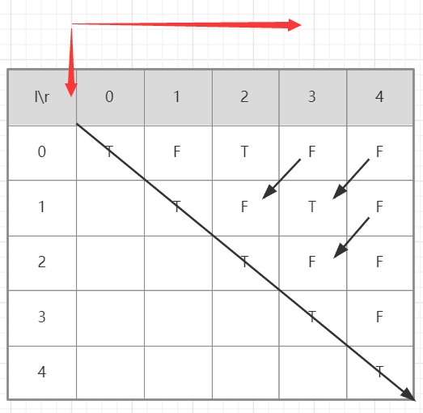

# longest-palindromic-substring

## 一.题目

https://leetcode-cn.com/problems/longest-palindromic-substring/

给定一个字符串 `s`，找到 `s` 中最长的回文子串。你可以假设 `s` 的最大长度为 1000。

**示例 1：**

```
输入: "babad"
输出: "bab"
注意: "aba" 也是一个有效答案。
```

## 二.解题

通过分析决定使用动态规划实现算法：

### 动态规划

动态规划的思考流程：

1. 思考状态

状态先尝试“题目问什么，就把什么设置为状态”。然后考虑“状态如何转移”，如果“状态转移方程”不容易得到，尝试修改定义，目的仍然是为了方便得到“状态转移方程”。

2. 思考状态转移方程（核心、难点）

状态转移方程是非常重要的，是动态规划的核心，也是难点，起到承上启下的作用。

技巧是分类讨论。对状态空间进行分类，思考最优子结构到底是什么。即大问题的最优解如何由小问题的最优解得到。

归纳“状态转移方程”是一个很灵活的事情，得具体问题具体分析，除了掌握经典的动态规划问题以外，还需要多做题。如果是针对面试，请自行把握难度，我个人觉得掌握常见问题的动态规划解法，明白动态规划的本质就是打表格，从一个小规模问题出发，逐步得到大问题的解，并记录过程。动态规划依然是“空间换时间”思想的体现。

3. 思考初始化

初始化是非常重要的，一步错，步步错，初始化状态一定要设置对，才可能得到正确的结果。

角度 1：直接从状态的语义出发；

角度 2：如果状态的语义不好思考，就考虑“状态转移方程”的边界需要什么样初始化的条件；

角度 3：从“状态转移方程”方程的下标看是否需要多设置一行、一列表示“哨兵”，这样可以避免一些边界的讨论，使得代码变得比较短。

4. 思考输出

有些时候是最后一个状态，有些时候可能会综合所有计算过的状态。

5. 思考状态压缩

“状态压缩”会使得代码难于理解，初学的时候可以不一步到位。先把代码写正确，然后再思考状态压缩。

状态压缩在有一种情况下是很有必要的，那就是状态空间非常庞大的时候（处理海量数据），此时空间不够用，就必须状态压缩。

### 本题具体分析

“动态规划”最关键的步骤是想清楚“状态如何转移”，事实上，“回文”是天然具有“状态转移”性质的：

一个回文去掉两头以后，剩下的部分依然是回文（这里暂不讨论边界）。

依然从回文串的定义展开讨论：

1、如果一个字符串的头尾两个字符都不相等，那么这个字符串一定不是回文串；

2、如果一个字符串的头尾两个字符相等，才有必要继续判断下去。

（1）如果里面的子串是回文，整体就是回文串；

（2）如果里面的子串不是回文串，整体就不是回文串。

1. 思考状态

在本体中使用`dp[l][r]`表示字符串`s[l][r]`子串是否为回文

2. 思考状态转移

由回文串的定义可得状态方程：

```
dp[l][r] = (s[l] == s[r]) and dp[l + 1][r - 1]
```

分析状态转移方程：由于lr分别代表子串得左右指针，所以l<=r。

当子串 s[i + 1, j - 1] 只有 1 个字符，即去掉两头，剩下中间部分只有 11 个字符，当然是回文；
子串 s[i + 1, j - 1] 为空串，那么子串 s[i, j] 一定是回文子串。

所以子串长度不大于3时无需考虑` dp[l + 1][r - 1]`的状态。

3. 思考初始化

由于只有一个字符时一定为回文，所以初始化对角线为true;

4. 考虑输出

只要一得到 dp[i][j] = true，就记录子串的长度和起始位置，没有必要截取，因为截取字符串也要消耗性能，记录此时的回文子串的“起始位置”和“回文长度”即可。

5. 思考状态压缩

因为在填表的过程中，只参考了左下方的数值。事实上可以压缩，但会增加一些判断语句，增加代码编写和理解的难度，丢失可读性。在这里不做状态压缩。

由于状态考虑是左下角的数据，所以填表的顺序要为从左到右或者从下到上；



```java
class Solution {
    public String longestPalindrome(String s) {
        int len=s.length();
         if (len < 2) {
            return s;
        }
        boolean[][] dp= new boolean[len][len];
        int maxLen = 1;
        int start = 0;
        // 初始化
        for (int i = 0; i < len; i++) {
            dp[i][i] = true;
        }
        //当子串长度小于3时无需判断之前的数据可
        //判断是否为回文的条件为dp[i][j] = (s[i] == s[j]) and dp[i + 1][j - 1]
        //循环为r=1开始l=0,l<=r,l++
        for (int r = 1; r <len ; r++) {
            for (int l = 0; l <r ; l++) {
                if (r-l<3){
                    dp[l][r]=s.charAt(l)==s.charAt(r);
                }else {
                    dp[l][r]=s.charAt(l)==s.charAt(r)&&dp[l+1][r-1];
                }
                // 只要 dp[i][j] == true 成立，就表示子串 s[i, j] 是回文，此时记录回文长度和起始位置
                if (dp[l][r]) {
                    int curLen = r - l + 1;
                    if (curLen > maxLen) {
                        maxLen = curLen;
                        start = l;
                    }
                }
            }

        }
        return s.substring(start, start + maxLen);
    }
}
```

执行用时：**171 ms**

内存消耗：**42.9 MB**

## 四.分析

时间复杂度：O(N^{2})。
空间复杂度：O(N^{2})，二维 dp 问题，一个状态得用二维有序数对表示，因此空间复杂度是 O(N^{2})。

## 五.优化

Manacher 算法，被中国程序员戏称为“马拉车”算法。它专门用于解决“最长回文子串”问题，时间复杂度为 O(N)*O*(*N*)。暂时不了解

参考文章：https://leetcode-cn.com/problems/longest-palindromic-substring/solution/zhong-xin-kuo-san-dong-tai-gui-hua-by-liweiwei1419/

