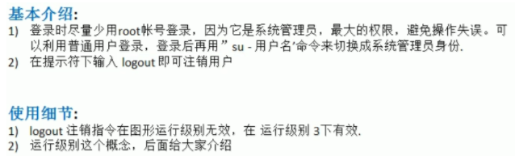

#### vi和vim是什么:
是linux中内置的一个文本编辑器;
#### vi和vim的三种模式
1. 正常模式
    打开之后就直接进入了,可复制粘贴等;
2. 插入模式
    在这个模式下,可以输入内容按下i,o,a,r即可;
3. 命令行模式
    提供相关指令,完成:读取,存盘,替换,离开,显示行号等;
4. 

### 基础介绍
#### 1.关机重启指令
| 指令             |            作用            |
| ---------------- | :------------------------: |
| shutdown -h now  |          立即关机          |
| shutdown -h      |        一分钟后关机        |
| shutdown -r now: |          立即重启          |
| halt             |   就是直接使用等价于关机   |
| reboot           |          重启系统          |
| sync             | 将内存中的数据同步到磁盘中 |
**注意细节:在关机和重启时要执行sync防止数据丢失**
#### 2.登录与注销

#### 3.用户管理

　Linux系统是一个多用户多任务的操作系统,任何一个要使用系统资源的用户都必须向系统管理员申请一个账号,然后以这个账号的身份进入系统.
　Linux的用户至少需要一个组.

 ##### 添加用户
 语法：
　useradd+用户名;
 细节:
 　当用户创建成功后,会自动创建和用户同名的home目录;
 　也可以通过useradd-d 指定目录,给新创建的用户指定home目录;
 ##### 指定/修改密码
 语法:
 　passwd 用户名;

 ##### 删除用户
 语法:
 　userdel 用户名;
 细节:
 　是否保留home目录?如果需要删除home目录 userdel -r 用户名;
##### 查询用户
  语法:
  　id 用户名->所有的用户信息
   whoami 查看自己的登录用户
   su- 用户名 切换到指定用户
  细节:

   #### 4.用户组
   类似于角色
   ##### 增加组
   语法: groupadd 组名
   ##### 删除组
   语法: groupdel 组名
   ##### 增加上用户时直接加上组
   语法: useradd -g 用户组 用户名
   ##### 修改用户的组
   语法: ysermod -g 用户组 用户名
   ##### 用户和组相关的文件

### 指令介绍
#### 1.指定运行级别
* 0:关机
* 1:单用户
* 2:多用户无网络服务
* 3:多用户有网络服务
* 4:保留
* 5:图形界面
* 6:系统重启
系统的运行级别的配置文件/etc/inittab
##### 如何指定运行级别
语法: init[0-6]
##### 面试题
如何找回丢失的root密码:
解决:进入单用户模式,然后修改密码:因为root不需要密码就可以登录
#### 2.帮助指令

#### 3.文件目录指令
| 语法            |                             作用                             |
| --------------- | :----------------------------------------------------------: |
| pwd             |                    显示当前工作的绝对路径                    |
| ls[]            | -a:显示当前目录所有的文件和目录(包括隐藏)-l:以列表的形式显示 |
| cd              |   cd~或者cd回到自己的home目录 cd..回到当前路径的上一级目录   |
| mkdir[]         |                   创建目录 -p:创建多级目录                   |
| rmdir[]         |                          删除空目录                          |
| rm -rf          |                           删除目录                           |
| thuch           |                          创建空文件                          |
| cp[]source dest |       -r:递归复制整个文件夹在命令前添加\强制覆盖不提醒       |
| rm[]            |             -r:删除整个文件夹 -f:强制删除不提示              |
| mv              |        文件名 文件名:重命名   文件名 /路径/:移动文件         |
| cat[]           |                浏览指定文件(只读)-n:显示行号                 |
| more            |                           |
| less            |                           |
| >               |                          输出重定向                          |
| >>              |                             追加                             |
| echo            |                       输出内容到控制台                       |
| head            |                  显示前十行,head-n5显示5行                   |
| tail            |         显示尾部内容 -n 5 后五行 -f:实时追踪所有更新         |
| ln -s [] []     |           前选项为源文件或者目录,后文件为软连接名            |
| history         |                   查看已经执行过的历史命令                   |
| date            |                                                              |
| cal             |                           查看日历                           |
| find            |                           |
| locate          |                           |
| grep            |                           |
| gzip            |                           压缩文件                           |
| gunzip          |                           解压文件                           |
| zip             |                           |
| tar             |                           |