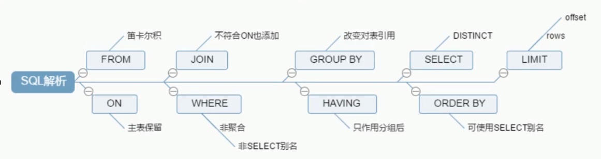
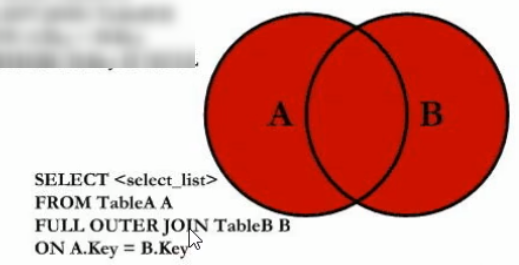
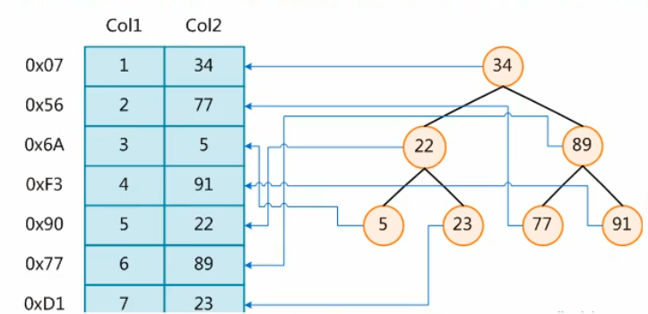
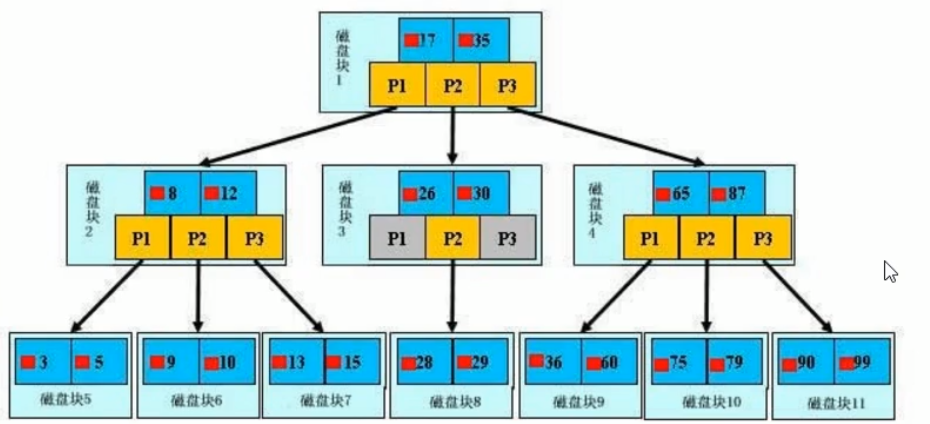

# MySQL高级

## 一.架构介绍

### 1.逻辑架构介绍

#### 1).连接层

最上层是一些客户端和连接服务，包含本地sock通信和大多数基于客户端服务端工具实现的类似于tcpp的通信。主要完成一些类似于连接处理、授权认证、及相关的安全方案。在该层上引入了线程池的概念，为通过认证安全接入的客户端提供线程。同样在该层上可以实现基于SSL的安全链接。服务器也会为安全接入的每个客户端验证它所具有的操作权限

#### 2).服务层

第二层架构主要完成大多少的核心服务功能，如SαL接口，并完成缓存的查询，SQL的分析和优化及部分内置函数的执行。所有跨存储引擎的功能也在这一层实现，如过程、函数等。在该层，服务器会解析查询并创建相应的内部解析树，并对其完成相应的优化如确定查询表的顺序，是否利用索引等，最后生成相应的执行操作。如果是 select语句，服务器还会查询内部的缓存。如果缓存空间足够大，这样在解决大量读操作的环境中能够很好的提升系统的性能。

#### 3).引擎层

存储引擎层，存储引擎真正的负责了MysαL中数据的存储和提取，服务器通过AP与存储引擎进行通信。不同的存储引擎具有的功能不同，这样我们可以根据自己的实际需要进行选取。后面介绍 MyISAM和InnoDB

#### 4).存储层

数据存储层，主要是将数据存储在运行于裸设备的文件系统之上，并完成与存储引擎的交互

### 2.存储引擎

| 对比项     | MyISAM                                                   | InnoDB                                                       |
| ---------- | -------------------------------------------------------- | ------------------------------------------------------------ |
| 主外键     | 不支持                                                   | 支持                                                         |
| 事务       | 不支持                                                   | 支持                                                         |
| 行表锁表锁 | 表锁，即使操作一条记录也会锁住整个表，不适合高并发的操作 | 行锁，操作时只锁某一行，不对其它行有影响，==适合高并发的操作== |
| 缓存       | 只缓存索引，不缓存真实数据                               | 不仅缓存索引还要缓存真实数据，对内存要求较高，而且内存大小对性能有决定性的影响 |
| 表空间     | 小                                                       | 大                                                           |
| 关注点     | 性能                                                     | 事务                                                         |
| 默认安装   | Y                                                        | Y                                                            |

## 二.索引优化分析

### 1.sql执行加载顺序

1. FROM
2. ON 
3. JOIN
4. WHERE 
5. GROUP BY
6. HAVING 
7. SELECT
8. DISTINCT
9. ORDER BY
10. LIMIT

### 2.JOION 

### 3.索引

#### 1).索引的简介

MysαL官方对索引的定义为：索引（ Index）是帮助 MySQL高效获取数据的数据结构可以得到索引的本质：索引是数据结构。

在数据之外，数据库系统还维护着满足特定查找算法的数据结构，这些数据结构以某种方式引用（指向）数据，这样就可以在这些数据结构上实现高级查找算法。这种数据结构，就是索引。下图就是一种可能的索引方式示例：

#### 2).索引的分类

* 单值索引
* 唯一索引
* 复合索引

#### 3).索引数据结构

* BTree索引
* Hash索引
* full-text全文索引
* R-Tree索引

主要使用B+Tree索引

#### 4).建议创建索引

1. 主键自动建立唯一索引
2. 频繁作为查询条件的字段应该创建索引
3. 查询中与其它表关联的字段，外键关系建立索引
4. 频繁更新的字段不适合创建索引
5. Where条件里用不到的字段不创建索引
6. 单键/组合索引的选择问题，who？（在高并发下倾向创建组合索引）
7. 查询中排序的字段，排序字段若通过索引去访问将大大提高排序速度
8. 查询中统计或者分钽字段

#### 5).不建议创建索引

1. 数据太少
2. 经常增删改的表
3. 数据重复且分布平均的表字段，因此应该只为最经常查询和最经常排序的数据列建立索引。注意，如果某个数据列包含许多重复的内容，为它建立索引就没有太大的实际效果。

### 4.性能分析

#### 1).explain 作用

* 表的读取顺序
* 数据读取操作的操作类型
* 哪些索引可以使用
* 哪些索引被实际使用
* 表之间的引用
* 每张表有多少行被优化器查询

#### 2).explain 结果

##### id

select查询的序列号，包含一组数字，表示查询中执行 select子句或操作表的顺序

**三种情况：**

* id相同，执行顺序由上至下
* id不同，如果是子查询，id的序号会递增，id值越大优先级越高，越先被执行
* id相同不同，同时存在，id如果相同，可以认内是一组，从上往下顺序执行；在所有组中，id值越大，优先级越高，越先执行I

##### select_type

1. SIMPLE:简单的 SELECT查询查询中不包含子查询或者UNION
2. PRIMARY:查询中若包含任何复杂的子部分，最外层查询则被标记为
3. SUBQUERY:在 SELECT或 WHERE列表中包含了子查询
4. DERIVED:在FROM列表中包含的子查询被标记为 DERIVED（衍生）MSQL会递归执行这些子查询，把结果放在临时表里。
5. UNION:若第二个 SELECT出现在 UNION之后，则被标记为 UNION 若 UNION包含在FROM子句的子查询中，外层 SELECT将被标记为：DERIVED
6. UNION RESULT:从 UNION表获取结果的 SELECT

##### table

tabe:显示这一行的数据是关于哪张表的

##### type

访问类型排列显示查询使用了何种类型，从最好到最差依次是：

system >const>eq ref ref fulltext >ref or null index merge unique subquery index subquery >range> index>ALL

主要考虑以下：

system>const>eq_ref>ref>range>index> ALL

1. system:表只有一行记录（等于系统表），这是 const类型的特列，平时不会出现，这个也可以忽略不计
2. const:表示通过索引一次就找到了， const用于比较 primary key或者 unique索引。因为只匹配一行数据，所以很快如将主键置于whee列表中， MySQL就能将该查询转换为一个常量
3. eq_ref:唯一性索引扫描，对于每个索引键，表中只有一条记录与之匹配。常见于主键或唯一索引扫描
4. ref:非唯一性索引扫描，返回匹配某个单独值的所有行本质上也是一种索引访问，它返回所有匹配某个单独值的行，然而，它可能会找到多个符合条件的行，所以他应该属于查找和扫描的混合体
5. range:只检索给定范围的行，使用一个索引来选择行。key列显示使用了哪个索引般就是在你 where语句中出现了 between、<、>、in等的查询这种范围扫描索引扫描比全表扫描要好，因为它只需要开始于索引的某一点，而结束语另一点，不用扫描全部索引。
6. index:Full Index scan, index与ALL区别为 lindex类型只遍历索引树。这通常比AL快，因为索引文件通常比数据文件小。（也就是说虽然a和 lIndex都是读全表，但ndex是从索引中读取的，而a是从硬盘中读的）
7. ALL:Full Table Scan，将遍历全表以找到匹配的行

##### possilbe key

显示可能应用在这张表中的索引，一个或多个。查询涉及到的字段上若存在索引，则该索引将被列出，==但不一定被查询实际使用==

##### key

实际使用的索引。如果为NULL，则没有使用索引査询中若使用了覆盖索引，则该索引仅出现在key列表中

##### key_len

表示索引中使用的字节数，可通过该列计算査询中使用的索引的长度。在不损失精确性的情况下，长度越短越好key_len显示的值为索引字段的最大可能长度，并非实际使用长度，即key_len是根据表定义计算而得，不是通过表内检索出的

##### ref

显示索引的哪一列被使用了，如果可能的话，是一个常数。哪些列或常量被用于查找索引列上的值

查询中与其它表关联的字段，外键关系建立索引

##### rows

根据表统计信息及索引选用情况，大致估算出找到所需的记录所需要读取的行数

##### Extra

1. using filesort:说明mysq会对数据使用一个外部的索引排序，而不是按照表内的索引顺序进行读取MySQL中无法利用索引完成的排序操作称为文件排序
2. using temporary:使了用临时表保存中间结果 MySQL在对查询果排序时使用临时表。常见于排序 order by和分组查询 group by
3. using index 表示相应的 select操作中使用了覆盖索引（ Covering Index），避免访问了表的数据行，效率不错！如果同时出现 using where，表明索引被用来执行索引键值的查找,如果没有同时出现 using where，表明索引用来读取数据而非执行查找动作。
4. using where :表示使用了where
5. using jion buffer:使用了连接缓存
6. impossible where :where子句的值总是false不能用来获取任何元组
7. select tables optimized away:在没有 GROUPBY子句的情况下，基于索引优化 MIN/MAX操作或者对于 MyISAM存储引擎优化 COUNT（*）操作，不必等到执行阶段再进行计算，查询执行计划生成的阶段即完成优化。
8. distinct:优化 distinct操作，在找到第一匹配的元组后即停止找同样值的动作

### 5.索引优化

