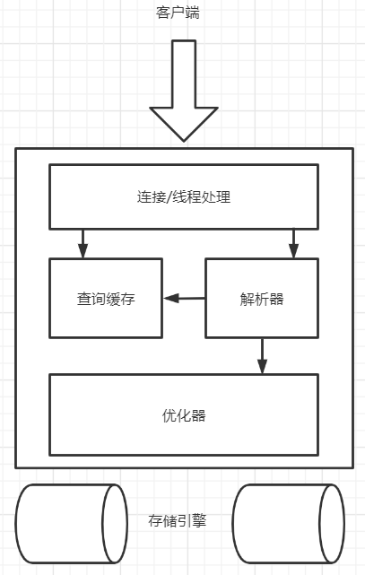

# 高性能MySQL

## 一MySQL架构

### 1.MySQL逻辑架构



-=-

#### 1).连接管理与安全性

每个连接都是单独的一个线程，服务器会缓存线程，所以不需要为每一个新建的连接创建或者销毁线程。

当进行连接时服务器会进行认证，基于用户名，原始主机信息和密码。使用了SSL的连接方式，还可以使用X.509证书认证。在认证完成后还会继续验证其权限。

#### 2).优化与执行

MySQL会解析查询，并创建内部数据结构，然后对其进行各种优化，包括重写查询，决定表的读取顺序，以及选择合适的索引等。可以用关键字`hint`影响它的决策过程，也可以使用`explain`来了解服务器是如何进行优化决策的。

### 2.并发控制

并发控制分为两个层面：服务器层与存储引擎层。

#### 1).读写锁

在处理并发读或者写时，可以通过实现一个由两种类型的锁组成的锁系统来解决，一般称为共享锁(shared lock)和排他锁(exlusive lock),也叫读锁(read lock)和写锁(write lock)。

#### 2).锁粒度

一种提高共享资源的并发性的方式就是让锁对象更有选择性，也就是只锁定需要的部分数据。在给定的资源上，锁定的数据量越少，则系统的并发程度越高，只要互相不发生冲突即可。

问题是加锁也是需要消耗资源的。锁的各种操作，包括获得锁，检查锁是否已经解除，释放锁等，都会增加系统的开销。

所谓的锁策略，就是在锁的开销和数据的安全性之间寻求平衡，MySQL提供了多种选择，每种存储引擎都可以写实现自己的锁策略和锁粒度。

##### 表锁(table lock)

表锁的Mysql种最基本的锁策略，并且是开销最小的策略。表锁会锁定一整张表，一个用户在进行写操作前要先获得写锁，写锁会阻塞读操作和写操作。读锁之间是不互相阻塞的。

##### 行级锁(row lock)

行级锁可以最大程度地支持并发处理，同时也带来了最大的锁开销。行级锁只在存储引擎层实现，而MySQL服务器层没有实现。

#### 3).事务

ACID：

1. 原子性(atomicity):一个事务必须被视为一个不可分割的最小工作单元，要么全部成功要么全部失败回滚
2. 一致性(consistency):从一个一致性状态转换到另一个一致性状态，也就是所有修改是一起完成的
3. 隔离性(isolation):一个事务做的修改在最终提交之前，对其他的事务是不可见的
4. 持久性(durability):一旦事务提交，则修改就会永久的保存到数据库种

##### 隔离

###### a.READ UNCOMMITTED(未提交读)

事务种修改即使没有提交，对其他事务也是可见的。事务可以读取未提交的数据，这里被称为脏读(Dirty Read)。

这个级别胡导致很多问题，从性能上来说也没有比其他级别好太多，一般很少使用。

###### b.READ COMMITTED(提交读)

一个事务开始时，只能看见已经提交的事务所做的修改，这个级别也叫不可重发读(nonrepeatableread),因为两次执行同样的查询，可能会得到不一样的结果。

###### c.REPEATABLE READ(可重复读)

该级别保证了在同一个事务中多次读取同样的记录的结果都是一致的。但是理论上，可重复读隔离级别还是无法解决另一个幻读(Phantom Read)的问题。

幻读就是当某个事务在读取某个范围内的记录时，另一个事务由在该范围内插入了新的记录，当之前的事务再次读取该范围的记录时，会产生幻行(Phantom Row)。

可重复读是MySQL默认的事务隔离级别。

###### d.SERIALIZABLE(可串行化)

是最高的隔离级别。通过强制的事务串行执行，避免了幻读问题，SERIALIZABLE会在读取每一行数据上都加锁，所以可能导致大量的超时和锁争用的问题。

只有在非常需要确保数据的一致性而且可以接受没有并发的情况下，才会考虑的级别。

##### 死锁

死锁的指两个或者多个事务在同一个资源上互相占用，并请求锁定对方占用的资源，从而导致恶性循环的现象。

死锁发送后，只有部分或者全部回滚其中一个事务，才能打破死锁。

##### MySQL中的事务

###### a.自动提交(AUTOCOMMIT)

MySQL默认使用自动提交模式，如果不是显式地开始一个事务，则每个查询都会被当做一个单独的事务来执行提交操作。

由一些命令会在执行之前强制执行COMMIT来提交当前活动的事务，比如DDL。

###### b.在事务中混合使用存储引擎

如果混合使用了事务型和非事务型的表，正常提交时没有什么问题，但是需要回滚时非事务型表就无法撤销了。

###### c.隐式和显式锁定

InnoDB采用的时两阶段锁定协议(two-phaselocking protocol)。在事务执行过程中，随时都可以执行锁定，锁只有在执行COMMIT或者ROLLBACK的时候才会释放，并且所有的锁是在同一时刻被释放。前面描述的锁定都是隐式锁定，InnoDB会根据隔离级别在需要时自动加锁。

InnoDB支持通过特定的语句进行显式的锁定

```sql
SELECT .... LOCK IN SHARE MODE
SELECT .... FOR UPDATE
```

#### 4).多版本并发控制

MySQL的大多数事务型存储引擎实现的都不是简单的行级锁，基于提高并发性能的考虑，一般都同时实现了多版本并发控制(MVCC)。

MVCC的实现，是通过保存数据在某个时间点的快照实现的。不管执行需要多长的时间，每个事务看到的数据都是一致的。根据事务开始的时间不同，每个事务对同一张表，同一时刻看到的数据可能是不一样的。

InnoDB的MVCC，是通过在每行记录后面保存两个隐藏的列来实现的。这两个列，一个保存了行的创建时间，一个保存行的过期时间(或者删除时间)。存储的不是真正的时间而是版本号。

#### 5).MySQL的存储引擎

在文件系统中，MySQL将没个数据库保存为数据目录下的一个子目录中。创建表时，会在数据库子目录下创建一个和表同名的.frm文件保存表的定义。

##### InnoDB存储引擎

InnoDB是默认的事务型引擎，也是最重要最广泛的。它被设计用来处理大量的短期事务，短期事务大多数都是正常提交的，很少被回滚。除非有非常的需求否则应该优先考虑InnoDB。

###### a.InnoDB概览

InnoDB采用MVCC来支持高并发，并且实现了四个标准的隔离级别。默认级别是REPEATABLE READ(可重复读)，并且通过间隙锁(next-key locking)策略防止幻读的出现。间隙锁使得InnoDB不仅仅锁定查询涉及的行，还会对索引种的间隙进行锁定，以防止幻影行的插入。

InnoDB表是基于聚簇索引建立的。聚簇索引对主键查询有很高的性能。不过它的二级索引(secondary index,非主键索引)中必须包含主键列，所以如果主键很大的话，其他所有索引都会很大。

##### MyISAM存储引擎

在MySQL5.1及之前，MyISAM是默认的存储引擎。MyISAM提供了：全文索引，压缩，空间函数(GIS)等，但是MyIASM不支持事务和行级锁，而且崩溃后文法安全恢复。

###### a.存储

MyISAM会将表存储在两个文件中，数据文件和索引文件，分别以.MYD和.MYI为扩展名。MyISAM表可以包含动态或者静态行。

###### b.MyISAM特性

1. 加锁与并发:MyISAM对整张表加锁，读取时加共享锁，写入时加排它锁。但是在读取的同时，也可以进行插入新的记录(并发插入)。
2. 修复:可以手动或者自动执行检查和修复操作。
3. 索引特性:即使是BLOB和TEXT等长字段，也可以基于其前500个字符创建索引。MyISAM也支持全文索引，是基于分词创建的索引。
4. 延迟更新索引键:创建MyISAM表时如果指定了DELAY_KEY_WRITE选项，在每次修改执行完成时，不会立刻将修改的索引数据写入到磁盘，而是会写道内存的缓冲区i中，在清理键缓冲区或者关闭表时才会将缓冲区中的索引块写入磁盘。极大的提升了写入索引的性能，但是在出现崩溃时会导致索引损坏，需要执行修复。

###### c.MyISAM压缩表

如果在创建并导入数据后，不会再对数据进行修改操作，这样的表或许就适合采用MyISAM压缩表。

可用mysiampack对MyISAM表进行压缩(打包)。压缩表是不能进行修改的(可以解压，修改，再压缩)。压缩表可以极大的减少磁盘空间的占用，因此可以减少磁盘IO，从而提升查询性能。压缩表也支持索引，但是只读。

###### d.MyISAM性能

MyISAM引擎设计简单，数据以紧密格式存储，所以再某些场景下的性能很号。MyISAM有些服务器级别的性能扩展限制，比如对于索引键缓冲区的Mutex锁。最经典的还是表锁的问题。

##### 其他存储引擎

略

## 二.创建高性能的索引

### 1.索引基础

#### 1).索引的类型

##### a.B-Tree索引

B-Tree索引能够加快访问数据的速度，因为引擎不需要再进行全表扫描，取而代之的是从索引的根节点开始进行搜索。

B-Tree对索引列是顺序组织存储的，很适合查找范围数据。

**可以使用B-Tree索引的查询类型：**

1. 全值匹配
2. 匹配最左前缀
3. 匹配列前缀
4. 匹配范围值
5. 精确匹配某一列并范围匹配另外一列
6. 只访问索引的查询

**B-Tree索引的限制**

1. 不是按照索引的最左列开始查找的，无法使用索引
2. 不能跳过索引
3. 某一个列的范围查询，则其右边的列都无法使用索引

##### 哈希索引

因为所有自身只需要存储对应的哈希值，所有索引的结构十分紧凑，这也让哈希索引查找的速度非常块。

**哈希索引的限制**

1. 哈希索引只包含哈希值和行指针，而不存储字段值，所以不能使用索引中的值来避免读取行。不过，访问内存中的行的速度很快，所以大部分情况下这一点对性能影响不大。
2. 哈希索引数据并不是按照索引值的顺序存储的，所以无法用于排序。
3. 哈希索引也不支持部分索引匹配查找，因为哈希索引始终是使用索引列的全部列来计算哈希值的。
4. 哈希索引只支持等值比较，也不支持任何范围查询。
5. 如果哈希冲突很多的话，一些索引维护的代价也会很高。

### 2.索引的优点

1. 索引大大减少了服务器需要扫描的数据量。
2. 索引可以帮助服务器避免排序和临时表。
3. 索引可以将随机IO变为顺序IO。

### 3.高性能索引策略

#### 1).独立的列

“独立的列”是指索引不能是表达式的一部分，也不能是函数的参数。

#### 2).前缀索引和索引选择性

当索引长度较大得字符串时，会导致索引变得很大且慢。这时可以索引开始的部分字符，这样可以大大节约索引空间，从而提高效率。但是这样也会降低索引的选择性。所以的选择性是：不重复的索引值和数据表的记录总数的比值。索引的选择性越高则查询效率越高，因为选择性高的索引可以让MySQL在查找时过滤更多的行。唯一索引的选择性是1，这是最好的索引选择，性能也是最好的。

前缀索引是能使索引更小更快的有效办法，但是MySQL无法使用前缀索引进行ORDEY BY 和GROUP BY，也无法使用前缀索引进行覆盖扫描。

#### 3).多列索引


