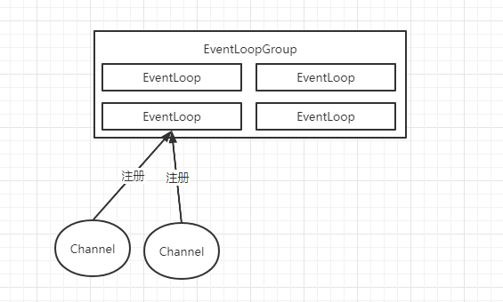

# Netty组件

* Channel-Socket
* EventLoop-控制流，多线程处理，并发
* ChannelFuture-异步通知

## Channel

包装了class Socket，降低Socket复杂性。

## EventLoop

* 一个EventLoopGroup包含一个或者多个EventLoop
* 一个EventLoop在其生命周期中与一个Thread绑定
* 所有由EventLoop处理的io请求都是在其绑定的线程上被处理的
* 一个Channel在其生命周期中只注册在一个EventLoop上
* 一个EventLoop可以有多个Channel

## ChannelFuture

Netty的所有操作都是异步的，所以需要一个在某个时间点确定其结果的方法。可以将ChannelFuture作为一个占位符，但是不确保其什么时候被执行。

## ChannelHandler

其充当了所有入站数据和出站数据的业务逻辑处理服务的容器，也就应用开发时业务代码的载体。

## ChannelPipeline

ChannelPipeline为ChannelHander链提供了容器，并定义了ChannelHandler链传播入站和出站事件流的api。当Channel被创建时，它会被自动的分配到专属的ChannelPipeline。

ChannelHander安装到ChannelPipeline过程如下：

1. 一个ChannelInitializer的实现被注册到了ServerBootStrap中；
2. 当ChannelInitializer.initChannel()方法被调用，ChannelInitializer将在ChannelPipeline中安装一组自定义的ChannelHander；
3. ChannelInitializer将自己从ChannelPipeline移除。

