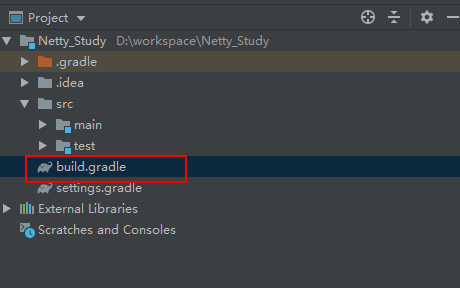

# 环境的搭建

## 使用gradle创建项目

简单了解gradle项目的构成,



build.相当于maven项目中的pom文件,作为项目构建的核心文件;

``` gradle
plugins {
    id 'java'
}

group 'com.syang'
version '1.0-SNAPSHOT'

sourceCompatibility = 1.8

repositories {
    mavenCentral()
}

dependencies {
    compile group: 'io.netty', name: 'netty-all', version: '4.1.10.Final'
}

```

**repositories:**定义项目的仓库

**dependencies:**设定项目中依赖的坐标

