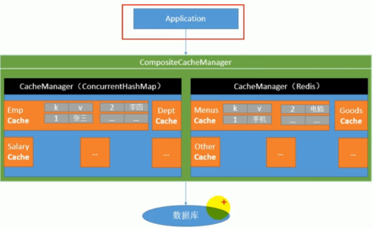

# 配置文件
Spring Boot 使用一个全局的配置文件,配置文件名是固定的:
- application.properties
- application.yml
## YAML
yml是以数据为中心的语法格式;
``` yml
server:
    port: 8081
```
### YAML语法
k:(空格)    -表示一对键值对,必须有空格
以空格的缩进来控制层级的关系;只要是左对齐的一列数据就是同级;
# spring boot与日志
日志门面:SL4J
日志实现:Log4j,log4j2,JUL,Logback
## SpringBoot使用Logback
在开发的时候日志的记录的调用,应该去调用接口而不是直接调用实现类;


### 日志整合问题
因为在项目中每个模块中使用的日志系统都不相同,如果我们想要将项目同的日志进行统一整合;

如何让项目中所有的日志都统一到slf4j,
1. 将系统中其他的日志框架先排除出去
2. 用中间包类来替换原有的日志框架
3. 我们导入slf4j其他的实现
### Spring Boot日志关系
 在Spring Boot 的start中引用了starter-logging来实现日志:


 # WEB开发
 ## SpringBoot对静态资源的映射规则


# spring boot整合环境的搭建
## 使用Docker在linux服务器上搭建环境
### 1.安装Mysql
在Linux服务器中,使用docker pull mysql命令将mysql拉取下来;
在Docker容器中启动Mysql服务
``` Linux
    //错误的启动方式
    [root@izbp1iqlc7ai38fpefb5dfz /]# docker run --name mysql -d mysql
    //查看日志的命令,后面的参数的id
    [root@izbp1iqlc7ai38fpefb5dfz /]# docker logs 68325fea1732 
```

因为没有指定root的密码,或者允许空密码,所以报错异常退出;

```Linux
   //正确的启动方式
   [root@izbp1iqlc7ai38fpefb5dfz /]# docker run -p 3306:3306 --name mymysql -e MYSQL_ROOT_PASSWORD=ssy111111 -d mysql
```


# Spring Boot整合篇
## 缓存概念
Spring从3.1开始定义了Cache,和CacheManager接口来统一不同的缓存技术,


## springboot环境的搭建
```java
/** * spring boot环境的搭建 * 1.配置数据源信息 * 2.使用注解版的mybatis * 1)mapperscan指定到扫描的包中; * * 使用缓存 *  1.开启注解的缓存:@EnableCaching *  2.标注缓存的注解 * */
@EnableCaching
@MapperScan("com.ssy.springbootcache.mapper")
@SpringBootApplicationpublic
class SpringbootcacheApplication {    
    public static void main(String[] args) {        
     SpringApplication.run(SpringbootcacheApplication.class, args);    
        }
    }
```
在未标明缓存注解时,在调用了service的查询方法就会打印标记,多次相同的请求会多次调用数据库;


### 缓存注解
1. @Cacheable
##### 用法
将方法的返回结果放入到缓存中,以后请求相同的数据就直接冲缓存中获取;
Cacheable的属性:
*                value:指定缓存的名字,可以多个也就是存放到多个cache中
*                key:缓存数据时使用的key(默认的是方法参数的值,也可以使用spEL)
*                keyGenerator:key的生成器,可以自己指定key的生成器的组件id
*                cacheManager:指定缓存管理器,或者是指定cacheResolver缓存解析器
*                condition:指定符合条件的情况下才缓存
*                unles:否定缓存,与condition相反
*                sync:是否使用异步模式(不支持unles)

**测试:** 将注解标记到service方法上后@Cacheable(cacheNames = "user")
只会打印一次service中sout;
##### 原理
从每个模块的自动配置入手:查看CacheAutoConfiguration.class
在方法CacheConfigurationImportSelector中打上断点后,发现返回值

* 1.从自动配置入手:CacheAutoConfiguration
* 2.缓存的配置类:org.springframework.boot.autoconfigure.cache.GenericCacheConfiguration
*              org.springframework.boot.autoconfigure.cache.JCacheCacheConfiguration
*              org.springframework.boot.autoconfigure.cache.EhCacheCacheConfiguration
*              org.springframework.boot.autoconfigure.cache.HazelcastCacheConfiguration
*              ........
* 3.默认生效:SimpleCacheConfiguration
* 4.给容器中注册了一个ConcurrentMapCacheManager,将数据保存在ConcurrentMap中
##### 运行流程
!
2. @CachePut
##### 用法
同cacheable相同,先调用目标方法,然后更新缓存数据
##### 运行流程
先调用目标方法,然后更新缓存数据
3. @CacheEvict
##### 用法
清楚指定的缓存
##### 运行流程
参数beforeInvocation=false,
在目标方法执行之后,清楚缓存;
4. @Caching
##### 用法
在注解中定义多个缓存方法和条件,!
## 整合Redis
### 1.在docker中安装Redis
详细查看 docker报错
### 2.引入redis的启动类
``` xml
<dependency>
<groupId>org.springframework.boot</groupId>    
<artifactId>spring-boot-starter-data-redis</artifactId>
</dependency>
```
### 3.配置上redis数据库
spring.redis.host=114.55.144.154
### 4.操作redis
在spring boot中使用Template操作