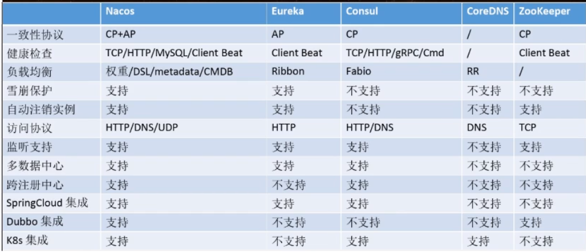

# Nacos

## 一.作为服务注册中心

### 1.基于Nacos的服务提供者

pom

```xml
<dependency>
            <groupId>com.alibaba.cloud</groupId>
            <artifactId>spring-cloud-starter-alibaba-nacos-discovery</artifactId>
        </dependency>
```

yml

```yam
spring:
  application:
    name: nacos-payment-provider
  cloud:
    nacos:
      discovery:
        server-addr: 127.0.0.1:8848
```

### 2.基于Nacos的服务消费者

pom 与yml操作不变，由于Nacos整合了Ribbon所以需要配置一个bean

```java
@Configuration
public class ApplicationContextConfig {

    @Bean
    @LoadBalanced
    public RestTemplate getRestTemplate(){
        return new RestTemplate();
    }
}

```

调用方法任然为resttemplate请求服务名。

### 3.注册中心对比



Nacos CP与AP切换：

==C是所有节点在同一时间看到的数据是一致的；而A的定义是所有的请求都会收到响应。==

何时选择使用何种模式？

一般来说，如果不需要存储服务级别的信息且服务实例是通过 nacos-cien注册，并能够保持心跳上报，那么就可以选择AP模式。当前主流的服务如 Spring cloud和 Dubbo服务，都适用于AP模式，AP模式为了服务的可能性而减弱了一致性，因此AP模式下只支持注册临时实例如果需要在服务级别编辑或者存储配置信息，那么CP是必须，K8S服务和DNS服务则适用于CP模式。

CP模式下则攴持注册持久化实例，此时则是以Raft协议为集群运行模式，该模式下注册实例之前必须先注册服，如果服务不存在，则会返回错误。

`curl-xX PUT 'SNACOS SERVER：8848/nacos/v1/ns/operator/switches？entry=server Mode&value=CP`

## 二.作为服务配置中心

### 1.基础配置

pom

```xm
        <dependency>
            <groupId>com.alibaba.cloud</groupId>
            <artifactId>spring-cloud-starter-alibaba-nacos-config</artifactId>
        </dependency>
        <dependency>
            <groupId>com.alibaba.cloud</groupId>
            <artifactId>spring-cloud-starter-alibaba-nacos-discovery</artifactId>
        </dependency>
```

application.yml

```yaml
spring:
  profiles:
    active: dev
```

bootstrap.yml

```yaml
spring:
  cloud:
    nacos:
      discovery:
        server-addr: localhost:8848   #服务注册中心地址
      config:
        server-addr: localhost:8848   #配置中心地址
        file-extension: yaml          #指定配置文件类型
  application:
    name: nacos-config-client

```

在 Nacos Spring Cloud 中，`dataId` 的完整格式如下：

```plain
${prefix}-${spring.profile.active}.${file-extension}
```

- `prefix` 默认为 `spring.application.name` 的值，也可以通过配置项 `spring.cloud.nacos.config.prefix`来配置。
- `spring.profile.active` 即为当前环境对应的 profile，详情可以参考 [Spring Boot文档](https://docs.spring.io/spring-boot/docs/current/reference/html/boot-features-profiles.html#boot-features-profiles)。 **注意：当 `spring.profile.active` 为空时，对应的连接符 `-` 也将不存在，dataId 的拼接格式变成 `${prefix}.${file-extension}`**
- `file-exetension` 为配置内容的数据格式，可以通过配置项 `spring.cloud.nacos.config.file-extension` 来配置。目前只支持 `properties` 和 `yaml` 类型

### 2.分类配置

#### 1).Namespace+Group+dataId

类似Java里面的 package名和类名最外层的 namespace是可以用于区分部署环境的， Group和 DataI逻辑上区分两个目标对象。

默认情况：

Namespace= public, Group= DEFAULT GROUP默认 Cluster是 DEFAULT 

Nacos默认的命名空间是 public, Namespace主要用来实现隔离。比方说我们现在有三个环境：开发、测试、生产环境，我们就可以创建三个 Namespace，不同的 Namespace之间是隔离的Group默认是 DEFAULT GROUP, Group可以把不同的微服务划分到同一个分组里面去

## 三.集群与持久化

### 1).持久化

1.将conf下的mysql-sql执行

2.修改application.properties添加如下

```properties
spring.datasource.platform=mysql

db.num=1
db.url.0=jdbc:mysql://11.162.196.16:3306/nacos_devtest?characterEncoding=utf8&connectTimeout=1000&socketTimeout=3000&autoReconnect=true
db.user=nacos_devtest
db.password=youdontknow
```

### 2).集群

在持久化完成后，将conf下的cluster.conf.example拷贝一份cluster.conf

修改其为`IP：port`

```
while getopts ":m:f:s:p:" opt
do
    case $opt in
        m)
            MODE=$OPTARG;;
        f)
            FUNCTION_MODE=$OPTARG;;
        s)
            SERVER=$OPTARG;;
        p)
            PORT=$OPTARG;;
        ?)
        echo "Unknown parameter"
        exit 1;;
    esac
done
# 添加p: 表示为端口
nohup $JAVA -Dserver.port=${PORT} ${JAVA_OPT} nacos.nacos >> ${BASE_DIR}/logs/start.out 2>&1 &
# 将上面的端口添加 -Dserver.port=${PORT} 
```

