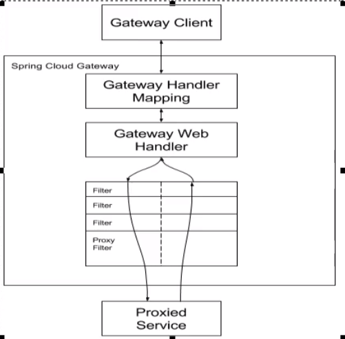

# Cloud组件-服务网关

## 一.gateway

### 1.简介

Spring Cloud Gateway是 Spring Cloud的个全新项目，基于 Spring5.0+ Spring Boot20和 Project Reactor等技术开发的网关，它旨在为微服务架构提供种简单有效的统的API路由管理方式。
	Spring Cloud Gateway作为 Spring Cloud生态系统中的网关，目标是替代zuul，在 Spring Cloud2.0以上版本中，没有对新版本的zuu2.0以上最新高性能版本进行集成，仍然还是使用的zuul1.×非 Reactor模式的老版本。而为了提升网关的性能， Spring Cloud Gateway是基于 WebFlux框架实现的，而 Nebflux框架底层则使用了高性能的 Reactor模式通信框架Net！
	Spring Cloud Gateway的目标提供统的路由方式且基于 Filter链的方式提供了网关基本的功能，例如：安全，监控/标，和限流。

### 2.特点

Spring Cloud Gateway具有如下特性

1. 基于 Spring Framework5， Project Reactor和 Spring Boot20进行构建；
2. 动态路由：能够匹配任何请求属性可以对路由指定 Predicate（断言）和 Filter（过滤器）；
3. 集成 hystrix的断路器功能；
4. 集成 Spring Cloud服务发现功能；
5. 易于编写的 Predicate（断言）和 Filter（过滤器）；
6. 请求限流功能；
7. 支持路径重写。

传统的Web框架，比如说：struts2， springmvc等都是基于 Servlet APl与 Servlet容器基础之上运行的。
但是在 Servlet3.1它后有了异步非阻塞的支持。而 Webflux是个典型非阻塞异步的框架，它的核心是基于 Reactor的相关AP实现的。相对于传统的web框架来说，它可以运行在诸如№et！y, Undertow及支持 Servlet3.1的容器上。非阻塞式+函数式编程（ Spring5必须让你使用java8

Spring WebFlux是 Spring5.0引入的新的响应式框架，区别于 Spring MVC，它不需要依赖 Servlet AP，它是完全异步非阻塞的，并且基于 Reactor来实现响应式流规范

### 3.核心概念

#### 1).Route（路由）

路由是构建网关的基本模块，它由ID，目标URL，一系列的断言和过滤器组成，如果断言为true则匹配该路由

#### 2).Predicate（断言）

开发人员可以匹配HTTP请求中的所有内容（例如请求头或请求参数），如果请求与断言相匹配则进行路由

#### 3).Filter（过滤）

指的是 Spring框架中 Gateway Filter的实例，使用过滤器，可以在请求被路由前或者之后对请求进行修改。

### 4.工作流程



核心逻辑：路由转发+执行过滤链

### 5.基础配置

在pom导入gateway的依赖即可

#### 1).在yml配置

```yaml
spring:   
  cloud:
    gateway:
      routes:
        - id: payment_routh           #路由的id，要求唯一
          uri: http://localhost:8001  #匹配成功后提供服务的地址
          predicates:
            - Path=/payment/get/**    #断言，路径匹配后进行路由
```

#### 2).注入Bean

```java
@Component
public class GateWayConfig {
    @Bean
    public RouteLocator cutomRouteLocator(RouteLocatorBuilder routeLocatorBuilder){
        RouteLocatorBuilder.Builder routes=routeLocatorBuilder.routes();
        routes.route("path_bean_one",
                r->r.path("/guonei")
                        .uri("http://www.bing.com")).build();
        return routes.build();
    }
}

```

### 6.动态路由

```yaml
spring:
  application:
    name: cloud-gateway
  cloud:
    gateway:
      discovery:
        locator:
          enabled: true               #开启从注册中心动态创建路由的功能，利用微服务名进行路由
      routes:
        - id: payment_routh           #路由的id，要求唯一
#          uri: http://localhost:8001  #匹配成功后提供服务的地址
          uri: lb://cloud-payment-service #lb代表负载均衡，通过微服务名来匹配
          predicates:
            - Path=/payment/get/**    #断言，路径匹配后进行路由
```

### 7.predicate的使用

1.  After Route predicate 时间之后判断`- After=2020-02-216:51:37,485+08:0【Asia/ Shanghai】`
2. Before Route Predicate 时间之前判断`- Before=2920-82-85T15:10:03.685+8:00【Asia/ Shanghai`
3. Between route predicate 时间之间判断 `- Between=2028-02-82T17:45:66.286+08：【Asia/ Shanghai】，2920-03-25T18:59:06.206+08：【Asia/ Shanghai`
4. Cookie Route Predicate Cookie判断指定的正则值`- Cookie=username, zzyy`
5. Header Route Predicate 请求头的正则`- Header=X-Request-Id, \d+`
6. Host route predicate 指定域名的正则
7. Method route predicate 请求的类型（Get，Post）
8. Path Route Predicate 
9. Query Route Predicate 一个参数名和一个参数值的正则表达式

### 8.filter的使用

路由过滤器可用于修改进入的HTTP请求和返回的HTTP响应，路由过滤器只能指定路由进行使用。Spring Cloud Gateway内置了多种路由过滤器，他们都由 GatewayFilter的工厂类来产生

实现自定义全局过滤器

```java
@Component
@Slf4j
public class LogGateWayFilter implements GlobalFilter, Ordered {
    @Override
    public Mono<Void> filter(ServerWebExchange exchange, GatewayFilterChain chain) {
        String name = exchange.getRequest().getQueryParams().getFirst("name");
        if (name==null){
            log.info("************name is null");
            exchange.getResponse().setStatusCode(HttpStatus.NOT_ACCEPTABLE);
            return exchange.getResponse().setComplete();
        }
        return chain.filter(exchange);
    }

    @Override
    public int getOrder() {
        return 0;
    }
}

```

