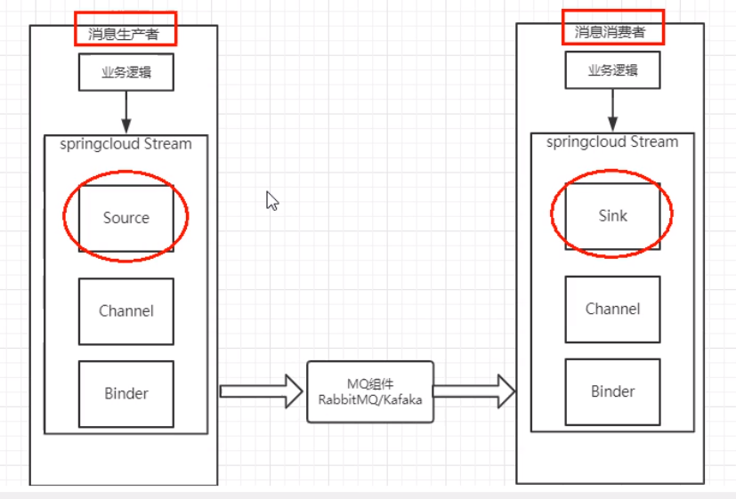

# Cloud组件-消息驱动

## 一.SpringCloud Strem

### 1.简介

屏蔽底层消息中间件的差异降低切换成本，统一消息的编程模型

什么是 Spring CloudStream

官方定义 Spring Cloud Stream是一个构建消息驱动微服务的框架。应用程序通过 Inputs或者 outputs来与 Spring Cloud Stream中bnde对象交互。通过我们配置来 binding绑定），而 Spring Cloud Stream的 binder对象负责与消息中间件交互。所以，我们只需要搞清楚如何与 Spring Cloud Stream交互就可以方便使用消息驱动的方式通过使用 Spring Integration来连接消息代理中间件以实现消息事件驱动。

Spring Cloud Stream为一些供应商的消息中间件产品提供了个性化的自动化配置实现，引用了发布-订阅、消费组、分区的三个核心概念

目前仅支持 RabbitMO、 Kafka

### 2.特点

在没有绑定器这个概念的情况下，我们的 Spring Boot应用要直接与消息中间件进行信息交互的时候由于各消息中间件构建的初衷不同，它们的实现细节上会有较大的差异性通过定义绑定器作为中间层，==完美地实现了应用程序与消息中间件细节之间的隔离。==

通过向应用程序暴露统的 Channel通道，使得应用程序不需要再考虑各种不同的消息中间件实现。

通过定义绑定器 Binder作为中间层，实现了应用程序与消息中间件细节之间的隔离。

* Binder ：很方便的连接中间司件，屏蔽差异Channel
* Channel通道：是队列 Queue的一种抽象，在消息通讯系统中就是实现存储和转发的媒介，通过 Channel对队列进行配置
* Source和Sink ：简单的可理解为参照对象是 Spring Cloud Stream自身， Source和Sink从 Stream发布消息就是输出，接受消息就是输入，

### 3.整合RabbitMq使用

#### 1).常用注解

| 注解             | 作用                                                     |
| ---------------- | -------------------------------------------------------- |
| @Input           | 注解标识输入通道，通过该输入通道接收到的消息进入应用程序 |
| @output          | 注解标识输出通道，发布的消息将通过该通道离开应用程序     |
| @ StreamListener | 监听队列，用于消费者的队列的消息接收                     |
| @ EnableBinding  | 指信道 channel和exchange绑定在一起                       |

#### 2).结构



#### 3).整合

pom

```xml
        <!--stream-rabbit-->
        <dependency>
            <groupId>org.springframework.cloud</groupId>
            <artifactId>spring-cloud-starter-stream-rabbit</artifactId>
        </dependency>
```


yml

```yaml
spring:
  application:
    name: cloud-stream-provider
  cloud:
    stream:
      binders:
        defaultRabbit:     #表示定义的名称，用 binding整合
          type: rabbit
          environment:
            spring:
              rabbitmq:
                host: 118.24.123.205
                port: 5672
                username: guest
                password: guest
                group: sy                     #设置分组在集群时避免重复消费问题
      bindings:
        output: #input
          destination: studyExchange    #表示要使用 Exchange名称定义
          content-type: application/json
          binder: defaultRabbit         #没置要绑定的消息服务的具体设置
```


##### a.消费者

```java

@Component
@EnableBinding(Sink.class)
public class ReceiveMessageController {

    @Value("${server.port}")
    private String port;

    @StreamListener(Sink.INPUT)
    public void input(Message<String> message){
        System.out.println(port+":"+message.getPayload());
    }
}
```


##### b.生产者

```java

@EnableBinding(Source.class)    //定义消息的推送管道
public class MessageProviderImpl implements IMessageProvider {

    @Resource
    private MessageChannel output;  //消息发送管道

    @Override
    public String send() {
        String simpleUUID = IdUtil.simpleUUID();
        output.send(MessageBuilder.withPayload(simpleUUID).build());
        System.out.println(simpleUUID);
        return null;
    }
}

```

