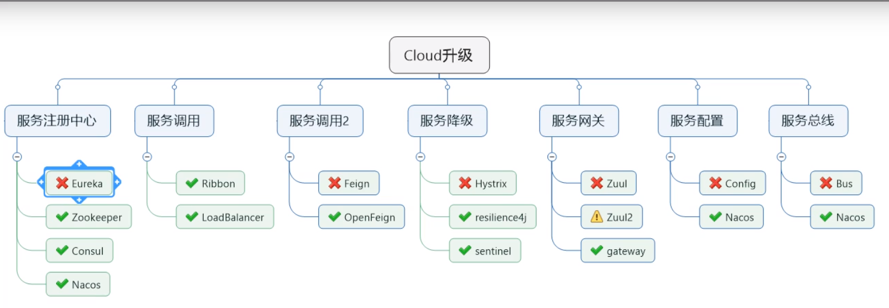
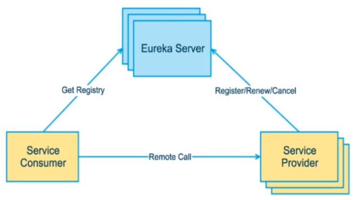
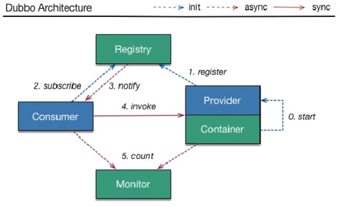
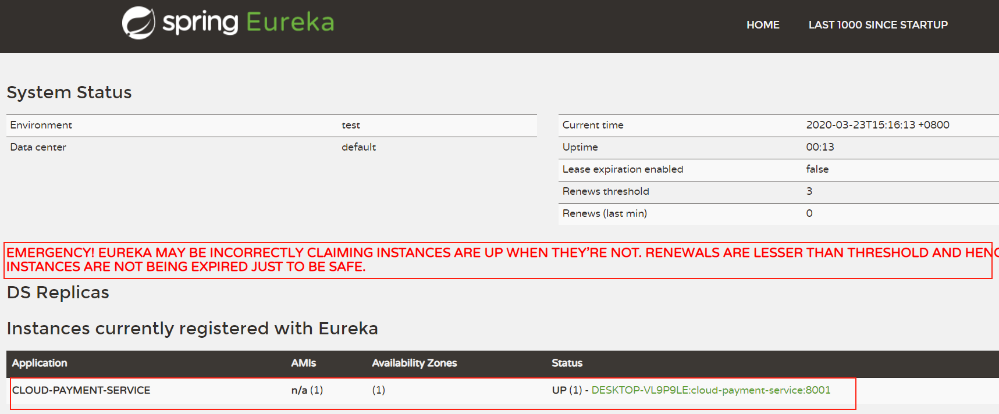
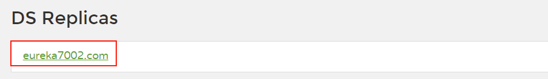
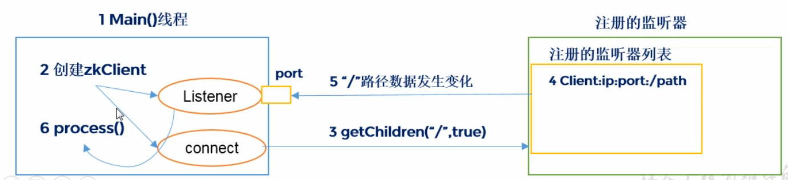
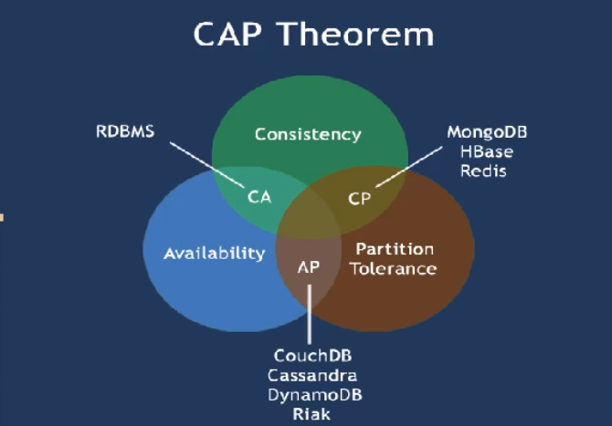

# Cloud组件-服务注册中心



## 一.Eureka

### 1.Eureka基础知识

#### 1).什么是服务治理

什么是服务治理Spring Cloud封装了 Netflix公司开发的 Eureka模块来实现服务治理

在传统的rpc远程调用框架中，管理每个服务与服务之间依赖关系比较复杂，管理比较复杂，所以需要使用服务治理，管理服务于服务之间依赖关系，可以实现服务调用、负载均衡、容错等，实现服务发现与注册。

#### 2).什么是服务注册

什么是服务注册与发现Eureka采用了CS的设计架构， Eureka Server作为服务注册功能的服务器，它是服务注册中心。而系统中的其他微服务，使用 Eureka的客户端连接到 Eureka Server并维持心连接。这样系统的维护人员就可以通过 Eureka Server来监控系统中各个微服务是否正常运行。

在服务注册与发现中，有一个注册中心。当服务器启动的时候，会把当前自己服务器的信息比如服务地址通讯地址等以别名方式注册到注册中心上。另一方（消费者服务提供者），以该别名的方式去注册中心上获取到实际的服务通讯地址，然后再实现本地RPC调用RPC远程调用框架核心设计思想：在于注册中心，因为使用注册中心管理每个服务与服务之间的一个依赖关系服务治理概念）。在任何rp远程框架中，都会有一个注册中心存放服务地址相关信息（接口地址）

**Eureka架构**



**Dubbo架构**



#### 3).Eureka组件

Eureka包含两个组件：Eureka server和 Eureka Client 

==Eureka Server==提供服务注册服务各个微服务节点通过配置启动后，会在 Eureka Server中进行注册，这样 EurekaServer中的服务注册表中将会存储所有可用服务节点的信息，服务节点的信息可以在界面中直观看到。

==Eureka Client==通过注册中心进行访问是一个ava客户端，用于简化 Eureka server的交互，客户端同时也具备一个内置的、使用轮询（ round- robin）负载算法的负载均衡器。在应用启动后，将会向 Eureka Server发送心跳默认周期为30秒）。如果 Eureka server在多个心跳周期内没有接收到某个节点的心跳， EurekaServer'将会从服务注册表中把这个服务节点移除（默认90秒）

### 2.单机 Eureka构建步骤

#### 1).DEA生成 eurekaServer端服务注册中心

##### a.建Module

##### b.改pom

```xml
<!--eureka-server-->
        <dependency>
            <groupId>org.springframework.cloud</groupId>
            <artifactId>spring-cloud-starter-netflix-eureka-server</artifactId>
        </dependency>
        <!--接入公用api-->
        <dependency>
            <groupId>com.syang.springcloud</groupId>
            <artifactId>cloud-api-commons</artifactId>
            <version>${project.version}</version>
        </dependency>
```

##### c.写yml

```yaml
server:
  port: 7001

eureka:
  instance:
    hostname: localhost #eureka服务端的实例名称
  client:
    #false表示不向注册中心注册自己
    register-with-eureka: false
    #false表示自己就是注册中心，任务为维护服务实例，不需要区检索服务
    fetch-registry: false
    service-url:
      #设置与Eureka server交互额地址查询服务和注册服务都需要依赖这个地址
      defaltZone: http://${eureka.instance.hostname}:${server.port}/eureka/
```

##### d.主启动

为主启动类添加`@EnableEurekaServer`注解

##### e.测试

访问http://localhost:7001/

#### 2).注册进 Eureka Server成为服务提供者 provider

##### a.改pom

```xml
<!--eureka-client-->
        <dependency>
            <groupId>org.springframework.cloud</groupId>
            <artifactId>spring-cloud-starter-netflix-eureka-client</artifactId>
        </dependency>
```

##### b.写yml

```yaml
eureka:
  client:
    #表示是否将自己注册进EurekaServer默认true
    register-with-eureka: true
    #是否从EurekaServer中抓却已有的注册信息，默认为true，单节点无所谓，集群必须设置为true才能配合Ribbon使用负载均衡    
    fetch-registry: true
    service-url:
      defaultZone: http://localhost:7001/eureka
```

##### c.主启动

为主启动类添加`@EnableEurekaClient`注解

##### d.测试

先启动EurekaServer，访问http://localhost:7001/



### 3.集群 Eureka构建步骤

#### 1).Eureka集群原理说明

互相注册，相互守望：所以的eureka都有其他eureka的信息，而对外所有eureka暴露为一个整体。

#### 2).EurekaServer集群环境构建步骤

##### a.创建Eureka

##### b.修改host

添加 127.0.0.1       eureka7001.com 127.0.0.1       eureka7002.com

##### c.改yml

```yaml
eureka:
  instance:
    hostname: eureka7001.com #eureka服务端的实例名称
  client:
    #false表示不向注册中心注册自己
    register-with-eureka: false
    #false表示自己就是注册中心，任务为维护服务实例，不需要区检索服务
    fetch-registry: false
    service-url:
      #设置与Eureka server交互额地址查询服务和注册服务都需要依赖这个地址
      defaltZone: http://eureka7002.com:7002/eureka/
```

在defaltZone注册其他的eureka，7001注册7002，7002注册7001。

##### d.测试

启动集群，访问http://eureka7001.com:7001/



#### 3).服务发布到Eureka集群

修改yml文件

```yaml
      defaultZone: http://eureka7002.com:7002/eureka/,http://eureka7001.com:7001/eureka/

```

#### 4).服务的集群搭建

复制一份服务微服务，修改其端口和启动类；

#### 5).消费者负载均衡

将消费者的请求路劲更换为服务者对外暴露的集体：http://CLOUD-PAYMENT-SERVICE，为消费者配置的RestTemplate添加上`@LoadBalanced`以开启负载均衡；

### 4.actuator微服务信息完善

#### 1).主机名称:服务名称修改

在application.yml中的eureka添加

```yaml
  instance:
  	#在eureka中显示的服务名称
    instance-id: payment8001
```

#### 2).访问信息有IP信息提示

在application.yml中的eureka添加

```yaml
  instance:
    #在eureka中显示的服务名称
    instance-id: payment8001
    #访问路径显示ip地址
    prefer-ip-address: true
```

### 5.服务发现 Discovery

对于注册进 eureka里面的微服务，可以通过服务发现来获得该服务的信息

#### 1).注入DiscoveryCient

注入` DiscoveryClient discoveryClient;`通过discoveryClient可以获取到已经注册到Eureka中的服务和实例；

#### 2).主启动类

添加注解`@EnableDiscoveryClient`以开启服务发现；

### 6.eureka自我保护

#### 1).什么是自我保护

保护模式主要用于—组客户端和 Eureka server之间存在网络分区场景下的保护。一旦进入保护模式，Eureka Server将会尝试保护其服务注册表中的信息，不再删除服务注册表中的数据，也就是不会注销任何微服务

* 某时刻某一个微服务不可用了， Eureka不会立刻清理，依旧会对该微服务的信息进行保存

* 属于CAP里面的AP分支

默认情况下，如果 EurekaServer在一定时间内没有接收到某个微服务实例的心跳，ε urekaServer'将会注销该实例（默认90秒）。但是当网络分区故障发生（延时、卡顿、拥挤）时，微服务与 Eurekaserter之间无法正常通信，以上行为可能变得非常危险了——因为微服务本身其实是健康的，此时本不应该注销这个微服务。 Eureka通过“自我保护模式"来解决这个问题——当 EurekaServer节点在短时间内丢失过多客户端时（可能发生了网络分区故障），那么这个节点就会进入自我保护模式

#### 2).如何禁止自我保护

* 注册中心 eureakeServer

```yaml
#自我保护开关
  server:
    enable-self-preservation: false
    #心跳间隔时间
    eviction-interval-timer-in-ms: 2000
```

* 生产者客户端 eureakeclient

```yaml
instance:
    #eureka客户端向服务端发送心跳的间隔（默认30s）
    lease-renewal-interval-in-seconds: 1
    #eureka服务端在最后一次心跳等待时间上限，（默认90s）,超时剔除
    lease-expiration-duration-in-seconds: 2
```

## 二.Zookeeper

### 1.简介

### 1).概述

Zookeeper从设计模式角度来理解：是一个基 于观察者模式设计的分布式服务管理框架，它负 责存储和管理大家都关心的数据，然后接受观察 者的注册，一旦这些数据的状态发生变化， Zookeeper就将负责通知已经在Zookeeper上注册 的那些观察者做出相应的反应。 

#### a.特点

1. Zookeeper：一个领导者（Leader），多个跟随者（Follower）组成的集群。
2. 集群中只要有半数以上节点存活，Zookeeper集群就能正常服务。
3. 全局数据一致：每个Server保存一份相同的数据副本，Client无论连接到哪个Server，数据都是一致的
4. 更新请求顺序进行，来自同一个Client的更新请求按其发送顺序依次执行。
5. 数据更新原子性，一次数据更新要么成功，要么失败。
6. 实时性，在一定时间范围内，Client能读到最新数据。

#### b.操作

1. 启动  bin/zkServer.sh start 
2. 查看状态： bin/zkServer.sh status 
3. 启动客户端： bin/zkCli.sh 
4. 退出客户端：  quit 
5. 停止  bin/zkServer.sh stop 

#### 2).配置文件

```shell

# The number of milliseconds of each tick
tickTime=2000
# The number of ticks that the initial 
# synchronization phase can take
initLimit=10
# The number of ticks that can pass between 
# sending a request and getting an acknowledgement
syncLimit=5
# the directory where the snapshot is stored.
# do not use /tmp for storage, /tmp here is just 
# example sakes.
dataDir=/opt/module/zookeeper-3.4.14/zkData
# the port at which the clients will connect
clientPort=2181
# the maximum number of client connections.
# increase this if you need to handle more clients
#maxClientCnxns=60
#
# Be sure to read the maintenance section of the 
# administrator guide before turning on autopurge.
#
# http://zookeeper.apache.org/doc/current/zookeeperAdmin.html#sc_maintenance
#
# The number of snapshots to retain in dataDir
#autopurge.snapRetainCount=3

```

1. tickTime =2000：通信心跳数，Zookeeper 服务器与客户端心跳时间，单位毫秒 Zookeeper使用的基本时间，服务器之间或客户端与服务器之间维持心跳的时间间隔，也就是每个tickTime时间就会发送一个心跳，时间单位为毫秒。 它用于心跳机制，并且设置最小的session超时时间为两倍心跳时间。(session的最小超时时间是2*tickTime) 
2. initLimit =10：LF 初始通信时限 集群中的Follower跟随者服务器与Leader领导者服务器之间初始连接时能容忍的最多心
   跳数（tickTime的数量），用它来限定集群中的Zookeeper服务器连接到Leader的时限。 
3. syncLimit =5：LF 同步通信时限 集群中Leader与Follower之间的最大响应时间单位，假如响应超过syncLimit * 
   tickTime，Leader认为Follwer死掉，从服务器列表中删除Follwer。 
4. dataDir：数据文件目录+数据持久化路径 主要用于保存 Zookeeper 中的数据。 
5. clientPort =2181：客户端连接端口 监听客户端连接的端口

### 3).内部原理

#### a. 选举机制
1. 半数机制：集群中半数以上机器存活，集群可用。所以 Zookeeper适合安装奇数台服务器
2.  Zookeeper虽然在配置文件中并没有指定 Master和 Slave。但是， Zookeeper工作时，是有一个节点为 Leader，其他则为 Follower, Leader是通过内部的选举机制临时产生的。
3. 投票逻辑，从id号由小到大开始，先投自己一票如果得票没又超过集群的一半则投给下一个。直到选出Leader。

#### b.节点类型

* 持久（ Persistent）：客户端和服务器端断开连接后，创建的节点不删除
  1. 持久化目录节点客户端与 Zookeeper断开连接后，该节点依旧存在
  2. 持久化顺序编号目录节点客户端与 Zookeeper断开连接后，该节点依旧存在，只是 Zookeeper给该节点名称进行顺序编号
* 短暂（- ephemeral）：客户端和服务器端断开连接后，创建的节点自己删除
  1. 临时目录节点客户端与 Zookeeper断开连接后，该节点被删除
  2. 临时顺序编号目录节点客户端与 Zookeeper断开连接后，该节点被删除，只是Z006给该点名称进行顺序编号。让天下没为难学的

#### c.stat结构体

1. cixi-创建节点的事务zxid每次修改 ZooKeeper状态都会收到一个zid形式的时间戳，也就是 ZooKeeper事务ID。事务ID是 ZooKeeper中所有修改总的次序。每个修改都有唯一的zxid，如果 zaidi小于zxid2，那么zxid1在zxid2之前发生。
2. ctime- znode被创建的毫秒数（从1970年开始）
3. mzxid- znode最后更新的事务zxid
4. mtime- znode最后修改的毫秒数（从1970年开始）
5. pAid- znode最后更新的子节点zxid
6. cversion- znode子节点变化号，mode子节点修改次数 
7. dataversion- znode数据变化号
8. advErsion- znode访问控制列表的变化号
9. ephemeralOwner-如果是临时节点，这个是 znode拥有者的 session id。如果不是临时节则为0
10. dataLength- znode的数据长度
11. num children- znode子节点数量

#### d.监听器的原理

1. 首先要有一个main0线程
2. 在mai线程中创建 Zookeeper客户端，这时就会创建两个线程，一个负责网络连接通信（ connet），一个负责监听（ listener）。
3. 通过 connect线程将注册的监听事件发送给 Zookeeper
4. 在 Zookeeper的注册监听器列表中将注册的监听事件添加到列表中。
5.  Zookeeper监听到有数据或路径变化，就会将这个消息发送给 listene线程。
6.  listener线程内部调用了 process方法。




#### e.写数据的流程

1. Client向 ZooKeeper的Serverl上写数据，发送一个写请求。
2. 如果 Serverl不是 Leader，那么 Server1会把接受到的请求进一步转发给Leader，因为每个 ZooKeeper的 Server里面有一个是 Leader。这个 Leader会将写请求广播给各个 Server，比如 Server1和 Server2，各个 Server写成功后就会通知Leader
3. 当 Leader收到大多数 Server数据写成功了，那么就说明数据写成功了。如果这里三个节点的话，只要有两个节点数据写成功了，那么就认为数据写成功了。写成功之后， Leader会告诉 Serve1数据写成功了。
4. Server1会进一步通知 Client数据写成功了，这时就认为整个写操作成功。

### 4).实战

#### a.分布式安装部署

1. 在/opt/module/zookeeper-3.4.10/zkData 目录下创建一个 myid 的文件`touch myid`
2. 编辑 myid 文件`vi myid`
3. 在文件中添加与 server 对应的编号：2 
4. 拷贝配置好的 zookeeper 到其他机器上修改 myid 文件中内容为 3、4 
5. 配置 zoo.cfg 文件

```shell
#######################cluster##########################

server.2=hadoop102:2888:3888

server.3=hadoop103:2888:3888

server.4=hadoop104:2888:3888
```

**配置参数解读**

server.A=B:C:D。 

**A** 是一个数字，表示这个是第几号服务器；

集群模式下配置一个文件 myid，这个文件在 dataDir 目录下，这个文件里面有一个数据

就是 A 的值，Zookeeper 启动时读取此文件，拿到里面的数据与 zoo.cfg 里面的配置信息比

较从而判断到底是哪个 server。 

**B** 是这个服务器的地址；

**C** 是这个服务器 Follower 与集群中的 Leader 服务器交换信息的端口；

**D** 是万一集群中的 Leader 服务器挂了，需要一个端口来重新进行选举，选出一个新的Leader，而这个端口就是用来执行选举时服务器相互通信的端口。

#### b.客户端命令操作

| 命令基本语法     | 功能描述                                    |
| ---------------- | ------------------------------------------- |
| help             | 显示所有操作命令                            |
| ls path [watch]  | 使用 ls 命令来查看当前 znode 中所包含的内容 |
| ls2 path [watch] | 查看当前节点数据并能看到更新次数等数据      |
| create           | 普通创建                                    |
| get path [watch] | 获得节点的值                                |
| set              | 设置节点的具体值                            |
| stat             | 查看节点状态                                |
| delete           | 删除节点                                    |
| rmr              | 递归删除节点                                |

## 2.整合SpringCloud

### 1).连接到zookeeper

1. pom

   ```xml
   <!--        整合zookeeper-->
           <dependency>
               <groupId>org.springframework.cloud</groupId>
               <artifactId>spring-cloud-starter-zookeeper-discovery</artifactId>
   <!--            排除自带的zzookeeper3.5.3-->
               <exclusions>
                   <exclusion>
                       <groupId>org.apache.zookeeper</groupId>
                       <artifactId>zookeeper</artifactId>
                   </exclusion>
               </exclusions>
           </dependency>
   <!--        添加上服务器对于版本的zookeeper-->
           <dependency>
               <groupId>org.apache.zookeeper</groupId>
               <artifactId>zookeeper</artifactId>
               <version>3.4.14</version>
               <exclusions>
                   <exclusion>
                       <groupId>org.slf4j</groupId>
                       <artifactId>slf4j-log4j12</artifactId>
                   </exclusion>
               </exclusions>
           </dependency>
   ```

2. yml

   ```yaml
   spring:
     application:
       name: cloud-payment-service
     cloud:
       zookeeper:
         connect-string: 118.24.123.205:2181
   ```

3. 主启动

在主启动类上添加注解`@EnableDiscoveryClient`

4. 测试

   在zookeeper中` get /services/cloud-payment-service/73422138-66dc-4038-9871-e148aa052271`

   获得node连接的信息

``` json
{
  "name": "cloud-payment-service",
  "id": "73422138-66dc-4038-9871-e148aa052271",
  "address": "DESKTOP-VL9P9LE",
  "port": 8004,
  "sslPort": null,
  "payload": {
    "@class": "org.springframework.cloud.zookeeper.discovery.ZookeeperInstance",
    "id": "application-1",
    "name": "cloud-payment-service",
    "metadata": {}
  },
  "registrationTimeUTC": 1585996837092,
  "serviceType": "DYNAMIC",
  "uriSpec": {
    "parts": [
      {
        "value": "scheme",
        "variable": true
      },
      {
        "value": "://",
        "variable": false
      },
      {
        "value": "address",
        "variable": true
      },
      {
        "value": ":",
        "variable": false
      },
      {
        "value": "port",
        "variable": true
      }
    ]
  }
}
```

## 三.Consul

### 1.简介

#### 1).是什么

Consul是一套开源的分布式服务发现和配置管理系统，由 Hashi.rp公司用Go语言开发。提供了微服务系统中的服务治理、配置中心、控制总线等功能。这些功能中的毎_个都可以根据需要单独使用，也可以一起使用以构建全方位的服务网格，总之 Consu提供了一种完整的服务网格解决方案。

#### 2).特点

* 服务发现提供HTTP和DNS两种发现方式。
* 健康监测支持多种方式，HTTP、TCP、Docker、She脚本定制化
* KV存储Key、Vaue的存储方式
* 多数据中心Consu支持多数据中心
* 可视化Web界面

https://www.springcloud.cc/spring-cloud-consul.html

注意在云服务器上安装启动时绑定时使用私网ip，访问管理页面时使用公网ip

```shell
 consul agent -dev -ui -node=consul-dev -client=私网ip
```

### 2.整合到SpringCloud

1. pom

```xml
<!--        consul-->
        <dependency>
            <groupId>org.springframework.cloud</groupId>
            <artifactId>spring-cloud-starter-consul-discovery</artifactId>
        </dependency>
```

2. yml

```shell
spring:
  application:
    name: cloud-provider-payment
  cloud:
    consul:
      host: 118.24.123.205
      port: 8500
      discovery:
        service-name: ${spring.application.name}
```

1. 主启动

```java
@SpringBootApplication
@EnableDiscoveryClient
public class PaymentMain8006 {
    public static void main(String[] args) {
        SpringApplication.run(PaymentMain8006.class,args);
    }
}
```

## 四.三个注册中心的区别

| 组件名    | 语言 | 服务健康检查 | 对外暴露接口 | springcloud集成 |
| --------- | ---- | ------------ | ------------ | --------------- |
| Eureka    | Java | 可配支持     | HTTP         | 已集成          |
| Consul    | Go   | 支持         | HTTP/DNS     | 已集成          |
| Zookeeper | Java | 支持         | 客户端       | 已集成          |




* C:Consistency（强一致性）
* A:Availability（可用性）
* P:Partition tolerance（分区容错性）


