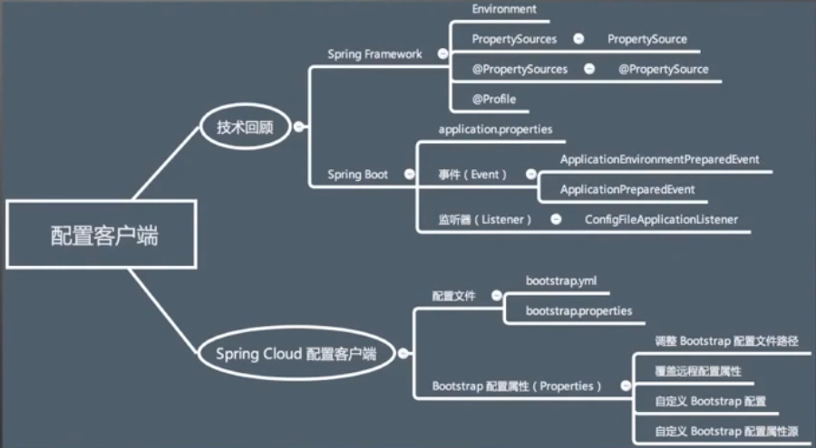

 # Spring Cloud

## 一.配置客户端

### 1.Spring Environment

#### a.Environment

Environment是一种在容器内以配置( Profile))和属性( Properties)为模型的应用环境抽象整
Spring Framework提供了两种 Environment的实现,即:

- 一般应用: Standard Environment
- Web应用: Standardservlet Environment

#### b.配置(Profile)

在 Spring容器, Profile是一种命名的Bean定义逻辑组。一个 Spring应用可以同时激活多个Profile,常见的使用场景如:应用部署环境(test、 stage、 production)、单元测试等。

应用程序可通过调用 Configurableenvironment接口控制 Profile的激活,如:

- setactiveprofiles(String...)   
- addactive Profile( String)
- setdefaultprofiles(String...)

#### c.属性(Properties)

属性又称之为配置项,Key- Valuel的形式。在 Spring应用中常用作占位符( Placeholder),而在APl层面, Spring Framework如下抽象来表述:

- 组合属性: Property Sources
- 单一属性: Property Source

### 2.  

