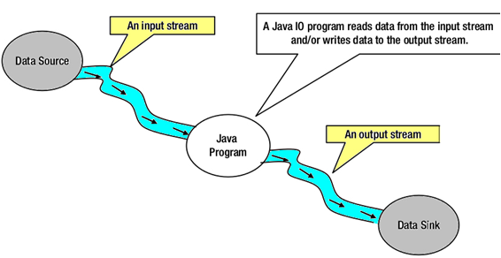

# NIO

## 一.NIO组件

在Java中，NIO读写是I/O的基本过程。 *从通道读取*：创建一个缓冲区，然后请求通道读取数据。*通道写入*：创建一个缓冲区，填充数据，并要求通道写入数据。

读写操作中使用的核心部件有：

* *Channels*
* *Buffers*
* Selectors

### 1.通道和缓冲区

在标准I/O API中，使用字符流和字节流。 在NIO中使用通道和缓冲区。 NIO中的所有I/O都是通过一个通道开始的。数据总是从缓冲区写入通道，并从通道读取到缓冲区。

**数据读取操作：**

下面来看看将数据从通道读入缓冲区，如下图所示：


**数据写入操作：**

下面来看看从缓冲区将数据写入通道，如下图所示：


### 2.通道分类

在Java NIO中，主要使用的通道如下：

- *DatagramChannel*
- *SocketChannel*
- *FileChannel*
- *ServerSocketChannel*

上述通道涵盖UDP(用户数据报协议)+ TCP(传输控制协议)网络I/O和文件I/O。

### 3.缓冲分类

在Java NIO中使用的核心缓冲区如下：

- CharBuffer
- DoubleBuffer
- IntBuffer
- LongBuffer
- ByteBuffer
- ShortBuffer
- FloatBuffer

上述缓冲区覆盖了通过I/O发送的基本数据类型：`characters`，`double`，`int`，`long`，`byte`，`short`和`float`。

### 4.选择器

Java NIO提供了“选择器”的概念。这是一个可以用于监视多个通道的对象，如数据到达，连接打开等。因此，单线程可以监视多个通道中的数据。

如果应用程序有多个通道(连接)打开，但每个连接的流量都很低，则可考虑使用它。 例如：在聊天服务器中。

下面来看看线程使用选择器来处理`3`个通道，如下图所示：


## 二.IO与NIO的比较

下面表格列出了Java IO和NIO之间的主要区别：

| IO              | NIO                       |
| --------------- | ------------------------- |
| 基于阻塞I/O操作 | 基于非阻塞I/O操作         |
| 面向流的        | 面向缓存的                |
| 通道不可用      | 通道可用于非阻塞I/O操作   |
| 选择器不可用    | 选择器可用于非阻塞I/O操作 |

### 1.阻塞与非阻塞IO

**阻塞I/O**

阻塞IO等待数据写入或返回前的读取。Java IO的各种流是阻塞的。这意味着当线程调用`write()`或`read()`时，线程会被阻塞，直到有一些数据可用于读取或数据被完全写入。

**非阻塞I/O**

非阻塞IO不等待返回前读取或写入数据。 Java NIO非阻塞模式允许线程请求向通道写入数据，但不等待它被完全写入。允许线程继续进行，并做其他事情。

### 2.面向流与面向缓冲

**面向流**

Java IO是面向流的I/O，这意味着我们需要从流中读取一个或多个字节。它使用流来在数据源/槽和java程序之间传输数据。使用此方法的I/O操作较慢。

下面来看看在Java程序中使用输入/输出流的数据流图：



**面向缓冲**

Java NIO是面向缓存的I/O方法。 将数据读入缓冲器，使用通道进一步处理数据。 在NIO中，使用通道和缓冲区来处理I/O操作。

通道和流之间的主要区别是：

- 流可以用于单向数据传输。
- 通道提供双向数据传输。

因此，通过在java NIO中引入通道，可以执行非阻塞I/O操作。

下面看看通道，缓冲区，java程序，数据源和数据接收器之间的相互作用 - 


**通道(Channels)**

在Java NIO中，通道是在实体和字节缓冲区之间有效传输数据的媒介。 它从一个实体读取数据，并将其放在缓冲区块中以供消费。

通道作为Java NIO提供的网关来访问I/O机制。通常，通道与操作系统文件描述符具有一对一关系，用于提供平台独立操作功能。

**NIO通道基础**

通道使用本地代码执行实际工作。通道接口允许我们以便携和受控的方式访问低级I/O服务。

在层次结构的顶部，通道接口如下所示：

```java
package java.nio.channels;  
 public interface Channel{  
    public boolean isclose();  
    public void Open() throws IOException;  
}
Java
```

正如在上述通道接口中看到的，所有通道中有常见的两个操作：

- 检查通道是否关闭(`isclose()`)
- 打开关闭通道(`close()`)

### 3.选择器(Selectors)

在Java NIO中，选择器是可选择通道的多路复用器，可用作可以进入非阻塞模式的特殊类型的通道。它可以检查一个或多个NIO通道，并确定哪个通道准备好进行通信，即读取或写入。

**选择器(Selectors)的用途是什么？**

选择器用于使用单个线程处理多个通道。因此，它需要较少的线程来处理这些通道。

线程之间的切换对于操作系统来说是昂贵的。 因此，为了提高系统效率选择器是有用的。

下面来看看使用选择器来处理`3`个通道的线程的示意图：


**创建选择器**

可以通过调用`Selector.open()`方法创建一个选择器，如下代码所示：

```java
Selector selector = Selector.open();
```

https://www.yiibai.com/java_nio/java-nio-selector.html