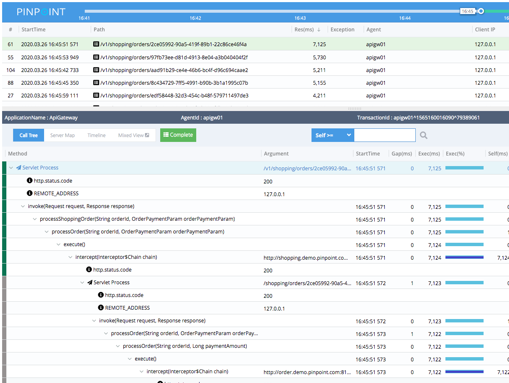
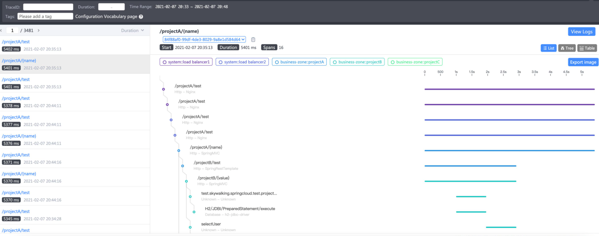

# APM技术选型

## 一.背景

现thomas平台的后续开发目标为pass平台，现在的监控系统是结合spring actuator和手动实现插件埋点的方式进行数据的采样。这样的方式对业务系统的侵入性较高，切接入需要对业务系统进行改造。不符合pass平台的定位和设计。

所以现在阶段需要一个无侵入的分布式监控系统。

## 二.常见APM技术选型

市面上较为常见使用较多的APM框架有:

* Zipkin
* Pinpoint
* SkyWalking
* CAT

由于Zipkin采用的是插件拦截请求，而CAT使用代码埋点。本次技术选型不考虑这两款框架，着重对Pinpoint和SkyWalking进行对比分析。

### 1.总体对比

Pinpoint-2.2.2  SkyWalking-8.4.0

| -           | Pinpoint              | SkyWalking                                         |
| ----------- | --------------------- | -------------------------------------------------- |
| OpenTracing | 否                    | 是                                                 |
| agent支持   | java,php,python,c,c++ | java,php,go,nginx,python,c#,c++,node.js,javaScript |
| 收集协议    | Thrift,gRPC           | HTTP(保留),gRPC                                    |
| 存储        | Hbase                 | H2，ElasticSearch6,7，MySQL，TiDB，influxDB        |
| 实现方式    | 字节码增强            | 字节码增强                                         |
| 接入方式    | javaagent             | javaagent                                          |
| 扩展性      | 低                    | 高                                                 |
| TraceId查询 | 不支持                | 支持                                               |
| 告警        | 支持                  | 支持                                               |
| JVM监控     | 支持                  | 支持                                               |
| 跟踪粒度    | 细                    | 一般                                               |
| 过滤追踪    | filter配置            | Optional Plguin支持                                |
| 性能损耗    | 高                    | 低                                                 |
| 发布包      | War                   | Jar+执行脚本                                       |

### 2.具体分析

#### OpenTracing（不重要）

对于OpenTracing规范的支持上，SkyWalking 从 2017 年开始支持 OpenTracing 和 OpenTracing-Java API。而Pinpoint不支持，但是这一点对现有需求并不是非常重要的。

#### agent支持（重要）

Pinpoint的agent对语言上的支持就比较少了，只有java,php,python,c,c++。而SkyWlaking在语言上java,Nginx LUA, Python, .NetCore, PHP, NodeJS, Go, 。

#### 收集协议（不重要）

SkyWalking支持gRPC和HTTP、不过建议使用gRPC、SkyWalking6.x版本已经不提供HTTP方式（但是还会保留接收5.x的数据）、以后会考虑删除、而Pinpoint使用的是thrift协议、协议本身没有谁好谁坏。

#### 存储（非常重要）

存储是SkyWalking和Pinpoint最大的差异所在、因为底层存储决定了上层功能、Pinpoint只支持HBase、且扩展代价较大、如果选择了Pinpoint那么对应的也要有一套HBase。

Pinpoint只支持HBase的另一个缺陷就是、HBase本身查询能力有限（HBase只能支持三种方式查询：RowKey精确查找、SCAN范围查找、全表扫描）限制了Pinpoint的查询能力、所以其支持的查询一定是在时间的基础上（Pinpoint通过鼠标圈定一个时间范围后查看这个范围内的Trace信息）。

而SkyWalking官方推荐使用es，但是也对其他的存储进行了支持。多种存储介质的支持让使用其的成本更低。ES强在检索能力、存储能力偏弱、HBase强在存储能力、检索能力偏弱。

#### 扩展性（重要）

pinpoint扩展性较差、无论是底层的存储、还是自定义探针实现等、而SkyWalking核心设计目标之一就是Plug，无论是对应agent还是oap来说都是由一个个的插件来组装其功能。

以存储为例、Pinpoint完全没有考虑扩展性、而SkyWalking从设计理念上就是SPI模式、实现一些接口配置就可以完成存储扩展、至于Pinpoint则完全没有考虑过扩展底层存储、

#### 跟踪粒度(重要)

Pinpoint在这方面做的非常好，跟踪粒度非常细。如下图所示，是Pinpoint对某个接口的trace信息：

而SkyWalking默认策略比较保守。

#### 性能损耗(重要)

由于Pinpoint采集信息太过详细、所以、它对性能的损耗较大的、而SkyWalking默认策略比较保守、对性能损耗较小、所以、在性能损耗方面、SkyWalking更胜一筹。附上各自官方的测试报告，和对比测试结果。

在满采样的测试情况下skywalking对tps与返回时间的影响也非常小几乎可以忽略，cpu的消耗也在6%。

Pinpoint在提供的测试数据中，满采样下对tps的影响在1%以上，cpu的消耗则未列出，只是说明在1-2%的采样下cpu消耗在3%。

https://skyapmtest.github.io/Agent-Benchmarks/README_zh.html

https://github.com/SkyAPMTest/agent-integration-test-report

https://pinpoint-apm.github.io/pinpoint/performance.html

#### 部署方式（不重要）

pinpoint采用war包的方法，而skywalking采用jar加sh脚本部署更加简单。

### 3.总结

在语言支持方面，skywalking无疑是强与pinpoint的。

在扩展性方面，skywalking不仅可以对agent进行插件扩展，还可以对oap进行module的扩展，而且扩展方式也是非常简单只需将按照规范的插件的jar放入agent的路径即可。

追踪粒度上虽然pinpoint更加详细但是带来的性能消耗也更加的大，而且我们如果真的需要对某一个场景下进行详细的监控，我们也可以编写skywalking的插件来进行支持。

在最为重要的存放介质方面由于pinpoint只能选择HBase，需要公司投入新的资源。而对skywalking而言无论是tidb还是es现有环境都是可以使用的。

所以在多种因素的考虑下，在现有资源与需求下skywalking是更好的选择。

