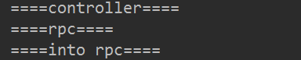

# SkyWalkingAgent插件开发

## 一.概念

首先需要掌握OpentTracing的概念，可以查看另一篇OpenTracing的文章。或者中文文档https://wu-sheng.gitbooks.io/opentracing-io/content/

https://github.com/SkyAPM/document-cn-translation-of-skywalking/blob/master/docs/zh/8.0.0/guides/Java-Plugin-Development-Guide.md

## 二.开发插件

追踪就是拦截java方法，SkyWalking使用字节码操作技术和instrument以及AOP的概念。SkyWalking 包装了字节码操作技术, 并追踪上下文的传播. 所以你只需要定义拦截点(换句话说就是 Spring 的切面)。

### 拦截

SkyWalking 提供两类通用的定义去拦截构造方法, 实例方法和类方法.

- `ClassInstanceMethodsEnhancePluginDefine` 定义了构造方法 `Contructor` 拦截点和 `instance method` 实例方法拦截点.
- `ClassStaticMethodsEnhancePluginDefine` 定义了类方法 `class method` 拦截点.

当然, 您也可以继承 `ClassEnhancePluginDefine` 去设置所有的拦截点, 但这不常用.

```java
public abstract class ClassInstanceMethodsEnhancePluginDefine extends ClassEnhancePluginDefine {
    
    /**
     * 获取静态方法的切点
     */
    @Override
    public StaticMethodsInterceptPoint[] getStaticMethodsInterceptPoints() {
        return null;
    }

}
public abstract class ClassStaticMethodsEnhancePluginDefine extends ClassEnhancePluginDefine {
    /**
     * 获取构造器的切点
     */
    @Override
    public ConstructorInterceptPoint[] getConstructorsInterceptPoints() {
        return null;
    }
    /**
     * 获取方法的切点
     */
    @Override
    public InstanceMethodsInterceptPoint[] getInstanceMethodsInterceptPoints() {
        return null;
    }
}
```


### 实现插件

#### 1.实现ClassEnhancePluginDefine

```java
/**
 * @author 孙绍洋
 * @date 2021/3/15 16:13
 */
public class TrpcInstrumentation extends ClassInstanceMethodsEnhancePluginDefine {

    private static final String INTERCEPTOR_CLASS = "com.demo.rpc.ExecuteAsyncMethodInterceptor";

    private static final String ENHANCE_CLASS = "com.yealink.trpc.client.netty.NettyRpcClient";

    private static final String INTERCEPTOR_METHOD = "executeAsync";

    @Override
    protected ClassMatch enhanceClass() {
        return byName(ENHANCE_CLASS);
    }

    @Override
    public ConstructorInterceptPoint[] getConstructorsInterceptPoints() {
        return new ConstructorInterceptPoint[0];
    }

    /**
     * 添加rpc client发送时的切点
     * @return
     */
    @Override
    public InstanceMethodsInterceptPoint[] getInstanceMethodsInterceptPoints() {
        return new InstanceMethodsInterceptPoint[] {
                new InstanceMethodsInterceptPoint() {
                    @Override
                    public ElementMatcher<MethodDescription> getMethodsMatcher() {
                        return named(INTERCEPTOR_METHOD);
                    }

                    @Override
                    public String getMethodsInterceptor() {
                        return INTERCEPTOR_CLASS;
                    }

                    @Override
                    public boolean isOverrideArgs() {
                        return false;
                    }
                }
        };
    }
}

```

#### 2.实现拦截器

```java
/**
 * @author 孙绍洋
 * @date 2021/3/15 16:34
 */
public class ExecuteAsyncMethodInterceptor  implements InstanceMethodsAroundInterceptor {
    @Override
    public void beforeMethod(EnhancedInstance enhancedInstance, Method method, Object[] objects, Class<?>[] classes, MethodInterceptResult methodInterceptResult) throws Throwable {
        System.out.println("====into rpc====");
    }

    @Override
    public Object afterMethod(EnhancedInstance enhancedInstance, Method method, Object[] objects, Class<?>[] classes, Object o) throws Throwable {
        return o;
    }

    @Override
    public void handleMethodException(EnhancedInstance enhancedInstance, Method method, Object[] objects, Class<?>[] classes, Throwable throwable) {

    }
}
```

#### 3.编写配置文件

创建`resources/skywalking-plugin.def` ，内容如下：


```properties
# Key=value的形式
# key随便写；value是Instrumentation类的包名类名全路径
trpc-demo-plugin=com.demo.rpc.TrpcInstrumentation
```

#### 4.构建

打包完成后放入agent/plugins路径下即可。

#### 5.测试

```java
/**
 * @author 孙绍洋
 * @date 2021/3/15 16:41
 */
@RestController
@RequiredArgsConstructor
public class RpcController {

    @RpcReference(directUrl = "127.0.0.1:18000", appName = "echo2")
    public final TestRpc testRpc;

    @GetMapping("/test")
    public void testRpc(){
        System.out.println("====controller====");
        System.out.println("====rpc====");
        testRpc.test("hello");
    }
}
```



