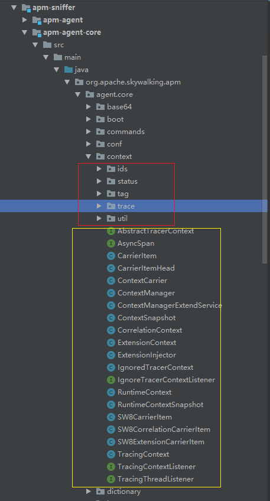
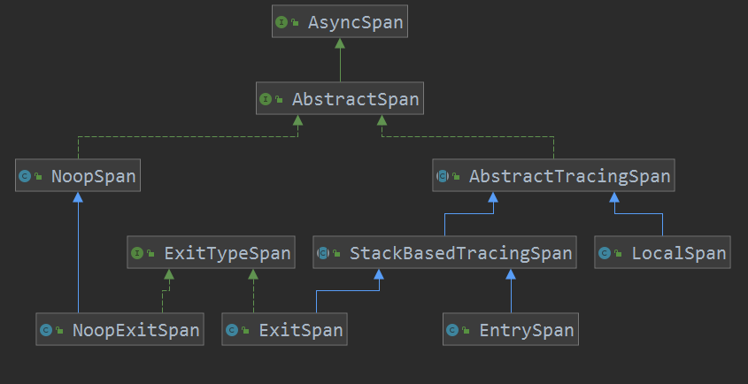

# Trace的收集

## 一.概述

在skywalkingAgent插件开发中我们已经知道了基本的如何去开发一个插件。但是在skywalking中许许多多的插件和环节都是一个链路串联起来的。那么了解skywalking是如何收集和发送trace信息是非常重要的。



* 红框为Trace的结构
* 黄框为context收集Trace的方法

## 二.Trace结构

### 1.TraceSegment

`TraceSegment`是代表当前调用链的一个片段，一个分布式调用的链路是由多个片段组成。

`TraceSegment`中的属性：

1. traceSegmentId：TraceSegment 的编号，全局唯一。
2. refs：`TraceSegmentRef`的数组，代表其父`TraceSegment`。**为什么会有多个？**
3. spans：`AbstractTracingSpan`的数组，这是`TraceSegment`的**主体**，总的来说，`TraceSegment`是 Span 数组的封装。
4. relatedGlobalTraces:`DistributedTraceIds`对象,表示所有相关跟踪的集合，与refs的区别是refs是直接父级，而relatedGlobalTraces包含了所有相关的`TraceSegment`的id。
5. ignore：是否忽略。
6. isSizeLimited：是否大小受限制。
7. createTime：创建时间。

`TraceSegment`中的方法：

```java
/**
 *在span调用finish后实际处理的方法，TraceSegment将结算的span放入直接自己的spans中
 */
public void archive(AbstractTracingSpan finishedSpan) {
    spans.add(finishedSpan);
}

/**
 * 结束TraceSegment
 */
public TraceSegment finish(boolean isSizeLimited) {
    this.isSizeLimited = isSizeLimited;
    return this;
}
/**
 * 创建 DistributedTraceIds 对象，并添加relatedGlobalTraces，在append方法中如果当 TraceSegment 是一次分布式链路追踪的首条记录，创建的       NewDistributedTraceId 对象，即为分布式链路追踪的全局编号。
 */
public void relatedGlobalTraces(DistributedTraceId distributedTraceId) {
	relatedGlobalTraces.append(distributedTraceId);
}
```

### 2.AbstractSpan

`AbstractSpan`是一个接口而非抽象类，在其中有几个较为重要的方法下面解析一下：

#### AbstractSpan的方法

**AbstractSpan setComponent(Component component);**

设置一个组件例如：MongoDB / SpringMVC / Tomcat 等等。

官方支持的component的定义在org.apache.skywalking.apm.network.trace.component.ComponentsDefine中。

**AbstractSpan setLayer(SpanLayer layer);**

设置span的分层现在有：DB(1), RPC_FRAMEWORK(2), HTTP(3), MQ(4), CACHE(5);

**AbstractSpan tag(AbstractTag<?> tag, String value);**

设置一个kv键值对的tag。

**AbstractSpan setOperationName(String operationName);**

设置span的操作名称

**AbstractSpan start();**

开始span，设置其开始时间。

#### AbstractSpan的实现



左侧实现类为空实现，右侧有具体实现。

右侧span由三个实现类

- EntrySpan ：入口 Span
- LocalSpan ：本地 Span
- ExitSpan ：出口 Span

##### 1).AbstractTracingSpan

Span的一个抽象类，其中的方法大多为GetSet方法和简单的设置。下面解释几个较为重要的：

**finish(TraceSegment owner) **

结束该激活的span其拥有者`TraceSegment`来结束归档该span。

##### 2).StackBasedTracingSpan

实现 `AbstractTracingSpan` 抽象类，基于**栈**的链路追踪 Span 抽象类。这种 Span 能够被多次调用 `#start(...)` 和 `#finish(...)` 方法，在类似堆栈的调用中。

stackDepth：其栈的深度。

该finish方法必须在--stackDepth为0时才会结束。

##### 3).EntrySpan

实现 `StackBasedTracingSpan` 抽象类，`EntrySpan`代表服务提供者点，例如Tomcat服务器入口。

`EntrySpan` 是 `TraceSegment` 的第一个 Span ，这也是为什么称为”**入口**“ Span 的原因。

为什么`EntrySpan`,要继承`StackBasedTracingSpan`？如何保证一个`TraceSegment`中只有一个入口。

在应用中肯定是不止一个skywalking的切面的，比如Tomcat与SpringMvc。Tomcat的的插件中在切面进入的点strart了`EntrySpan`，SpringMvc也strart了`EntrySpan`。不就有两个入口了吗。

Agent 只会在第一个方法切面，生成 EntrySpan 对象，第二个方法切面，栈深度 **+ 1**。这也是上面我们看到的 `#finish(TraceSegment)` 方法，只在栈深度为零时，出栈成功。通过这样的方式，保持一个 TraceSegment 有且仅有一个 EntrySpan 对象。

##### 4).ExitSpan

继承 StackBasedTracingSpan 抽象类，**出口** Span ，用于服务消费者( Service Consumer ) ，例如 HttpClient 、MongoDBClient 。

为什么`ExitSpan`,要继承`StackBasedTracingSpan`？

与EntrySpan理由相同，在出口调用其他节点时也可能会出现多个插件进行ExitSpan的strart。为保证一个调用只有一个出口start中当++栈深为1时才作为一个出口。

当然一个`TraceSegment` 是可以有多个出口的，比如服务a调用服务b结束后服务a又调用了服务c。

##### 5).LocalSpan

是继承了AbstractTracingSpan的span用于一个普通方法的链路追踪，例如本地方法。

### 3.TraceSegmentRef

通过 `traceSegmentId` 和 `spanId` 属性，指向父级 TraceSegment 的指定 Span 。

- `type` 属性，指向类型。不同的指向类型，使用不同的构造方法。
  - `CROSS_PROCESS` ，跨进程，例如远程调用，对应构造方法 TraceSegmentRef(ContextCarrier carrier) 。
  - `CROSS_THREAD` ，跨线程，例如异步线程任务，对应构造方法TraceSegmentRef(ContextSnapshot snapshot)。
  - 构造方法的代码，在 Context中，伴随着调用过程，一起解析。
- `traceSegmentId` 属性，**父** TraceSegment 编号。**重要**
- `spanId` 属性，**父** Span 编号。**重要**
- `traceId`整个调用链的id。

## 三.Context收集Trace

### 1.ContextManager

`ContextManager`实现了`BootService`，用于控制`TraceSegment`的上下文。其属性CONTEXT。

```java
private static ThreadLocal<AbstractTracerContext> CONTEXT = new ThreadLocal<AbstractTracerContext>();
```

为什么是ThreadLocal？**一个** TraceSegment 对象，关联到**一个**线程，负责收集该线程的链路追踪数据，因此使用线程变量。

而**一个** AbstractTracerContext 会关联**一个** TraceSegment 对象，ContextManager 负责获取、创建、销毁 AbstractTracerContext 对象。

getOrCreate **静态**方法，获取 AbstractTracerContext 对象。若不存在，进行**创建**。

- **要**需要收集 Trace 数据的情况下，创建 TracingContext对象。
- **不**需要收集 Trace 数据的情况下，创建IgnoredTracerContext对象。

ContextManager 封装了**所有** AbstractTracerContext 提供的方法，从而实现，外部调用者，例如 SkyWalking 的插件，只调用 ContextManager 的方法，而不调用 AbstractTracerContext 的方法。

#### SamplingService

实现 Service 接口，Agent 抽样服务。该服务的作用是，如何对 TraceSegment 抽样收集。考虑到如果每条 TraceSegment 都进行追踪，会带来一定的 CPU ( 用于序列化与反序列化 ) 和网络的开销。通过配置 `Config.Agent.SAMPLE_N_PER_3_SECS` 属性，设置**每三秒**，收集 TraceSegment 的条数。默认情况下，不开启抽样服务，即全部收集。

```java
private static AbstractTracerContext getOrCreate(String operationName, boolean forceSampling) {
    AbstractTracerContext context = CONTEXT.get();
    if (context == null) {
        if (StringUtil.isEmpty(operationName)) {
            if (LOGGER.isDebugEnable()) {
                LOGGER.debug("No operation name, ignore this trace.");
            }
            context = new IgnoredTracerContext();
        } else {
            if (EXTEND_SERVICE == null) {
                EXTEND_SERVICE = ServiceManager.INSTANCE.findService(ContextManagerExtendService.class);
            }
            //调用ContextManagerExtendService的方法来创建context
            context = EXTEND_SERVICE.createTraceContext(operationName, forceSampling);

        }
        CONTEXT.set(context);
    }
    return context;
}

    public AbstractTracerContext createTraceContext(String operationName, boolean forceSampling) {
        AbstractTracerContext context;
        if (!Config.Agent.KEEP_TRACING && GRPCChannelStatus.DISCONNECT.equals(status)) {
            return new IgnoredTracerContext();
        }

        int suffixIdx = operationName.lastIndexOf(".");
        if (suffixIdx > -1 && Arrays.stream(ignoreSuffixArray)
                                    .anyMatch(a -> a.equals(operationName.substring(suffixIdx)))) {
            context = new IgnoredTracerContext();
        } else {
            SamplingService samplingService = ServiceManager.INSTANCE.findService(SamplingService.class);
            //根据采样器的try方法来决定是否采样，采样就创建TracingContext，不然就创建IgnoredTracerContext
            if (forceSampling || samplingService.trySampling(operationName)) {
                context = new TracingContext(operationName, spanLimitWatcher);
            } else {
                context = new IgnoredTracerContext();
            }
        }
        
    public boolean trySampling(String operationName) {
        if (on) {
            int factor = samplingFactorHolder.get();
            if (factor < samplingRateWatcher.getSamplingRate()) {
                return samplingFactorHolder.compareAndSet(factor, factor + 1);
            } else {
                return false;
            }
        }
        return true;
    }
```

### 2.AbstractTracerContext 

- `#getReadableGlobalTraceId()` 方法，获得**关联**的全局链路追踪编号。
- `#createEntrySpan(operationName)` 方法，创建 EntrySpan 对象。
- `#createLocalSpan(operationName)` 方法，创建 LocalSpan 对象。
- `#createExitSpan(operationName, remotePeer)` 方法，创建 ExitSpan 对象。
- `#activeSpan()` 方法，获得当前**活跃**的 Span 对象。
- `#stopSpan(AbstractSpan)` 方法，停止( 完成 )指定 AbstractSpan 对象。
- ——— 跨进程( cross-process ) ———
- `#inject(ContextCarrier)` 方法，将 Context **注入**到 ContextCarrier ，用于跨进程，**传播**上下文。
- `#extract(ContextCarrier)` 方法，将 ContextCarrier **解压**到 Context ，用于跨进程，**接收**上下文。
- ——— 跨线程( cross-thread ) ———
- `#capture()` 方法，将 Context **快照**到 ContextSnapshot ，用于跨线程，**传播**上下文。
- `#continued(ContextSnapshot)` 方法，将 ContextSnapshot **解压**到 Context ，用于跨线程，**接收**上下文。

#### TracingContext

实现 AbstractTracerContext 接口，链路追踪上下文**实现类**。

- `segment` 属性，上下文对应的 TraceSegment 对象。
- `activeSpanStack` 属性，AbstractSpan **链表**数组，收集当前**活跃**的 Span 对象。正如方法的调用与执行一样，在一个**调用栈**中，先执行的方法后结束。
- `spanIdGenerator` 属性，Span 编号自增序列。创建的 Span 的编号，通过该变量自增生成。

### 3.ContextCarrier

**跨进程** Context 传输**载体**。

#### extract

在ContextManager的`createEntrySpan`方法中carrier是通过context的`extract`解压方法来构建TraceSegmentRef的。

```java
public static AbstractSpan createEntrySpan(String operationName, ContextCarrier carrier) {
    AbstractSpan span;
    AbstractTracerContext context;
    operationName = StringUtil.cut(operationName, OPERATION_NAME_THRESHOLD);
    if (carrier != null && carrier.isValid()) {
        SamplingService samplingService = ServiceManager.INSTANCE.findService(SamplingService.class);
        samplingService.forceSampled();
        context = getOrCreate(operationName, true);
        span = context.createEntrySpan(operationName);
        //调用context的解压方法
        context.extract(carrier);
    } else {
        context = getOrCreate(operationName, false);
        span = context.createEntrySpan(operationName);
    }
    return span;
}

    @Override
    public void extract(ContextCarrier carrier) {
        TraceSegmentRef ref = new TraceSegmentRef(carrier);
        this.segment.ref(ref);
        this.segment.relatedGlobalTraces(new PropagatedTraceId(carrier.getTraceId()));
        AbstractSpan span = this.activeSpan();
        if (span instanceof EntrySpan) {
            span.ref(ref);
        }

        carrier.extractExtensionTo(this);
        carrier.extractCorrelationTo(this);
    }
	//我们可以看到ContextCarrier和TraceSegmentRef的属性是很相似的
    public TraceSegmentRef(ContextCarrier carrier) {
        this.type = SegmentRefType.CROSS_PROCESS;
        this.traceId = carrier.getTraceId();
        this.traceSegmentId = carrier.getTraceSegmentId();
        this.spanId = carrier.getSpanId();
        this.parentService = carrier.getParentService();
        this.parentServiceInstance = carrier.getParentServiceInstance();
        this.parentEndpoint = carrier.getParentEndpoint();
        this.addressUsedAtClient = carrier.getAddressUsedAtClient();
    }
```

#### inject

注入就比较简单就是将span中的信息装载到carrier中。

#### 传输

ContextCarrier的真正传输载体是CarrierItem，carrier的传输就是通过遍历item作为kv键值对来进行传输和解析。

