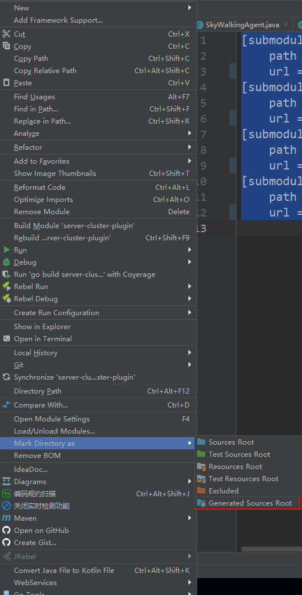

# skywalking源码环境搭建

环境Prepare JDK8+ and Maven 3.6+

### 1.克隆项目

更换为国内镜像，

```
git clone  https://github.com.cnpmjs.org/apache/skywalking.git
```

### 2.初始化更新模块

先将.gitmodules文件中对模块定义的git地址同样替换为国内镜像的地址。

```
[submodule "apm-protocol/apm-network/src/main/proto"]
   path = apm-protocol/apm-network/src/main/proto
   url = https://github.com.cnpmjs.org/apache/skywalking-data-collect-protocol.git
[submodule "oap-server/server-query-plugin/query-graphql-plugin/src/main/resources/query-protocol"]
   path = oap-server/server-query-plugin/query-graphql-plugin/src/main/resources/query-protocol
   url = https://github.com.cnpmjs.org/apache/skywalking-query-protocol.git
[submodule "skywalking-ui"]
   path = skywalking-ui
   url = https://github.com.cnpmjs.org/apache/skywalking-rocketbot-ui.git
[submodule "test/e2e/e2e-protocol/src/main/proto"]
   path = test/e2e/e2e-protocol/src/main/proto
   url = https://github.com.cnpmjs.org/apache/skywalking-data-collect-protocol.git
```

再进行模块的初始化和更新，==注意这一步一定要成功，失败后续步骤将无法进行==。

```
cd skywalking/
git submodule init
git submodule update
```

submodule update失败可以将失败模块的文件夹删除后重试。

如果实在无法更新成功也可以到对应的git地址，手动下载下来解压后放到path的下。

### 3.打包构建项目与依赖

./mvnw clean package -DskipTests --settings D:\Maven\apache-maven-3.6.0\conf\settings.xml

执行的setting指定到配置了国内镜像的配置文件。

以下是常用的打包项目与命令。

```
# IDEA打开Terminal执行，或是进入到skywalking目录下执行
# linux下执行
./mvnw clean package -DskipTests
# windows下执行
mvnw clean package -DskipTests
# 第二次为了避免重复构建全部源码，可以对某个模块编译并打完整包
# 编译 agent 包
./mvnw package -Pagent,dist
# 编译 backend 包并且打完整包
# 编译 UI 忽略Tests，并且打完整包
./mvnw package -Pui,dist -DskipTests
```

### 4.导入idea

将项目import project导入idea中，设置 gRPC 的**自动生成**的代码目录，为**源码**目录 

- `grpc-java` and `java` folders in **apm-protocol/apm-network/target/generated-sources/protobuf**
- `grpc-java` and `java` folders in **oap-server/server-core/target/generated-sources/protobuf**
- `grpc-java` and `java` folders in **oap-server/server-receiver-plugin/receiver-proto/target/generated-sources/fbs**
- `grpc-java` and `java` folders in **oap-server/server-receiver-plugin/receiver-proto/target/generated-sources/protobuf**
- `grpc-java` and `java` folders in **oap-server/exporter/target/generated-sources/protobuf**
- `grpc-java` and `java` folders in **oap-server/server-configuration/grpc-configuration-sync/target/generated-sources/protobuf**
- `grpc-java` and `java` folders in **oap-server/server-alarm-plugin/target/generated-sources/protobuf**
- `antlr4` folder in **oap-server/oal-grammar/target/generated-sources**

idea可能会自动配置。如果没有请手动设置。

