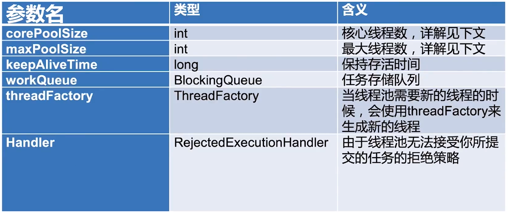
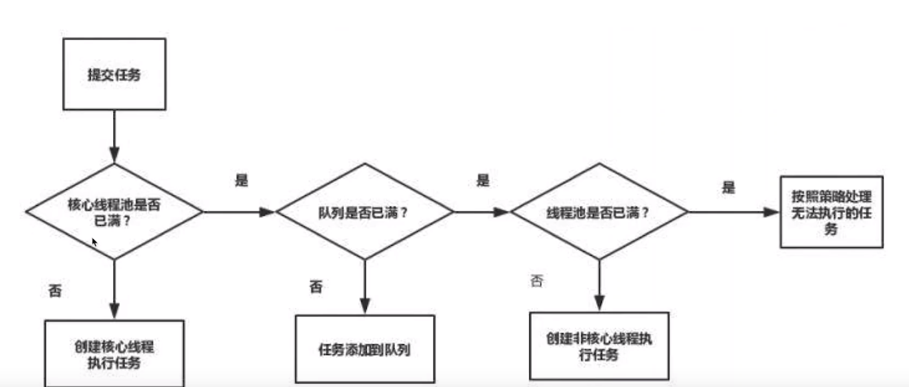
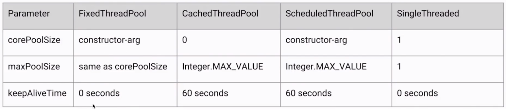

# 线程池

# 一.创建和停止线程池

## 1.构造函数

构造方法得参数

* core poolsize指的是核心线程数：线程池在完成初始化后，默认情況下，线程池中并没有任何线程，线程池会等待有任务到来时，再创建新线程去执行任务
* 线程池有可能会在核心线程数的基础上，额外增加一些线程，但是这些新增加的线程数有一个上限，这就是最大量 maxPoolsize
* 如果线程池当前的线程数多于 core poolsize，那么如果多余的线程空闲时间超过 keepAlive Time，它们就会被终止

## 2.线程添加规则

## 3.增减特点

1. 通过设置 core poolsize和 maximum Poolsize相同，就可以创建固定大小的线程池。
2. 线程池希望保持较少的线程数，并且只有在负载变得很大时才增加它。
3. 通过设置 maximum Poolsize为很高的值，例如Integer:MAX VALUE，可以允许线程池容纳任意数量的并发任务。
4. 是只有在队列填满时才创建多于 core poolsize的线程，所以如果你使用的是无界队列（例如 Linked BlockingQueue），那么线程数就不会超过 core poolsize

## 4.自动创建线程池

1. newFixed threadpool
   由于传进去的 Linked BlockingQueue是没有容量上限的所以当请求数越来越多，并且无法及时处理完毕的时候也就是请求堆积的时候，会容易造成占用大量的内存，可能会导致OOM。

2. new Single Thread Executor
   可以看出，这里和刚才的 InewFixed Thread Poo的原理基本一样，只不过把线程数直接设置成了1，所以这也会导致同样的问题，也就是当请求堆积的时候，可能会占用大量的内存。

3. newCached Thread pool
   这里的弊端在于第二个参数 maximum poolsize被设置为了 Integer. MAX_ VALUE，这可能会创建数量非常多的线程，甚至导致OOM。

   

## 5.手动创建

### a.线程数量

* CPU密集型（加密、计算hash等）：最佳线程数为CPU核心数的1-2倍左右。
* 耗时Io型（读写数据库、文件、网络读写等）：最仹线程数-般会大于cpu核心数很多倍，以M线程监控显示繁忙情况为依据，保证线程空闲可以衔接上，参考 Brain goetz
* 推荐的计算方法线程数=CPU核心数*（1+平均等待时间/平均工作时间）

## 6.停止线程池

