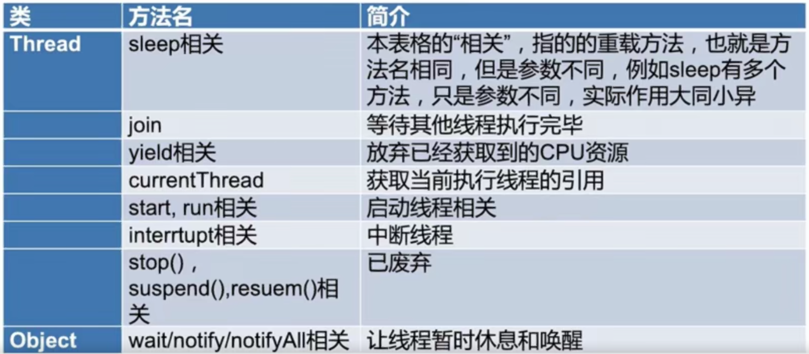

#  线程

## 一.线程的状态

* New 
* Runnable 
* Blocked 
* Waiting 
* Timed 
* Waiting 
* Terminated

### 1.阻塞状态

一般习惯而言，把 Blocked（被阻塞）、 Waiting（等待）、 Timed_waiting计时等待）都称为阻塞状态不仅仅是 Blocked

### 2.Thread和 Object类中的重要方法详解

#### a.方法概览

#### b.wait, notify, notify方法详解

##### 阻塞阶段

##### 唤醒阶段

##### 遇到中断

#### c.seep方法详解

#### d.join方法

#### e.yield方法

#### f.获取当前执行线程的引用：Thread. currentThread0方法

#### g.star和run方法

#### h.stop, suspend, resume方法