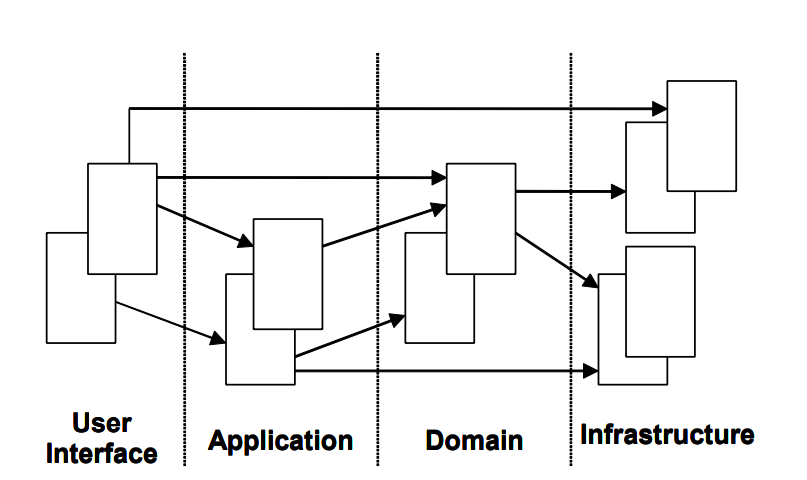

# 领域设计精简版-笔记

## 一.基本构成要素

### 1.分层架构

| 用户界面 用户界面 / 展现层 | 负责向用户展现信息以及解释用户命令。                         |
| -------------------------- | ------------------------------------------------------------ |
| 应用层                     | 很薄的一层，用来协调应用的活动。它不包含业务 逻辑。它不保留业务对象的状态，但它保有应用任务的进度状态。 |
| 领域层                     | 本层包含关于领域的信息。这是业务软件的核心所 在。在这里保留业务对象的状态，对业务对象和它 们状态的持久化被委托给了基础设施层。 |
| 基础设施层                 | 本层作为其他层的支撑库存在。它提供了层间的通 信，实现对业务对象的持久化，包含对用户界面层 的支撑库等作用。 |

#### 1).实体

有一类对象看上去好像拥有标识符，它的标识符在历经软件的各种 状态后仍能保持一致。对这些对象来讲这已经不再是它们关心的属性，这意味着能够跨越系统的生命周期甚至能超越软件系统的一系 列的延续性和标识符。我们把这样的对象称为实体。

当一个对象可以用其标识符而不是它的属性来区分时，可以将它作 为模型中的主要定义。保证类定义简洁并关注生命周期的延续性和 可标识性。对每个对象定义一个有意义的区分，而不管它的形式或 者历史。警惕要求使用属性匹配对象的需求。定义一个可以保证对 每一个对象产生一个唯一的结果的操作，这个过程可能需要某个符 号以保证唯一性。这意味着标识可以来自外部，或者它可以是由系 统产生、使用任意的标识符，但它必须符合模型中的身份差别。模 型必须定义哪些被看作同一事物。

 实体是领域模型中非常重要的对象，并且它们应该在建模过程开始 时就被考虑。决定一个对象是否需要成为一个实体也很重要，这会 在下一个模型中被讨论。

#### 2).值对象

我们对某个 对象是什么不感兴趣，只关心它拥有的属性。用来描述领域的特殊 方面、且没有标识符的一个对象，叫做值对象。

区分实体对象和值对象非常必要。出于要统一的缘故而将所有对象 处理成实体对象并没有太大帮助。实际上，只建议选择那些符合实 体定义的对象作为实体，将剩下的对象处理成值对象这会简化设计，并且将会产生某些其他的积极的意义。 

没有标识符，值对象就可以被轻易地创建或者丢弃。没有人关心创 建一个标识符，在没有其他对象引用时，垃圾回收会处理这个对 象。这极大简化了设计。

如果值对象是可共享的，那么它们应该是不可变的。 值对象应该保持尽量的简单。当其他当事人需要一个值对象时，可 以简单地传递值，或者创建一个副本。制作一个值对象的副本是非 常简单的，通常不会有什么副作用。如果没有标识符，你可以按你 所需创建若干副本，然后根据需要来销毁它们。

#### 3).服务

有些领域中的动作，它们是一些动作，看上去却不属于任何对象。它们代表了领域中的一个重要的行为，所以不能忽略它们或者简单的把它们合 并到某个实体或者值对象中。给一个对象增加这样的行为会破坏这 个对象，让它看上去拥有了本该属于它的功能。但是，要使用一种 面向对象语言，我们必须用到一个对象才行。我们不能只拥有一个 单独的功能，它必须附属于某个对象。通常这种行为类的功能会跨 越若干个对象，或许是不同的类。例如，为了从一个账户向另一个 账户转钱，这个功能应该放到转出的账户还是在接收的账户中？感 觉放在这两个中的哪一个也不对劲。

一个服务应该不是对通常属于领域对象的操作的替代。我们不应该 为每一个需要的操作来建立一个服务。但是当一个操作凸现为一个领域中的重要概念时，就需要为它建立一个服务了。以下是服务的 3 个特征：

1. 服务执行的操作涉及一个领域概念，这个领域概念通常不属于一 个实体或者值对象。
2. 被执行的操作涉及到领域中的其他的对象。
3. .操作是无状态的。

#### 4).模块

对一个大型的复杂项目而言，模型趋向于越来越大。模型到达了一 个作为整体很难讨论的点，理解不同部件之间的关系和交互变得很 困难。基于此原因，很有必要将模型组织进模块。模块被用来作为 组织相关概念和任务以便降低复杂性的一种方法。

#### 5).聚合

聚合是针对数据变化可以考虑成一个单元的一组 相关的对象。聚合使用边界将内部和外部的对象划分开来。每个聚合有一个根。这个根是一个实体，并且它是外部可以访问的唯一的 对象。根可以保持对任意聚合对象的引用，并且其他的对象可以持 有任意其他的对象，但一个外部对象只能持有根对象的引用。如果 边界内有其他的实体，那些实体的标识符是本地化的，只在聚合内 有意义。

聚合是如何保持数据一致性和强化不变量的呢？因为其他对象只能 持有根对象的引用，这意味着它们不能直接变更聚合内的其他的对 象。它们所能做的就是对根进行变更，或者让根来执行某些活动。 根能够变更其他的对象，但这是聚合内包含的操作，并且它是可控 的。如果根从内存中被删除或者移除，聚合内的其他所有的对象也 将被删除，因为再不会有其他的对象持有它们当中的任何一个了。 当针对根对象的修改间接影响到聚合内的其他的对象，强化不变量 变得简单了，因为根将做这件事情。如果外部对象能直接访问内部 对象并且变更它们时，这将变得越发困难。在这种情况下想强化不 变量意味着讲某些逻辑放到外部对象中去处理，这不是我们所期望的。

#### 6).工厂

工厂用来封装对象创建所必 需的知识，它们对创建聚合特别有用。当聚合的根建立时，所有聚 合包含的对象将随之建立，所有的不变量得到了强化。 将创建过程原子化非常重要。如果不这样做，创建过程就会存在对 某个对象执行了一半操作的机会，将这些对象置于未定义的状态， 对聚合而言更是如此。当根被创建时，所有对象服从的不变量也必 须被创建完毕，否则，不变量将不能得到保证。对不变的值对象而 言则意味着所有的对象被初始化成有效的状态。如果一个对象不能 被正常创建，将会产生一个异常，确保没有返回一个无效值。

实体工厂和值对象工厂是有差异的。值通常是不可变的对象，并且 其所有的必需的属性需要在创建时完成。当一个对象被创建时，它是有效的，也是最终的，不会再发生变化。实体是非不可变的。它们会在以后发生变化，前面提及过设置某些属性时需要考虑所有的 不变量。另一个差异源于实体需要标识符，而值对象不需要。

有时工厂是不需要的，一个简单的构造函数就足够了。在如下情况 下使用构造函数：

* 构造过程并不复杂。
* 对象的创建不涉及到其他对象的创建，所有的属性需要传递给构造函数。
* 客户程序对实现很感兴趣，可能希望选择使用策略模式。
* 类是特定的类型，不涉及到继承，所以不用在一系列的具体实现中进行选择。

#### 7).资源库

资源库会保存对某些对象的引用。当一个对象被创建出来时，它可以被保存到资源库中，然后以后使用时可从资源库中检索到。如果客户程序从资源库中请求一个对象，而资源库中并没有它，就会从 存储介质中获取它。换种说法是，资源库作为一个全局的可访问对 象的存储点而存在。

