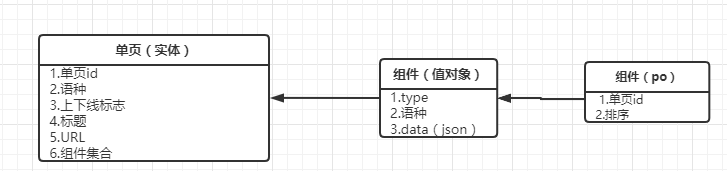

# 领域驱动设计

## 一.实体

有一类对象看上去好像拥有标识符，它的标识符在历经软件的各种 状态后仍能保持一致。对这些对象来讲这已经不再是它们关心的属性，这意味着能够跨越系统的生命周期甚至能超越软件系统的一系 列的延续性和标识符。我们把这样的对象称为实体。

### 1.不要从数据库中出发

如果将关注点放到数据库中的模型就会导致大量的贫血模型和无法分清值对象和实体。

#### 例

由于从数据库的方式考虑：为了防止单字段的长度过大，将其拆分为了两个实体。它们都具有唯一标识来进行关联。

#### 改

将组件设计为值对象：

* 因为组件本身就是单页的一部分
* 组件没有单独进行的事件是依赖于单页
* 在持久化时可以进行分表存储

### 2.不要将实体或者聚合业务放到领域服务中处理

将原本属于实体的构建获取变更值的业务放到service获取application中处理会导致实体再次变得贫血，变成了属性字段的装载器。

### 3.抽离出领域事件

什么是一个事件：对聚合或者实体产生了修改，丢失了这个操作就无法还原出正确的聚合或者实体。

为什么要使用领域事件：

* 能让两个系统解耦
* 使两个系统保持一致
* 方便后续扩展

### 4.领域事件是原子的

由于领域事件是聚合或者实体的事件，一个事件是对实体原子操作的描述，所以一个领域事必须是原子的，他的消费者也是事务的。

### 5.Repository也可以是事件的直接消费者

Repository：

* 事件本身的仓储
* 消费事件对快照进行仓储

当发生事件后Repository可以直接消费事件以更新DB中的快照。

### 6.实体的唯一标识不可修改

当实体被创建还原出来后其唯一标识就是不可修改的，因为只有唯一标识才能代表实体的唯一性。

### 7.共享值对象也是不可修改的

当一个值对象可以被多个实体进行持有时，那这个值对象是不能被修改的只能被替换。

### 8.没有其他技术实现的服务没有独立接口的必要

当一个service在技术和业务上没有其他的实现方式时，没有必要为其创建一个独立接口并将其与实现类分离在不同的层和模块中。