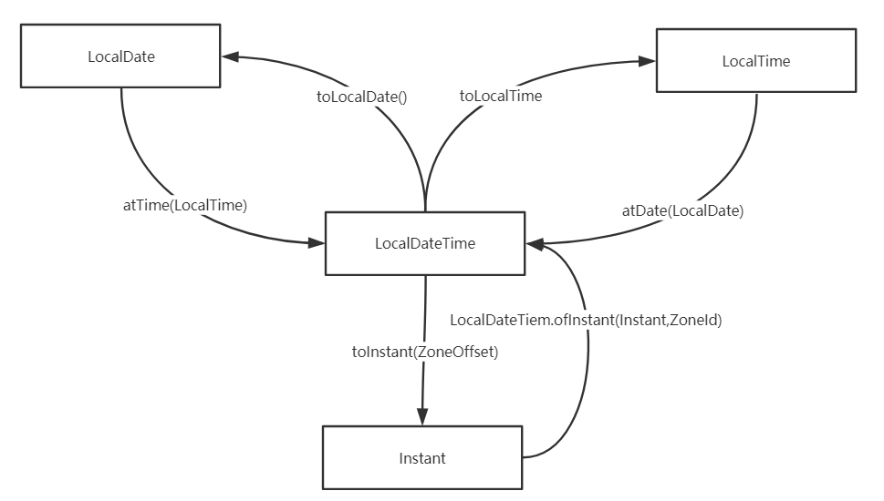

## 前言

从现实上看，Java8以前似乎没有对日期API特别重视，如比较常用的`Date`类，并没有一个专门的包进行囊括，而`SimpleDateFormat`作为一个常用的日期格式化工具类，居然放在了`java.text`包下。

甚至`SimpleDateFormat`在多线程访问的情况下可能还会引起异常，JDK的原文如是`If multiple threads access a format concurrently, it must be synchronized`。

这些类中，对于日期的操作方法也是很让人费解，不好掌握，而且很多的方法都是已经过时。

天下早已苦之旧矣！*（难怪我之前学这块学的不好，原来是有原因的）*

而在Java8之后，对于日期的相关操作已经容易了很多，让我们一起来了解一下吧！


## 日期时间


关于日期、时间有三个常用的类：

- LocalDateTime：默认的日期格式，yyyy-MM-dd HH:mm:ss.fff
- LocalDate：yyyy-MM-dd
- LocalTime：HH:mm:ss.fff

从上面日期的格式化上看，`LocalDateTime = LocalDate + LocalTime`

`LocalDate就是年月日类`

`LocalTime就是时分秒类`


需要注意的一点是，这三个类默认都是取的`本地时区（系统的默认时区）`，因为地理位置的不同，时间的表示也存在差异，目前国内使用的是` 上海的时区，Asia/Shanghai`


`从LocalDateTime 中，可以很简单的获得LocalDate和LocalTime`

```java
LocalDateTime now = LocalDateTime.now();
LocalDate localDate = now.toLocalDate();
LocalTime localTime = now.toLocalTime();
```


`LocalDate也可以加上LocalTime，进而转为LocalDateTime `

```java
LocalDateTime localDateTime = localDate.atTime(localTime);
```


LocalTime亦然

```java
LocalDateTime localDateTime = localTime.atDate(localDate);
```


三个日期类的方法比较雷同，这里演示一下`LocalDateTime`的使用


```java
LocalDateTime now = LocalDateTime.now();
System.out.println("也可以指定时间：" + LocalDateTime.of(2020, 4, 15, 9, 30, 2));

System.out.println("当前时刻：" + now);
System.out.println("当前年：" + now.getYear());
System.out.println("当前月：" + now.getMonthValue());
System.out.println("当前日：" + now.getDayOfMonth());
System.out.println("当前时：" + now.getHour());
System.out.println("当前分：" + now.getMinute());
System.out.println("当前秒：" + now.getSecond());

System.out.println("加2年：" + now.plusYears(2l));
System.out.println("减3个月：" + now.minusMonths(3l));
System.out.println("减50天：" + now.minusDays(50l));
System.out.println("跳到2035年基本实现社会主义现代化：" + now.withYear(2035));
System.out.println("每次计算都会返回一个新对象，原来的对象不会受影响哦！" + now);
```


这些简单的API调用各位小伙伴了解一下，有个印象即可，在编码的时候，有代码提示，编程障碍比较小。而`日期、时间、时间戳的互相转换和格式化`，才是重点，这方面不熟悉，会造成比较大的编程障碍。


## 时区


Java8提供了`ZoneId`标识各个国家所使用的时区


可以使用`systemDefault()`方法获得当前系统的默认时区，如Asia/Shanghai

```java
ZoneId zoneId = ZoneId.systemDefault();
```


获取所有的时区

```java
Set<String> zoneIds = ZoneId.getAvailableZoneIds();
```


根据时区名获取时区对象

```java
ZoneId zoneId = ZoneId.of("Asia/Shanghai");
```


带时区的日期时间，`ZonedDateTime`，该类的日期格式与`LocalDateTime`的区别是，在尾部增加了时区。没有衍生的`ZonedDate`和`ZonedTime`。


如：获取当前带时区的日期时间并打印

```java
System.out.println(ZonedDateTime.now());
```


打印结果：

```java
2020-07-07T15:17:23.737+08:00[Asia/Shanghai]
```


## 时间戳


计算机中的时间戳，是指格林威治时间1970年01月01日00时00分00秒(北京时间1970年01月01日08时00分00秒)起至现在的总秒数。


时间戳用`Instant`类进行表示

Unix元年的时间戳

```java
Instant.EPOCH
```


获得当前的时间戳

```java
Instant now = Instant.now();
```


将时间戳转为总秒数

```java
long second = now.getEpochSecond();
```


将时间转为总毫秒值

```java
long second = now.toEpochMilli();
```


转秒数的方法是`getEpochSecond()`，转毫秒值的方法是`toEpochMilli()`，方法名规范好像有问题，不知道是什么高深的原因？


`时间戳配合时区生成LocalDateTime`

```java
Instant now = Instant.now();
LocalDateTime dateTime = LocalDateTime.ofInstant(now, ZoneId.systemDefault());
```


转换的示例图




## 格式化


对比以往格式化使用的SimpleDateFormat， `DateTimeFormatter`是最新的日期格式化类，提供很多了预定义的时间格式。


以LocalDateTime举例，下面是一些简单的日期时间格式化操作：

```java
LocalDateTime now = LocalDateTime.now();
System.out.println("yyyy-MM-dd HH:mm:ss.fff : " + now.format(DateTimeFormatter.ISO_LOCAL_DATE_TIME));
System.out.println("yyyy-MM-dd : " + now.format(DateTimeFormatter.ISO_LOCAL_DATE));
System.out.println("HH:mm:ss.fff : " + now.format(DateTimeFormatter.ISO_LOCAL_TIME));
// 自定义格式化
System.out.println(now.format(DateTimeFormatter.ofPattern("yyyy年MM月dd日 HH:mm:ss")));
```


打印结果：

```java
yyyy-MM-dd HH:mm:ss.fff : 2020-07-07T19:21:24.728 //相当于没格式化哈哈
yyyy-MM-dd : 2020-07-07
HH:mm:ss.fff : 19:21:24.728
2020年07月07日 19:21:24
```


从上面可以看出来

`ISO_LOCAL_DATE_TIME = ISO_LOCAL_DATE + ISO_LOCAL_TIME`，其中的ISO是指国际标准化组织的缩写


`DateTimeFormatter`也可以格式化时间戳，不过需要注意的是，必须指定时区，没有时区，格式化程序将不知道如何将即时转换为人类日期时间字段，因此会引发异常。

示例代码：

```java
DateTimeFormatter formatter = DateTimeFormatter.ISO_LOCAL_DATE_TIME.withZone(ZoneId.systemDefault());
System.out.println(formatter.format(Instant.now()));
```


打印结果：

```java
2020-07-07T19:42:28.805
```

时间戳自定义格式化与上面`LocalDateTime`的相同，不过多赘述。


## 时间段


关于时间段，有两个常用的操作类，一个是`Duration`，另一个是`Period`，`Period用于计算日期， Duration用于计算时间`，如下：

- Duration：时秒分
- Period：年月日 


这两个类的方法都差不多，我们以`Duration`进行演示：


获得当前时间与未来时分秒的时间段：

```java
LocalTime now = LocalTime.now();
LocalTime hour = now.plusHours(2);
LocalTime minute = now.plusMinutes(10);
LocalTime second = now.plusSeconds(30);
System.out.println(Duration.between(now, hour));
System.out.println(Duration.between(now, minute));
System.out.println(Duration.between(now, second));
```


打印结果：

```java
PT2H
PT10M
PT30S
```

注意，默认的打印结果为`ISO国际标准化组织`规定的日期格式，`PT2H中的H，表示Hour小时，M代表Minute分钟，S代表Second秒数`


其他示例操作：

```java
LocalTime now = LocalTime.now();
LocalTime hour = now.plusHours(2);
Duration duration = Duration.between(now, hour);
System.out.println("获取时间段的秒数：" + duration.getSeconds());
System.out.println("获取时间段的毫秒数：" +duration.toMillis());
System.out.println("获取时间段的天数：" +duration.toDays());
```


打印结果：

 ```java
获取时间段的秒数：7200
获取时间段的毫秒数：7200000
获取时间段的天数：0
 ```


`Duration`类也有相关的时分秒加减方法，不过多赘述。


## 调整器


`LocalDateTime、Duration、Instant`等，尽管已经提供了很多日期加减的方法，但还是比较局限性，如`下个星期天`，`下个结婚生日`等需求便难以满足。

为此，我们可以使用，调整器进行日期的调整。


日期校正器类为`TemporalAdjuster`，该类是一个接口，而Java8 也提供了其实现的工具类，`TemporalAdjusters`一些的使用方法如下:

```java
LocalDateTime now = LocalDateTime.now();
System.out.println("当前时间:"+now);
System.out.println("下周日:" + now.with(TemporalAdjusters.next(DayOfWeek.SUNDAY)));
System.out.println("下个月的第一天:" + now.with(TemporalAdjusters.firstDayOfNextMonth()));
System.out.println("下一个工作日:" + now.with(l -> {
    LocalDateTime dateTime = (LocalDateTime) l;
    //先获取周几
    DayOfWeek dayOfWeek = dateTime.getDayOfWeek();
    if (DayOfWeek.FRIDAY.equals(dayOfWeek)){
        //周五加三天等于工作日
        return dateTime.plusDays(3);
    }else if(DayOfWeek.SATURDAY.equals(dayOfWeek)){
        //周六加两天
        return dateTime.plusDays(2);
    }
    //其他均加一天
    return dateTime.plusDays(1);
}));
```


打印结果：

```java
当前时间:2020-07-08T00:10:05.549
下周日:2020-07-12T00:10:05.549
下个月的第一天:2020-08-01T00:10:05.549
下一个工作日:2020-07-09T00:10:05.549
```


 `DayOfWeek`这个类，有七个常量值，分别为周一到周日，如`MONDAY,TUESDAY,WEDNESDAY`等。


## Date转换


`Date`类目前有很多过时、不推荐的方法，如果项目中有使用到该类的话，可以考虑进行替换。


新的日期API可以使用`时间戳的毫秒值`通过`Date`类的构造方法，new一个`Date`对象

如下：

```java
long milli = Instant.now().toEpochMilli();
Date date = new Date(milli);
```

`特别注意！该构造方法传的单位是毫秒值`


`Date`可以通过toInstant方法转换为一个时间戳

```java
Instant instant = new Date().toInstant();
```


