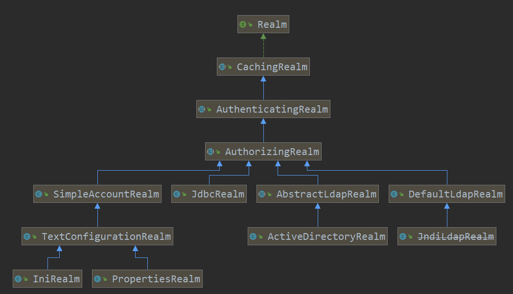
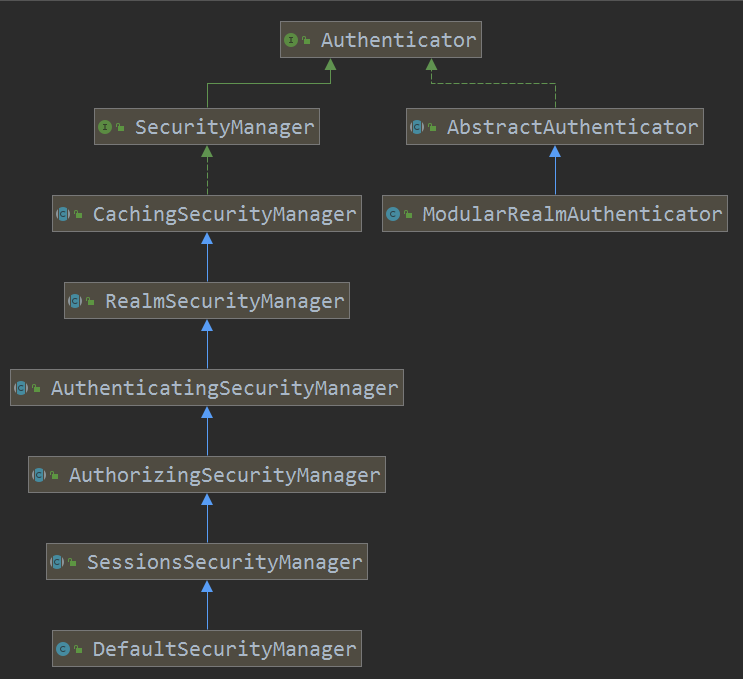

# Shiro

## 一.Shiro简介

参考资料：

https://www.iteye.com/blog/jinnianshilongnian-2049092

https://gitee.com/UnlimitedBladeWorks_123/spring-biz-module/tree/master/win-security

https://www.v2ex.com/t/536855

### 1.API

Apache Shiro是Java的一个安全框架。目前，使用Apache Shiro的人越来越多，因为它相当简单，对比Spring Security，可能没有Spring Security做的功能强大，但是在实际工作时可能并不需要那么复杂的东西，所以使用小而简单的Shiro就足够了。


**Authentication**：身份认证/登录，验证用户是不是拥有相应的身份；

**Authorization**：授权，即权限验证，验证某个已认证的用户是否拥有某个权限；即判断用户是否能做事情，常见的如：验证某个用户是否拥有某个角色。或者细粒度的验证某个用户对某个资源是否具有某个权限；

**Session Manager**：会话管理，即用户登录后就是一次会话，在没有退出之前，它的所有信息都在会话中；会话可以是普通JavaSE环境的，也可以是如Web环境的；

**Cryptography**：加密，保护数据的安全性，如密码加密存储到数据库，而不是明文存储；

**Web Support**：Web支持，可以非常容易的集成到Web环境；

**Caching**：缓存，比如用户登录后，其用户信息、拥有的角色/权限不必每次去查，这样可以提高效率；

**Concurrency**：shiro支持多线程应用的并发验证，即如在一个线程中开启另一个线程，能把权限自动传播过去；

**Testing**：提供测试支持；

**Run As**：允许一个用户假装为另一个用户（如果他们允许）的身份进行访问；

**Remember Me**：记住我，这个是非常常见的功能，即一次登录后，下次再来的话不用登录了。

### 2.外部使用结构

从外部使用的角度来看，即程序如何使用和接入shiro。

 

**Subject**：主体，代表了当前“用户”，这个用户不一定是一个具体的人，与当前应用交互的任何东西都是Subject，如网络爬虫，机器人等；即一个抽象概念；所有Subject都绑定到SecurityManager，与Subject的所有交互都会委托给SecurityManager；可以把Subject认为是一个门面；SecurityManager才是实际的执行者；

**SecurityManager**：安全管理器；即所有与安全有关的操作都会与SecurityManager交互；且它管理着所有Subject；可以看出它是Shiro的核心，它负责与后边介绍的其他组件进行交互，如果学习过SpringMVC，你可以把它看成DispatcherServlet前端控制器；

**Realm**：域，Shiro从从Realm获取安全数据（如用户、角色、权限），就是说SecurityManager要验证用户身份，那么它需要从Realm获取相应的用户进行比较以确定用户身份是否合法；也需要从Realm得到用户相应的角色/权限进行验证用户是否能进行操作；可以把Realm看成DataSource，即安全数据源。

也就是说对于我们而言，最简单的一个Shiro应用：

1、应用代码通过Subject来进行认证和授权，而Subject又委托给SecurityManager；

2、我们需要给Shiro的SecurityManager注入Realm，从而让SecurityManager能得到合法的用户及其权限进行判断。

### 3.Shiro架构


**Subject**：主体，可以看到主体可以是任何可以与应用交互的“用户”；

**SecurityManager**：相当于SpringMVC中的DispatcherServlet或者Struts2中的FilterDispatcher；是Shiro的心脏；所有具体的交互都通过SecurityManager进行控制；它管理着所有Subject、且负责进行认证和授权、及会话、缓存的管理。

**Authenticator**：认证器，负责主体认证的，这是一个扩展点，如果用户觉得Shiro默认的不好，可以自定义实现；其需要认证策略（Authentication Strategy），即什么情况下算用户认证通过了；

**Authrizer**：授权器，或者访问控制器，用来决定主体是否有权限进行相应的操作；即控制着用户能访问应用中的哪些功能；

**Realm**：可以有1个或多个Realm，可以认为是安全实体数据源，即用于获取安全实体的；可以是JDBC实现，也可以是LDAP实现，或者内存实现等等；由用户提供；注意：Shiro不知道你的用户/权限存储在哪及以何种格式存储；所以我们一般在应用中都需要实现自己的Realm；

**SessionManager**：如果写过Servlet就应该知道Session的概念，Session呢需要有人去管理它的生命周期，这个组件就是SessionManager；而Shiro并不仅仅可以用在Web环境，也可以用在如普通的JavaSE环境、EJB等环境；所有呢，Shiro就抽象了一个自己的Session来管理主体与应用之间交互的数据；这样的话，比如我们在Web环境用，刚开始是一台Web服务器；接着又上了台EJB服务器；这时想把两台服务器的会话数据放到一个地方，这个时候就可以实现自己的分布式会话（如把数据放到Memcached服务器）；

**SessionDAO**：DAO大家都用过，数据访问对象，用于会话的CRUD，比如我们想把Session保存到数据库，那么可以实现自己的SessionDAO，通过如JDBC写到数据库；比如想把Session放到Memcached中，可以实现自己的Memcached SessionDAO；另外SessionDAO中可以使用Cache进行缓存，以提高性能；

**CacheManager**：缓存控制器，来管理如用户、角色、权限等的缓存的；因为这些数据基本上很少去改变，放到缓存中后可以提高访问的性能

**Cryptography**：密码模块，Shiro提高了一些常见的加密组件用于如密码加密/解密的。


## 二.身份验证

### 1.身份认证流程

```java
@Test
public void testHelloworld() {
    //1、获取SecurityManager工厂，此处使用Ini配置文件初始化SecurityManager
    Factory<SecurityManager> factory =
            new IniSecurityManagerFactory("classpath:shiro.ini");
    //2、得到SecurityManager实例 并绑定给SecurityUtils
    SecurityManager securityManager = factory.getInstance();
    SecurityUtils.setSecurityManager(securityManager);
    //3、得到Subject及创建用户名/密码身份验证Token（即用户身份/凭证）
    Subject subject = SecurityUtils.getSubject();
    UsernamePasswordToken token = new UsernamePasswordToken("zhang", "123");
    try {
        //4、登录，即身份验证
        subject.login(token);
    } catch (AuthenticationException e) {
        //5、身份验证失败
    }
    Assert.assertEquals(true, subject.isAuthenticated()); //断言用户已经登录
    //6、退出
    subject.logout();
}
```

1. 首先调用Subject.login(token)进行登录，其会自动委托给Security Manager，调用之前必须通过SecurityUtils. setSecurityManager()设置；
2. SecurityManager负责真正的身份验证逻辑；它会委托给Authenticator进行身份验证；
3. Authenticator才是真正的身份验证者，Shiro API中核心的身份认证入口点，此处可以自定义插入自己的实现；
4. Authenticator可能会委托给相应的AuthenticationStrategy进行多Realm身份验证，默认ModularRealmAuthenticator会调用AuthenticationStrategy进行多Realm身份验证；
5. Authenticator会把相应的token传入Realm，从Realm获取身份验证信息，如果没有返回/抛出异常表示身份验证失败了。此处可以配置多个Realm，将按照相应的顺序及策略进行访问。

### 2.Realm

Realm：域，Shiro从从Realm获取安全数据（如用户、角色、权限），就是说SecurityManager要验证用户身份，那么它需要从Realm获取相应的用户进行比较以确定用户身份是否合法；也需要从Realm得到用户相应的角色/权限进行验证用户是否能进行操作；可以把Realm看成DataSource，即安全数据源。如我们之前的ini配置方式将使用org.apache.shiro.realm.text.IniRealm。

接口如下

1. String getName(); //返回一个唯一的Realm名字 
2. boolean supports(AuthenticationToken token); //判断此Realm是否支持此Token 
3. AuthenticationInfo getAuthenticationInfo(AuthenticationToken token) throws  AuthenticationException; //根据Token获取认证信息 

#### 1).自定义Realm

1.自定义Realm实现

2.ini配置文件指定自定义Realm实现

```ini
#声明一个realm  
myRealm1= com.demo.MyRealm1
#指定securityManager的realms实现  
securityManager.realms=$myRealm1
```

3.指定新的ini配置的引用

#### 2).Realm层级关系



### 3.Authenticator与AuthenticationStrategy

Authenticator职责是验证用户账号，是Shiro API中身份验证核心的入口点；



ModularRealmAuthenticator委托给多个Realm进行验证，验证规则通过AuthenticationStrategy接口指定，默认提供的实现：

**FirstSuccessfulStrategy**：只要有一个Realm验证成功即可，只返回第一个Realm身份验证成功的认证信息，其他的忽略；

**AtLeastOneSuccessfulStrategy**：只要有一个Realm验证成功即可，和FirstSuccessfulStrategy不同，返回所有Realm身份验证成功的认证信息；

**AllSuccessfulStrategy**：所有Realm验证成功才算成功，且返回所有Realm身份验证成功的认证信息，如果有一个失败就失败了。

## 三.授权

### 1.授权方式

编程式

```java
Subject subject = SecurityUtils.getSubject();  
if(subject.hasRole(“admin”)) {  
    //有权限  
} else {  
    //无权限  
}   
```

注解式

```java
@RequiresRoles("admin")  
public void hello() {  
    //有权限  
} 
```

JSP/GSP标签

```jsp
<shiro:hasRole name="admin">  
<!— 有权限 —>  
</shiro:hasRole>   
```

### 2.授权

 基于角色的访问控制（隐试角色）

```ini
[users]  
zhang=123,role1,role2  
wang=123,role1   
```

```java
    //判断拥有角色：role1  
    Assert.assertTrue(subject().hasRole("role1"));  
    //判断拥有角色：role1 and role2  
    Assert.assertTrue(subject().hasAllRoles(Arrays.asList("role1", "role2")));  
    //判断拥有角色：role1 and role2 and !role3  
    boolean[] result = subject().hasRoles(Arrays.asList("role1", "role2", "role3")); 
    //断言拥有角色：role1  
    subject().checkRole("role1");  
    //断言拥有角色：role1 and role3 失败抛出异常  
    subject().checkRoles("role1", "role3");  

```

根据用户名找到角色，然后根据角色再找到权限；即角色是权限集合；Shiro同样不进行权限的维护，需要我们通过Realm返回相应的权限信息。只需要维护“用户——角色”之间的关系即可。

基于资源的访问控制（显示角色）

```ini
[users]  
zhang=123,role1,role2  
wang=123,role1  
[roles]  
role1=user:create,user:update  
role2=user:create,user:delete 
```

```java
    //判断拥有权限：user:create  
    Assert.assertTrue(subject().isPermitted("user:create"));  
    //判断拥有权限：user:update and user:delete  
    Assert.assertTrue(subject().isPermittedAll("user:update", "user:delete"));  
    //判断没有权限：user:view  
    Assert.assertFalse(subject().isPermitted("user:view")); 
    //断言拥有权限：user:create  
    subject().checkPermission("user:create");  
    //断言拥有权限：user:delete and user:update  
    subject().checkPermissions("user:delete", "user:update");  
    //断言拥有权限：user:view 失败抛出异常  
    subject().checkPermissions("user:view"); 
```

### 3.字符串通配符权限

规则：“资源标识符：操作：对象实例ID” 即对哪个资源的哪个实例可以进行什么操作。其默认支持通配符权限字符串，“:”表示资源/操作/实例的分割；“,”表示操作的分割；“*”表示任意资源/操作/实例。

#### 1.单个资源单个权限 

```java
subject().checkPermissions("system:user:update");  
```

用户拥有资源“system:user”的“update”权限。

#### 2.单个资源多个权限

```ini
role41=system:user:update,system:user:delete  
role42="system:user:update,delete"  
```

```java
subject().checkPermissions("system:user:update", "system:user:delete");  
subject().checkPermissions("system:user:update,delete");  
```

通过“system:user:update,delete”验证"system:user:update, system:user:delete"是没问题的，但是反过来是规则不成立。

#### 3.单个资源全部权限

```ini
role51="system:user:create,update,delete,view" 
role52=system:user:*  
role53=system:user
```

```java
subject().checkPermissions("system:user:create,delete,update:view");  
subject().checkPermissions("system:user:*");  
subject().checkPermissions("system:user");  
```

#### 4.所有资源全部权限

```ini
role61=*:view  
```

```java
subject().checkPermissions("user:view");
```

#### 5.实例级别的权限

```ini
role71=user:view:1  //单个实例单个权限
role72="user:update,delete:1"  //单个实例多个权限
role73=user:*:1  //单个实例所有权限
role74=user:auth:* //所有实例单个权限
role75=user:*:* //所有实例所有权限
```

```java
subject().checkPermissions("user:view:1");  

subject().checkPermissions("user:delete,update:1");  
subject().checkPermissions("user:update:1", "user:delete:1"); 

subject().checkPermissions("user:update:1", "user:delete:1", "user:view:1");  

subject().checkPermissions("user:auth:1", "user:auth:2");  

subject().checkPermissions("user:view:1", "user:auth:2");  
```

### 4.授权流程

