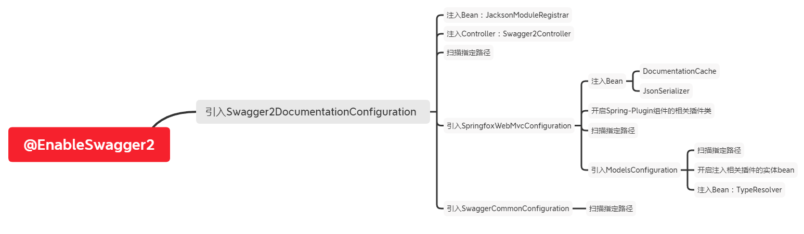

# spring-fox(一)程序入口

## 一.Swagger规范

swagger规定了对于api描述的规范：OpenAPI

https://github.com/OAI/OpenAPI-Specification/tree/master/versions

一个标准的Swagger接口规范可能类似上面的JSON文件,主要有以下属性:

- **swagger**:当前swagger的版本号
- **info**:文档的基础信息,包括描述信息,标题、作者、host等
- **tags**：分组tag标志
- **paths**:接口明细集合
- **securityDefinitions**:权限信息
- **definitions**：接口涉及到的Model类型定义

## 二.使用

在使用swagger时主要有两步

1. 创建`Docket`实例对象，并将其注入到Spring容器中
2. 在application类中添加`@EnableSwaggger2`注解

## 三.分析

### @EnableSwaggger2

EnableSwaggger2注解作用是引入`Swagger2DocumentationConfiguration`类

```java
@Retention(value = java.lang.annotation.RetentionPolicy.RUNTIME)
@Target(value = { java.lang.annotation.ElementType.TYPE })
@Documented
@Import({Swagger2DocumentationConfiguration.class})
public @interface EnableSwagger2 {
}
```

### Swagger2DocumentationConfiguration

```java
@Configuration
@Import({ SpringfoxWebMvcConfiguration.class, SwaggerCommonConfiguration.class })
@ComponentScan(basePackages = {
    "springfox.documentation.swagger2.mappers"
})
@ConditionalOnWebApplication
public class Swagger2DocumentationConfiguration {
  @Bean
  public JacksonModuleRegistrar swagger2Module() {
    return new Swagger2JacksonModule();
  }

  @Bean
  public HandlerMapping swagger2ControllerMapping(
      Environment environment,
      DocumentationCache documentationCache,
      ServiceModelToSwagger2Mapper mapper,
      JsonSerializer jsonSerializer) {
    return new PropertySourcedRequestMappingHandlerMapping(
        environment,
        new Swagger2Controller(environment, documentationCache, mapper, jsonSerializer));
  }
}
```

config类主要的作用是：

1. 加入`JacksonModuleRegistrar`Bean到Spring容器中
2. 注入一个`HandlerMapping`Bean到Spring容器中
3. 扫描`springfox.documentation.swagger2.mappers`路径，进行Bean的注入
4. 引入`SpringfoxWebMvcConfiguration`和`SwaggerCommonConfiguration`

#### Swagger2Controller

```java
@Controller
@ApiIgnore
public class Swagger2Controller {

  public static final String DEFAULT_URL = "/v2/api-docs";
  private static final Logger LOGGER = LoggerFactory.getLogger(Swagger2Controller.class);
  private static final String HAL_MEDIA_TYPE = "application/hal+json";

  private final String hostNameOverride;
  private final DocumentationCache documentationCache;
  private final ServiceModelToSwagger2Mapper mapper;
  private final JsonSerializer jsonSerializer;

  @Autowired
  public Swagger2Controller(
      Environment environment,
      DocumentationCache documentationCache,
      ServiceModelToSwagger2Mapper mapper,
      JsonSerializer jsonSerializer) {

    this.hostNameOverride =
        environment.getProperty(
            "springfox.documentation.swagger.v2.host",
            "DEFAULT");
    this.documentationCache = documentationCache;
    this.mapper = mapper;
    this.jsonSerializer = jsonSerializer;
  }

  @RequestMapping(
      value = DEFAULT_URL,
      method = RequestMethod.GET,
      produces = { APPLICATION_JSON_VALUE, HAL_MEDIA_TYPE })
  @PropertySourcedMapping(
      value = "${springfox.documentation.swagger.v2.path}",
      propertyKey = "springfox.documentation.swagger.v2.path")
  @ResponseBody
  public ResponseEntity<Json> getDocumentation(
      @RequestParam(value = "group", required = false) String swaggerGroup,
      HttpServletRequest servletRequest) {

    String groupName = Optional.fromNullable(swaggerGroup).or(Docket.DEFAULT_GROUP_NAME);
    Documentation documentation = documentationCache.documentationByGroup(groupName);
    if (documentation == null) {
      LOGGER.warn("Unable to find specification for group {}", groupName);
      return new ResponseEntity<Json>(HttpStatus.NOT_FOUND);
    }
    Swagger swagger = mapper.mapDocumentation(documentation);
    UriComponents uriComponents = componentsFrom(servletRequest, swagger.getBasePath());
    swagger.basePath(Strings.isNullOrEmpty(uriComponents.getPath()) ? "/" : uriComponents.getPath());
    if (isNullOrEmpty(swagger.getHost())) {
      swagger.host(hostName(uriComponents));
    }
    return new ResponseEntity<Json>(jsonSerializer.toJson(swagger), HttpStatus.OK);
  }

  private String hostName(UriComponents uriComponents) {
    if ("DEFAULT".equals(hostNameOverride)) {
      String host = uriComponents.getHost();
      int port = uriComponents.getPort();
      if (port > -1) {
        return String.format("%s:%d", host, port);
      }
      return host;
    }
    return hostNameOverride;
  }
}
```

从代码中得知：

* swaggerController定义了一个接口`/v2/api-docs`
* 接口文档的数据是在`DocumentationCache`中的
* 接口文档的初始化和解析并不在这里进行

#### SpringfoxWebMvcConfiguration

```java
@Configuration
@Import({ ModelsConfiguration.class })
@ComponentScan(basePackages = {
    "springfox.documentation.spring.web.scanners",
    "springfox.documentation.spring.web.readers.operation",
    "springfox.documentation.spring.web.readers.parameter",
    "springfox.documentation.spring.web.plugins",
    "springfox.documentation.spring.web.paths"
})
@EnablePluginRegistries({ DocumentationPlugin.class,
    ApiListingBuilderPlugin.class,
    OperationBuilderPlugin.class,
    ParameterBuilderPlugin.class,
    ExpandedParameterBuilderPlugin.class,
    ResourceGroupingStrategy.class,
    OperationModelsProviderPlugin.class,
    DefaultsProviderPlugin.class,
    PathDecorator.class,
    ApiListingScannerPlugin.class
})
public class SpringfoxWebMvcConfiguration {

  @Bean
  public Defaults defaults() {
    return new Defaults();
  }

  @Bean
  public DocumentationCache resourceGroupCache() {
    return new DocumentationCache();
  }

  @Bean
  public static ObjectMapperConfigurer objectMapperConfigurer() {
    return new ObjectMapperConfigurer();
  }

  @Bean
  public JsonSerializer jsonSerializer(List<JacksonModuleRegistrar> moduleRegistrars) {
    return new JsonSerializer(moduleRegistrars);
  }

  @Bean
  public DescriptionResolver descriptionResolver(Environment environment) {
    return new DescriptionResolver(environment);
  }

  @Bean
  public HandlerMethodResolver methodResolver(TypeResolver resolver) {
    return new HandlerMethodResolver(resolver);
  }

}
```

SpringfoxWebMvcConfiguration主要动作：

* 加入了文档缓存的Bean`DocumentationCache`
* 注入了JSON序列化实体Bean`JsonSerializer`
* 通过`EnablePluginRegistries`注解,开启Spring-Plugin组件的相关插件类,关于`Spring-Plugin`
* 扫描相关package路径
* 引入`ModelsConfiguration`配置

##### ModelsConfiguration

```java
@Configuration
@ComponentScan(basePackages = {
    "springfox.documentation.schema"
})
@EnablePluginRegistries({
    ModelBuilderPlugin.class,
    ModelPropertyBuilderPlugin.class,
    TypeNameProviderPlugin.class,
    SyntheticModelProviderPlugin.class
})
public class ModelsConfiguration {
  @Bean
  public TypeResolver typeResolver() {
    return new TypeResolver();
  }
}
```

和`SpringfoxWebMvcConfiguration`配置类行为相似，主要是:

- 扫描`springfox.documentation.schema`进行实体bean的注入或者初始化工作
- 通过`EnablePluginRegistries`插件开启注入相关插件的实体bean
- 注入`TypeResolver`实体bean到Spring容器中

#### SwaggerCommonConfiguration

```java
@Configuration
@ComponentScan(basePackages = {
    "springfox.documentation.swagger.schema",
    "springfox.documentation.swagger.readers",
    "springfox.documentation.swagger.web"
})
public class SwaggerCommonConfiguration {

}
```

SwaggerCommonConfiguration这个类就比较简单的只是进行包扫描注入Spring容器

