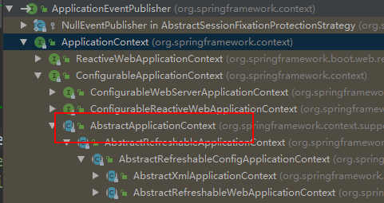
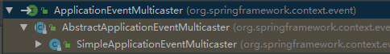

# Spring Boot Event

**事件与直接方法调用**

事件和直接方法调用都适合于不同的情况。对于方法调用，这就像断言一样，无论发送和接收模块的状态如何，他们都需要知道此事件的发生。

另一方面，对于事件，我们只是说发生了一个事件，并且通知了哪些模块不是我们关心的问题。当我们想将处理传递给另一个线程时，最好使用事件（例如：在完成某些任务时发送电子邮件）。同样，事件对于测试驱动的开发非常有用。


事件用于在松耦合的组件之间交换信息。由于发布者和订阅者之间没有直接耦合，因此我们可以修改订阅者而不影响发布者，反之亦然。让我们看看如何在Spring Boot应用程序中创建，发布和收听自定义事件。

## 1.创建一个ApplcationEvent

从Spring 4.2开始，我们还可以将对象直接发布为事件，而无需扩展ApplicationEvent：

## 2.发布一个 ApplicationEvent

我们使用ApplicationEventPublisher接口来发布事件：

```java
@Component
class Publisher {
  
  private final ApplicationEventPublisher publisher;
    
    Publisher(ApplicationEventPublisher publisher) {
      this.publisher = publisher;
    }

  void publishEvent(final String name) {
    // Publishing event created by extending ApplicationEvent
    publisher.publishEvent(new UserCreatedEvent(this, name));
    // Publishing an object as an event
    publisher.publishEvent(new UserRemovedEvent(name));
  }
}
```

当我们发布的对象不是ApplicationEvent时，Spring会自动用PayloadApplicationEvent包装它

## 3. 监听事件

有两种定义侦听器的方法。我们可以使用@EventListener注释或实现ApplicationListener接口。无论哪种情况，监听器类都必须由Spring管理。

从Spring 4.1开始，现在可以简单地注释托管bean的方法，@EventListener以自动注册ApplicationListener与该方法的签名匹配的方法：

```java
@Component
class UserRemovedListener {

  @EventListener
  ReturnedEvent handleUserRemovedEvent(UserRemovedEvent event) {
    // handle UserRemovedEvent ...
    return new ReturnedEvent();
  }

  @EventListener
  void handleReturnedEvent(ReturnedEvent event) {
        // handle ReturnedEvent ...
  }
  ...
}
```

启用注释驱动的配置时，不需要其他配置。我们的方法可以监听多个事件，或者如果我们想完全不使用任何参数来定义它，那么事件类型也可以在注释本身上指定。范例：@EventListener({ContextStartedEvent.class, ContextRefreshedEvent.class})。


对于带有注释@EventListener的方法的返回类型如定义为非void，Spring会将结果作为新事件发布给我们。在上面的示例中，ReturnedEvent第一种方法返回的结果将被发布，然后由第二种方法处理。

如果指定SpEL，Spring仅在某些情况下允许触发我们的侦听器condition：

```java
@Component
class UserRemovedListener {

  @EventListener(condition = "#event.name eq 'reflectoring'")
  void handleConditionalListener(UserRemovedEvent event) {
    // handle UserRemovedEvent
  }
}
```

仅当表达式的计算结果为true，或包含以下字符串之一时：“true”, “on”, “yes”, 或“1”.方法参数通过其名称公开。条件表达式还公开了一个引用了raw ApplicationEvent（#root.event）和实际方法参数的“根”变量(#root.args)

在以上示例中，UserRemovedEvent仅当#event.name的值为时'reflectoring'，才会触发侦听器。


侦听事件的另一种方法是实现ApplicationListener接口：

```java
@Component
class UserCreatedListener implements ApplicationListener<UserCreatedEvent> {

  @Override
  public void onApplicationEvent(UserCreatedEvent event) {
    // handle UserCreatedEvent
  }
}
```

## 4.异步事件监听器

默认情况下，spring事件是同步的，这意味着发布者线程将阻塞，直到所有侦听器都完成对事件的处理为止。

要使事件侦听器以异步模式运行，我们要做的就是@Async在该侦听器上使用注释：

```java
@Component
class AsyncListener {

  @Async
  @EventListener
  void handleAsyncEvent(String event) {
    // handle event
  }
}
```

为了使@Async注释生效，我们还必须注释一个@Configuration类，使用@EnableAsync注释SpringBootApplication类。

上面的代码示例还显示，我们可以将String用作事件。使用风险自负。最好使用特定于我们用例的数据类型，以免与其他事件冲突。

## 5.事务绑定事件

Spring允许我们将事件侦听器绑定到当前事务的某个阶段。当当前事务的结果对侦听器很重要时，这使事件可以更灵活地使用。

当我们使用注释我们的方法时@TransactionalEventListener，我们得到了一个扩展的事件监听器，该监听器知道事务：

```java
@Component
class UserRemovedListener {

  @TransactionalEventListener(phase=TransactionPhase.AFTER_COMPLETION)
  void handleAfterUserRemoved(UserRemovedEvent event) {
    // handle UserRemovedEvent
  }
}
```

UserRemovedListener 仅在当前事务完成时才调用。

我们可以将侦听器绑定到事务的以下阶段：


- AFTER_COMMIT：成功提交事务后，将处理该事件。如果事件侦听器仅在当前事务成功时才运行，则可以使用此方法。
- AFTER_COMPLETION：在事务提交或回滚时将处理该事件。例如，我们可以使用它在事务完成后执行清理。
- AFTER_ROLLBACK：交易回滚后，将处理该事件。
- BEFORE_COMMIT：

## 6.Spring Boot的应用程序事件

以上是Spring事件，Spring Boot提供了几个预定义ApplicationEvent的，这些预定义绑定到SpringApplication生命周期。

在ApplicationContext创建之前会触发一些事件，因此我们无法将这些事件注册为@Bean。我们可以通过手动添加侦听器来注册这些事件的侦听器：

```java
@SpringBootApplication
public class EventsDemoApplication {

  public static void main(String[] args) {
    SpringApplication springApplication = 
        new SpringApplication(EventsDemoApplication.class);
    springApplication.addListeners(new SpringBuiltInEventsListener());
    springApplication.run(args);
  }

}
```

通过将META-INF/spring.factories文件添加到我们的项目中，我们还可以注册侦听器，而不管如何创建应用的。并通过以下org.springframework.context.ApplicationListener键引用侦听器：

org.springframework.context.ApplicationListener= com.reflectoring.eventdemo.SpringBuiltInEventsListener

一旦确保正确注册了事件监听器，我们就可以监听所有Spring Boot的SpringApplicationEvents。让我们按照它们应用程序启动期间的执行顺序来看看：


**ApplicationStartingEvent**

ApplicationStartingEvent在运行开始时但在任何处理之前都会触发，除了侦听器和初始化程序的注册外。


**ApplicationEnvironmentPreparedEvent**

当Environment在上下文中是可用的，一个 被触发，由于此时Environment将准备就绪，因此我们可以在其他bean使用它之前对其进行检查和修改。


**ApplicationContextInitializedEvent**

ApplicationContext已准备就绪时，一个ApplicationContextInitializedEvent触发，ApplicationContextInitializers被称为尚未加载bean定义。在bean初始化到Spring容器之前，我们可以使用它执行任务。


**ApplicationPreparedEvent**

当ApllicationContext准备就绪时，一个ApplicationPreparedEvent时会触发，但不会刷新。

在准备好的Environment和bean定义将被加载。


**ContextRefreshedEvent**

当ApplicationContext刷新时，ContextRefreshedEvent会触发。

ContextRefreshedEvent是直接来自Spring，而不是Spring Boot，并不继承扩展SpringApplicationEvent。


**WebServerInitializedEvent**

如果我们使用的是Web服务器，WebServerInitializedEvent则在Web服务器准备就绪后会触发a。ServletWebServerInitializedEvent和ReactiveWebServerInitializedEvent分别是servlet和反应式变量。

WebServerInitializedEvent不是继承扩展SpringApplicationEvent。


**ApplicationStartedEvent**

上下文已被刷新之后，一个ApplicationStartedEvent触发，但在任何Spring boot应用程序和命令行运行都被调用前。


**ApplicationReadyEvent**

一个ApplicationReadyEvent触发时就表示该应用程序已准备好服务请求。

建议此时不要修改内部状态，因为所有初始化步骤都将完成。


**ApplicationFailedEvent**

一个ApplicationFailedEvent如果有异常，应用程序无法启动点火。在启动期间的任何时间都可能发生这种情况。我们可以使用它来执行一些任务，例如执行脚本或在启动失败时发出通知。

# 源码

## 1.ApplicationEventPublisher



```java
    @Nullable
    private Set<ApplicationListener<?>> earlyApplicationListeners;
    @Nullable
    private Set<ApplicationEvent> earlyApplicationEvents;    

protected void publishEvent(Object event, @Nullable ResolvableType eventType) {
        Assert.notNull(event, "Event must not be null");
        Object applicationEvent;
        //扩展了ApplicationEvent的
        if (event instanceof ApplicationEvent) {
            applicationEvent = (ApplicationEvent)event;
        } else {
        //未扩展的spring帮我们扩展
            applicationEvent = new PayloadApplicationEvent(this, event);
            if (eventType == null) {
                eventType = ((PayloadApplicationEvent)applicationEvent).getResolvableType();
            }
        }
		//加入到early事件集合中
        if (this.earlyApplicationEvents != null) {
            //这个事件集合会在refresh方法中被初始化后置空，同时也会并初始化earlylistener。
            this.earlyApplicationEvents.add(applicationEvent);
        } else {
            //添加到事件多播器中
            this.getApplicationEventMulticaster().multicastEvent((ApplicationEvent)applicationEvent, eventType);
        }
		//如果有父context则也进行发布，只到AbstractApplicationContext层
        if (this.parent != null) {
            if (this.parent instanceof AbstractApplicationContext) {
                ((AbstractApplicationContext)this.parent).publishEvent(event, eventType);
            } else {
                this.parent.publishEvent(event);
            }
        }

    }

```

```java
public class PayloadApplicationEvent<T> extends ApplicationEvent implements ResolvableTypeProvider {
    private final T payload;
	//帮我们包装了applicationEvent所以在4.2之后不需要扩展了，spring已经帮我们扩展了。
    public PayloadApplicationEvent(Object source, T payload) {
        super(source);
        Assert.notNull(payload, "Payload must not be null");
        this.payload = payload;
    }

    public ResolvableType getResolvableType() {
        return ResolvableType.forClassWithGenerics(this.getClass(), new ResolvableType[]{ResolvableType.forInstance(this.getPayload())});
    }

    public T getPayload() {
        return this.payload;
    }
}
```

 所以实际上event是被发布到了`ApplicationEventMulticaster`中。如果我们没有实现接口则spring会启动默认的`SimpleApplicationEventMulticaster`

所有的对listener的操作在`AbstractApplicationEventMulticaster`中实现。



```java
		@Override
	public void multicastEvent(final ApplicationEvent event, @Nullable ResolvableType eventType) {
		ResolvableType type = (eventType != null ? eventType : resolveDefaultEventType(event));
		Executor executor = getTaskExecutor();
		for (ApplicationListener<?> listener : getApplicationListeners(event, type)) {
            //根据event，和type来获取所有的listeners，taskExecutor不为空则是异步执行
			if (executor != null) {
				executor.execute(() -> invokeListener(listener, event));
			}
			else {
				invokeListener(listener, event);
			}
		}
	}
```

对listener的操作在abstracet中被定义。

**SmartApplicationListener **

SmartApplicationListener 接口是 ApplicationListener 的子接口，还继承了 Ordered 接口。SmartApplicationListener 定义了两个 support 方法用于判断事件类型、来源类型是否和当前监听者匹配，这样监听者可以筛选自己感兴趣的事件和来源。继承 Ordered 接口后，该监听者具备了排序的功能，可以按照 order 从小到大的顺序给监听者确定一个优先级，从而确保执行顺序。

**GenericApplicationListener**

GenericApplicationListener 接口是 ApplicationListener 的子接口，也继承了 Ordered 接口，同 SmartApplicationListener 一样具有事件筛选能力和排序能力。但筛选事件使用的是 ResolvableType 类型，而不是 ApplicationEvent 类型。

# 新源码阅读

整理基本加载流程和发布流程。

spring事件的从注解`@EventListener`看起。

# 1.EventListenerMethodProcessor

```java
public class EventListenerMethodProcessor
      implements SmartInitializingSingleton, ApplicationContextAware, BeanFactoryPostProcessor {

   protected final Log logger = LogFactory.getLog(getClass());

   @Nullable
   private ConfigurableApplicationContext applicationContext;

   @Nullable
   private ConfigurableListableBeanFactory beanFactory;

   @Nullable
   private List<EventListenerFactory> eventListenerFactories;

   private final EventExpressionEvaluator evaluator = new EventExpressionEvaluator();

   private final Set<Class<?>> nonAnnotatedClasses = Collections.newSetFromMap(new ConcurrentHashMap<>(64));


   @Override
   public void setApplicationContext(ApplicationContext applicationContext) {
      Assert.isTrue(applicationContext instanceof ConfigurableApplicationContext,
            "ApplicationContext does not implement ConfigurableApplicationContext");
      this.applicationContext = (ConfigurableApplicationContext) applicationContext;
   }

    	//获取环境中所有EventListenerFactory的实例
   @Override
   public void postProcessBeanFactory(ConfigurableListableBeanFactory beanFactory) {
      this.beanFactory = beanFactory;

      Map<String, EventListenerFactory> beans = beanFactory.getBeansOfType(EventListenerFactory.class, false, false);
      List<EventListenerFactory> factories = new ArrayList<>(beans.values());
      AnnotationAwareOrderComparator.sort(factories);
      this.eventListenerFactories = factories;
   }

//对bean进行作用域校验，代理校验等重点为processBean（）方法
   @Override
   public void afterSingletonsInstantiated() {
      ConfigurableListableBeanFactory beanFactory = this.beanFactory;
      Assert.state(this.beanFactory != null, "No ConfigurableListableBeanFactory set");
      String[] beanNames = beanFactory.getBeanNamesForType(Object.class);
      for (String beanName : beanNames) {
         if (!ScopedProxyUtils.isScopedTarget(beanName)) {
            Class<?> type = null;
            try {
               type = AutoProxyUtils.determineTargetClass(beanFactory, beanName);
            }
            catch (Throwable ex) {
               // An unresolvable bean type, probably from a lazy bean - let's ignore it.
               if (logger.isDebugEnabled()) {
                  logger.debug("Could not resolve target class for bean with name '" + beanName + "'", ex);
               }
            }
            if (type != null) {
               if (ScopedObject.class.isAssignableFrom(type)) {
                  try {
                     Class<?> targetClass = AutoProxyUtils.determineTargetClass(
                           beanFactory, ScopedProxyUtils.getTargetBeanName(beanName));
                     if (targetClass != null) {
                        type = targetClass;
                     }
                  }
                  catch (Throwable ex) {
                     // An invalid scoped proxy arrangement - let's ignore it.
                     if (logger.isDebugEnabled()) {
                        logger.debug("Could not resolve target bean for scoped proxy '" + beanName + "'", ex);
                     }
                  }
               }
               try {
                  processBean(beanName, type);
               }
               catch (Throwable ex) {
                  throw new BeanInitializationException("Failed to process @EventListener " +
                        "annotation on bean with name '" + beanName + "'", ex);
               }
            }
         }
      }
   }

   private void processBean(final String beanName, final Class<?> targetType) {
      if (!this.nonAnnotatedClasses.contains(targetType) &&
            AnnotationUtils.isCandidateClass(targetType, EventListener.class) &&
            !isSpringContainerClass(targetType)) {
		//对目标class进行注解的校验和将方法上的进行抽离
         Map<Method, EventListener> annotatedMethods = null;
         try {
            annotatedMethods = MethodIntrospector.selectMethods(targetType,
                  (MethodIntrospector.MetadataLookup<EventListener>) method ->
                        AnnotatedElementUtils.findMergedAnnotation(method, EventListener.class));
         }
         catch (Throwable ex) {
            // An unresolvable type in a method signature, probably from a lazy bean - let's ignore it.
            if (logger.isDebugEnabled()) {
               logger.debug("Could not resolve methods for bean with name '" + beanName + "'", ex);
            }
         }

         if (CollectionUtils.isEmpty(annotatedMethods)) {
            this.nonAnnotatedClasses.add(targetType);
            if (logger.isTraceEnabled()) {
               logger.trace("No @EventListener annotations found on bean class: " + targetType.getName());
            }
         }
         else {
            // Non-empty set of methods
            ConfigurableApplicationContext context = this.applicationContext;
            Assert.state(context != null, "No ApplicationContext set");
            List<EventListenerFactory> factories = this.eventListenerFactories;
            Assert.state(factories != null, "EventListenerFactory List not initialized");
            for (Method method : annotatedMethods.keySet()) {
               for (EventListenerFactory factory : factories) {
                  if (factory.supportsMethod(method)) {
                      //为指定beanName的class对应的方法进行指定筛选
                     Method methodToUse = AopUtils.selectInvocableMethod(method, context.getType(beanName));
                      //将beanName，目标class，监听的方法作为一个坐标参数来构建一个listener
                     ApplicationListener<?> applicationListener =
                           factory.createApplicationListener(beanName, targetType, methodToUse);
                     if (applicationListener instanceof ApplicationListenerMethodAdapter) {
                        ((ApplicationListenerMethodAdapter) applicationListener).init(context, this.evaluator);
                     }
                     context.addApplicationListener(applicationListener);
                     break;
                  }
               }
            }
            if (logger.isDebugEnabled()) {
               logger.debug(annotatedMethods.size() + " @EventListener methods processed on bean '" +
                     beanName + "': " + annotatedMethods);
            }
         }
      }
   }

   private static boolean isSpringContainerClass(Class<?> clazz) {
      return (clazz.getName().startsWith("org.springframework.") &&
            !AnnotatedElementUtils.isAnnotated(ClassUtils.getUserClass(clazz), Component.class));
   }

}
```

spring默认生成的`ApplicationListenerMethodAdapter`

```java
public class DefaultEventListenerFactory implements EventListenerFactory, Ordered {

   private int order = LOWEST_PRECEDENCE;


   public void setOrder(int order) {
      this.order = order;
   }

   @Override
   public int getOrder() {
      return this.order;
   }


   @Override
   public boolean supportsMethod(Method method) {
      return true;
   }

   @Override
   public ApplicationListener<?> createApplicationListener(String beanName, Class<?> type, Method method) {
      return new ApplicationListenerMethodAdapter(beanName, type, method);
   }

}
```

```java
/*
 * Copyright 2002-2019 the original author or authors.
 *
 * Licensed under the Apache License, Version 2.0 (the "License");
 * you may not use this file except in compliance with the License.
 * You may obtain a copy of the License at
 *
 *      https://www.apache.org/licenses/LICENSE-2.0
 *
 * Unless required by applicable law or agreed to in writing, software
 * distributed under the License is distributed on an "AS IS" BASIS,
 * WITHOUT WARRANTIES OR CONDITIONS OF ANY KIND, either express or implied.
 * See the License for the specific language governing permissions and
 * limitations under the License.
 */

package org.springframework.context.event;

import java.lang.reflect.InvocationTargetException;
import java.lang.reflect.Method;
import java.lang.reflect.Proxy;
import java.lang.reflect.UndeclaredThrowableException;
import java.util.ArrayList;
import java.util.Collection;
import java.util.Collections;
import java.util.List;
import java.util.concurrent.CompletionStage;

import org.apache.commons.logging.Log;
import org.apache.commons.logging.LogFactory;
import org.reactivestreams.Subscriber;
import org.reactivestreams.Subscription;

import org.springframework.aop.support.AopUtils;
import org.springframework.context.ApplicationContext;
import org.springframework.context.ApplicationEvent;
import org.springframework.context.PayloadApplicationEvent;
import org.springframework.context.expression.AnnotatedElementKey;
import org.springframework.core.BridgeMethodResolver;
import org.springframework.core.ReactiveAdapter;
import org.springframework.core.ReactiveAdapterRegistry;
import org.springframework.core.ResolvableType;
import org.springframework.core.annotation.AnnotatedElementUtils;
import org.springframework.core.annotation.Order;
import org.springframework.lang.Nullable;
import org.springframework.util.Assert;
import org.springframework.util.ClassUtils;
import org.springframework.util.ObjectUtils;
import org.springframework.util.ReflectionUtils;
import org.springframework.util.StringUtils;
import org.springframework.util.concurrent.ListenableFuture;

/**
 * {@link GenericApplicationListener} adapter that delegates the processing of
 * an event to an {@link EventListener} annotated method.
 *
 * <p>Delegates to {@link #processEvent(ApplicationEvent)} to give subclasses
 * a chance to deviate from the default. Unwraps the content of a
 * {@link PayloadApplicationEvent} if necessary to allow a method declaration
 * to define any arbitrary event type. If a condition is defined, it is
 * evaluated prior to invoking the underlying method.
 *
 * @author Stephane Nicoll
 * @author Juergen Hoeller
 * @author Sam Brannen
 * @since 4.2
 */
public class ApplicationListenerMethodAdapter implements GenericApplicationListener {

   private static final boolean reactiveStreamsPresent = ClassUtils.isPresent(
         "org.reactivestreams.Publisher", ApplicationListenerMethodAdapter.class.getClassLoader());


   protected final Log logger = LogFactory.getLog(getClass());

   private final String beanName;

   private final Method method;

   private final Method targetMethod;

   private final AnnotatedElementKey methodKey;

   private final List<ResolvableType> declaredEventTypes;

   @Nullable
   private final String condition;

   private final int order;

   @Nullable
   private ApplicationContext applicationContext;

   @Nullable
   private EventExpressionEvaluator evaluator;


   public ApplicationListenerMethodAdapter(String beanName, Class<?> targetClass, Method method) {
      this.beanName = beanName;
      this.method = BridgeMethodResolver.findBridgedMethod(method);
      this.targetMethod = (!Proxy.isProxyClass(targetClass) ?
            AopUtils.getMostSpecificMethod(method, targetClass) : this.method);
      this.methodKey = new AnnotatedElementKey(this.targetMethod, targetClass);

      EventListener ann = AnnotatedElementUtils.findMergedAnnotation(this.targetMethod, EventListener.class);
      this.declaredEventTypes = resolveDeclaredEventTypes(method, ann);
      this.condition = (ann != null ? ann.condition() : null);
      this.order = resolveOrder(this.targetMethod);
   }

   private static List<ResolvableType> resolveDeclaredEventTypes(Method method, @Nullable EventListener ann) {
      int count = method.getParameterCount();
      if (count > 1) {
         throw new IllegalStateException(
               "Maximum one parameter is allowed for event listener method: " + method);
      }

      if (ann != null) {
         Class<?>[] classes = ann.classes();
         if (classes.length > 0) {
            List<ResolvableType> types = new ArrayList<>(classes.length);
            for (Class<?> eventType : classes) {
               types.add(ResolvableType.forClass(eventType));
            }
            return types;
         }
      }

      if (count == 0) {
         throw new IllegalStateException(
               "Event parameter is mandatory for event listener method: " + method);
      }
      return Collections.singletonList(ResolvableType.forMethodParameter(method, 0));
   }

   private static int resolveOrder(Method method) {
      Order ann = AnnotatedElementUtils.findMergedAnnotation(method, Order.class);
      return (ann != null ? ann.value() : 0);
   }


   /**
    * Initialize this instance.
    */
   void init(ApplicationContext applicationContext, EventExpressionEvaluator evaluator) {
      this.applicationContext = applicationContext;
      this.evaluator = evaluator;
   }


   @Override
   public void onApplicationEvent(ApplicationEvent event) {
      processEvent(event);
   }

   @Override
   public boolean supportsEventType(ResolvableType eventType) {
      for (ResolvableType declaredEventType : this.declaredEventTypes) {
         if (declaredEventType.isAssignableFrom(eventType)) {
            return true;
         }
         if (PayloadApplicationEvent.class.isAssignableFrom(eventType.toClass())) {
            ResolvableType payloadType = eventType.as(PayloadApplicationEvent.class).getGeneric();
            if (declaredEventType.isAssignableFrom(payloadType)) {
               return true;
            }
         }
      }
      return eventType.hasUnresolvableGenerics();
   }

   @Override
   public boolean supportsSourceType(@Nullable Class<?> sourceType) {
      return true;
   }

   @Override
   public int getOrder() {
      return this.order;
   }


   /**
    * Process the specified {@link ApplicationEvent}, checking if the condition
    * matches and handling a non-null result, if any.
    */
   public void processEvent(ApplicationEvent event) {
      Object[] args = resolveArguments(event);
      if (shouldHandle(event, args)) {
         Object result = doInvoke(args);
         if (result != null) {
            handleResult(result);
         }
         else {
            logger.trace("No result object given - no result to handle");
         }
      }
   }

   /**
    * Resolve the method arguments to use for the specified {@link ApplicationEvent}.
    * <p>These arguments will be used to invoke the method handled by this instance.
    * Can return {@code null} to indicate that no suitable arguments could be resolved
    * and therefore the method should not be invoked at all for the specified event.
    */
   @Nullable
   protected Object[] resolveArguments(ApplicationEvent event) {
      ResolvableType declaredEventType = getResolvableType(event);
      if (declaredEventType == null) {
         return null;
      }
      if (this.method.getParameterCount() == 0) {
         return new Object[0];
      }
      Class<?> declaredEventClass = declaredEventType.toClass();
      if (!ApplicationEvent.class.isAssignableFrom(declaredEventClass) &&
            event instanceof PayloadApplicationEvent) {
         Object payload = ((PayloadApplicationEvent<?>) event).getPayload();
         if (declaredEventClass.isInstance(payload)) {
            return new Object[] {payload};
         }
      }
      return new Object[] {event};
   }

   protected void handleResult(Object result) {
      if (reactiveStreamsPresent && new ReactiveResultHandler().subscribeToPublisher(result)) {
         if (logger.isTraceEnabled()) {
            logger.trace("Adapted to reactive result: " + result);
         }
      }
      else if (result instanceof CompletionStage) {
         ((CompletionStage<?>) result).whenComplete((event, ex) -> {
            if (ex != null) {
               handleAsyncError(ex);
            }
            else if (event != null) {
               publishEvent(event);
            }
         });
      }
      else if (result instanceof ListenableFuture) {
         ((ListenableFuture<?>) result).addCallback(this::publishEvents, this::handleAsyncError);
      }
      else {
         publishEvents(result);
      }
   }

   private void publishEvents(Object result) {
      if (result.getClass().isArray()) {
         Object[] events = ObjectUtils.toObjectArray(result);
         for (Object event : events) {
            publishEvent(event);
         }
      }
      else if (result instanceof Collection<?>) {
         Collection<?> events = (Collection<?>) result;
         for (Object event : events) {
            publishEvent(event);
         }
      }
      else {
         publishEvent(result);
      }
   }

   private void publishEvent(@Nullable Object event) {
      if (event != null) {
         Assert.notNull(this.applicationContext, "ApplicationContext must not be null");
         this.applicationContext.publishEvent(event);
      }
   }

   protected void handleAsyncError(Throwable t) {
      logger.error("Unexpected error occurred in asynchronous listener", t);
   }

   private boolean shouldHandle(ApplicationEvent event, @Nullable Object[] args) {
      if (args == null) {
         return false;
      }
      String condition = getCondition();
      if (StringUtils.hasText(condition)) {
         Assert.notNull(this.evaluator, "EventExpressionEvaluator must not be null");
         return this.evaluator.condition(
               condition, event, this.targetMethod, this.methodKey, args, this.applicationContext);
      }
      return true;
   }

   /**
    * Invoke the event listener method with the given argument values.
    */
   @Nullable
   protected Object doInvoke(Object... args) {
      Object bean = getTargetBean();
      // Detect package-protected NullBean instance through equals(null) check
      if (bean.equals(null)) {
         return null;
      }

      ReflectionUtils.makeAccessible(this.method);
      try {
         return this.method.invoke(bean, args);
      }
      catch (IllegalArgumentException ex) {
         assertTargetBean(this.method, bean, args);
         throw new IllegalStateException(getInvocationErrorMessage(bean, ex.getMessage(), args), ex);
      }
      catch (IllegalAccessException ex) {
         throw new IllegalStateException(getInvocationErrorMessage(bean, ex.getMessage(), args), ex);
      }
      catch (InvocationTargetException ex) {
         // Throw underlying exception
         Throwable targetException = ex.getTargetException();
         if (targetException instanceof RuntimeException) {
            throw (RuntimeException) targetException;
         }
         else {
            String msg = getInvocationErrorMessage(bean, "Failed to invoke event listener method", args);
            throw new UndeclaredThrowableException(targetException, msg);
         }
      }
   }

   /**
    * Return the target bean instance to use.
    */
   protected Object getTargetBean() {
      Assert.notNull(this.applicationContext, "ApplicationContext must no be null");
      return this.applicationContext.getBean(this.beanName);
   }

   /**
    * Return the condition to use.
    * <p>Matches the {@code condition} attribute of the {@link EventListener}
    * annotation or any matching attribute on a composed annotation that
    * is meta-annotated with {@code @EventListener}.
    */
   @Nullable
   protected String getCondition() {
      return this.condition;
   }

   /**
    * Add additional details such as the bean type and method signature to
    * the given error message.
    * @param message error message to append the HandlerMethod details to
    */
   protected String getDetailedErrorMessage(Object bean, String message) {
      StringBuilder sb = new StringBuilder(message).append("\n");
      sb.append("HandlerMethod details: \n");
      sb.append("Bean [").append(bean.getClass().getName()).append("]\n");
      sb.append("Method [").append(this.method.toGenericString()).append("]\n");
      return sb.toString();
   }

   /**
    * Assert that the target bean class is an instance of the class where the given
    * method is declared. In some cases the actual bean instance at event-
    * processing time may be a JDK dynamic proxy (lazy initialization, prototype
    * beans, and others). Event listener beans that require proxying should prefer
    * class-based proxy mechanisms.
    */
   private void assertTargetBean(Method method, Object targetBean, Object[] args) {
      Class<?> methodDeclaringClass = method.getDeclaringClass();
      Class<?> targetBeanClass = targetBean.getClass();
      if (!methodDeclaringClass.isAssignableFrom(targetBeanClass)) {
         String msg = "The event listener method class '" + methodDeclaringClass.getName() +
               "' is not an instance of the actual bean class '" +
               targetBeanClass.getName() + "'. If the bean requires proxying " +
               "(e.g. due to @Transactional), please use class-based proxying.";
         throw new IllegalStateException(getInvocationErrorMessage(targetBean, msg, args));
      }
   }

   private String getInvocationErrorMessage(Object bean, String message, Object[] resolvedArgs) {
      StringBuilder sb = new StringBuilder(getDetailedErrorMessage(bean, message));
      sb.append("Resolved arguments: \n");
      for (int i = 0; i < resolvedArgs.length; i++) {
         sb.append("[").append(i).append("] ");
         if (resolvedArgs[i] == null) {
            sb.append("[null] \n");
         }
         else {
            sb.append("[type=").append(resolvedArgs[i].getClass().getName()).append("] ");
            sb.append("[value=").append(resolvedArgs[i]).append("]\n");
         }
      }
      return sb.toString();
   }

   @Nullable
   private ResolvableType getResolvableType(ApplicationEvent event) {
      ResolvableType payloadType = null;
      if (event instanceof PayloadApplicationEvent) {
         PayloadApplicationEvent<?> payloadEvent = (PayloadApplicationEvent<?>) event;
         ResolvableType eventType = payloadEvent.getResolvableType();
         if (eventType != null) {
            payloadType = eventType.as(PayloadApplicationEvent.class).getGeneric();
         }
      }
      for (ResolvableType declaredEventType : this.declaredEventTypes) {
         Class<?> eventClass = declaredEventType.toClass();
         if (!ApplicationEvent.class.isAssignableFrom(eventClass) &&
               payloadType != null && declaredEventType.isAssignableFrom(payloadType)) {
            return declaredEventType;
         }
         if (eventClass.isInstance(event)) {
            return declaredEventType;
         }
      }
      return null;
   }


   @Override
   public String toString() {
      return this.method.toGenericString();
   }


   private class ReactiveResultHandler {

      public boolean subscribeToPublisher(Object result) {
         ReactiveAdapter adapter = ReactiveAdapterRegistry.getSharedInstance().getAdapter(result.getClass());
         if (adapter != null) {
            adapter.toPublisher(result).subscribe(new EventPublicationSubscriber());
            return true;
         }
         return false;
      }
   }


   private class EventPublicationSubscriber implements Subscriber<Object> {

      @Override
      public void onSubscribe(Subscription s) {
         s.request(Integer.MAX_VALUE);
      }

      @Override
      public void onNext(Object o) {
         publishEvents(o);
      }

      @Override
      public void onError(Throwable t) {
         handleAsyncError(t);
      }

      @Override
      public void onComplete() {
      }
   }

}
```