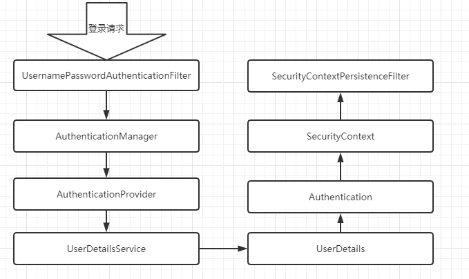
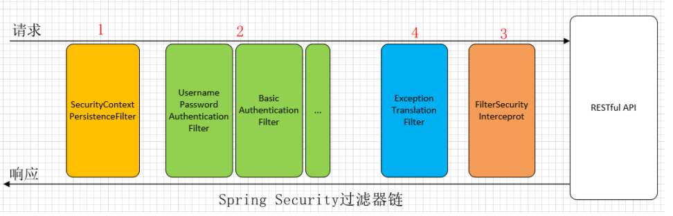

# Spring Security

## 一.认证流程



### 1.UsernamePasswordAuthenticationFilter

```java
public Authentication attemptAuthentication(HttpServletRequest request,
      HttpServletResponse response) throws AuthenticationException {
   if (postOnly && !request.getMethod().equals("POST")) {
      throw new AuthenticationServiceException(
            "Authentication method not supported: " + request.getMethod());
   }
   String username = obtainUsername(request);
   String password = obtainPassword(request);
   if (username == null) {
      username = "";
   }
   if (password == null) {
      password = "";
   }
   username = username.trim();
	//构建出authRequest此时的权限为空认证为false
   UsernamePasswordAuthenticationToken authRequest = new UsernamePasswordAuthenticationToken(
         username, password);
   setDetails(request, authRequest);
	//获取到AuthenticationManager对authRequest进行处理
   return this.getAuthenticationManager().authenticate(authRequest);
}
```

### 2.ProviderManager

```java
public Authentication authenticate(Authentication authentication)
      throws AuthenticationException {
   Class<? extends Authentication> toTest = authentication.getClass();
   AuthenticationException lastException = null;
   AuthenticationException parentException = null;
   Authentication result = null;
   Authentication parentResult = null;
   boolean debug = logger.isDebugEnabled();
	//遍历所有的AuthenticationProvider找到一个合适的provider来进行认证
   for (AuthenticationProvider provider : getProviders()) {
      if (!provider.supports(toTest)) {
         continue;
      }
      if (debug) {
         logger.debug("Authentication attempt using "
               + provider.getClass().getName());
      }
      try {
          //找到了provider调用其authenticate方法认证
         result = provider.authenticate(authentication);

         if (result != null) {
            copyDetails(authentication, result);
            break;
         }
      }
       .............
}

```

sercurity支持多种认证方式，一种认证方式就是一个provider。通过`getProviders`方法来进行匹配。

### 3.AbstractUserDetailsAuthenticationProvider

传统的表单认证匹配的是`AbstractUserDetailsAuthenticationProvider`在认证方法中最主要的就是`retrieveUser`方法。是在`DaoAuthenticationProvider`中实现的。

```java
user = retrieveUser(username,(UsernamePasswordAuthenticationToken) authentication);
```

```java
protected final UserDetails retrieveUser(String username,
      UsernamePasswordAuthenticationToken authentication)
      throws AuthenticationException {
   prepareTimingAttackProtection();
   try {
       //调用环境中的UserDetailService，来对对应的username的用户进行检查
       //返回的是一个UserDetails对象，该对象中可以设置权限和状态
      UserDetails loadedUser = this.getUserDetailsService().loadUserByUsername(username);
      if (loadedUser == null) {
         throw new InternalAuthenticationServiceException(
               "UserDetailsService returned null, which is an interface contract violation");
      }
      return loadedUser;
   }
   catch (UsernameNotFoundException ex) {
      mitigateAgainstTimingAttack(authentication);
      throw ex;
   }
   catch (InternalAuthenticationServiceException ex) {
      throw ex;
   }
   catch (Exception ex) {
      throw new InternalAuthenticationServiceException(ex.getMessage(), ex);
   }
}
```

在认证完成后返回user对象回到`AbstractUserDetailsAuthenticationProvider`中

```java
public Authentication authenticate(Authentication authentication)
      throws AuthenticationException {
   Assert.isInstanceOf(UsernamePasswordAuthenticationToken.class, authentication,
         () -> messages.getMessage(
               "AbstractUserDetailsAuthenticationProvider.onlySupports",
               "Only UsernamePasswordAuthenticationToken is supported"));

   // Determine username
   String username = (authentication.getPrincipal() == null) ? "NONE_PROVIDED"
         : authentication.getName();

   boolean cacheWasUsed = true;
   UserDetails user = this.userCache.getUserFromCache(username);

   if (user == null) {
      cacheWasUsed = false;

      try {
         user = retrieveUser(username,
               (UsernamePasswordAuthenticationToken) authentication);
      }
      catch (UsernameNotFoundException notFound) {
         logger.debug("User '" + username + "' not found");

         if (hideUserNotFoundExceptions) {
            throw new BadCredentialsException(messages.getMessage(
                  "AbstractUserDetailsAuthenticationProvider.badCredentials",
                  "Bad credentials"));
         }
         else {
            throw notFound;
         }
      }

      Assert.notNull(user,
            "retrieveUser returned null - a violation of the interface contract");
   }

   try {
       //前置检查
      preAuthenticationChecks.check(user);
       //附加检查
      additionalAuthenticationChecks(user,
            (UsernamePasswordAuthenticationToken) authentication);
   }
   catch (AuthenticationException exception) {
      if (cacheWasUsed) {
         // There was a problem, so try again after checking
         // we're using latest data (i.e. not from the cache)
         cacheWasUsed = false;
         user = retrieveUser(username,
               (UsernamePasswordAuthenticationToken) authentication);
         preAuthenticationChecks.check(user);
         additionalAuthenticationChecks(user,
               (UsernamePasswordAuthenticationToken) authentication);
      }
      else {
         throw exception;
      }
   }
	//后置检查
   postAuthenticationChecks.check(user);

   if (!cacheWasUsed) {
      this.userCache.putUserInCache(user);
   }

   Object principalToReturn = user;

   if (forcePrincipalAsString) {
      principalToReturn = user.getUsername();
   }
	//在上述检查中出现问题就会抛出异常。校验都通过后才会返回认证信息
   return createSuccessAuthentication(principalToReturn, authentication, user);
}
```

### 4.AbstractAuthenticationProcessingFilter

```java
public void doFilter(ServletRequest req, ServletResponse res, FilterChain chain)
      throws IOException, ServletException {

   HttpServletRequest request = (HttpServletRequest) req;
   HttpServletResponse response = (HttpServletResponse) res;

   if (!requiresAuthentication(request, response)) {
      chain.doFilter(request, response);

      return;
   }

   if (logger.isDebugEnabled()) {
      logger.debug("Request is to process authentication");
   }

   Authentication authResult;

   try {
      authResult = attemptAuthentication(request, response);
      if (authResult == null) {
         // return immediately as subclass has indicated that it hasn't completed
         // authentication
         return;
      }
      sessionStrategy.onAuthentication(authResult, request, response);
   }
   catch (InternalAuthenticationServiceException failed) {
      logger.error(
            "An internal error occurred while trying to authenticate the user.",
            failed);
      unsuccessfulAuthentication(request, response, failed);

      return;
   }
   catch (AuthenticationException failed) {
      // Authentication failed
       //认证失败调用对应的halder进行处理
      unsuccessfulAuthentication(request, response, failed);

      return;
   }

   // Authentication success
   if (continueChainBeforeSuccessfulAuthentication) {
      chain.doFilter(request, response);
   }
	//认证成功调用对应的halder进行处理
   successfulAuthentication(request, response, chain, authResult);
}
```

### 5.SecurityContextHolder

在`successfulAuthentication`中

```java
protected void successfulAuthentication(HttpServletRequest request,
      HttpServletResponse response, FilterChain chain, Authentication authResult)
      throws IOException, ServletException {

   if (logger.isDebugEnabled()) {
      logger.debug("Authentication success. Updating SecurityContextHolder to contain: "
            + authResult);
   }
	//将认证成功的信息放入context中
   SecurityContextHolder.getContext().setAuthentication(authResult);

   rememberMeServices.loginSuccess(request, response, authResult);

   // Fire event
   if (this.eventPublisher != null) {
      eventPublisher.publishEvent(new InteractiveAuthenticationSuccessEvent(
            authResult, this.getClass()));
   }

   successHandler.onAuthenticationSuccess(request, response, authResult);
}
```

### 6.SecurityContextPersistenceFilter

```java
public void doFilter(ServletRequest req, ServletResponse res, FilterChain chain)
      throws IOException, ServletException {
   HttpServletRequest request = (HttpServletRequest) req;
   HttpServletResponse response = (HttpServletResponse) res;

   if (request.getAttribute(FILTER_APPLIED) != null) {
      // ensure that filter is only applied once per request
      chain.doFilter(request, response);
      return;
   }
   final boolean debug = logger.isDebugEnabled();
   request.setAttribute(FILTER_APPLIED, Boolean.TRUE);
   if (forceEagerSessionCreation) {
      HttpSession session = request.getSession();
      if (debug && session.isNew()) {
         logger.debug("Eagerly created session: " + session.getId());
      }
   }
   HttpRequestResponseHolder holder = new HttpRequestResponseHolder(request,
         response);
    //SecurityContextRepository获取到session中的context
   SecurityContext contextBeforeChainExecution = repo.loadContext(holder);

   try {
      SecurityContextHolder.setContext(contextBeforeChainExecution);

      chain.doFilter(holder.getRequest(), holder.getResponse());

   }
   finally {
      SecurityContext contextAfterChainExecution = SecurityContextHolder
            .getContext();
      // Crucial removal of SecurityContextHolder contents - do this before anything
      // else.
      SecurityContextHolder.clearContext();
       //将context放入session
      repo.saveContext(contextAfterChainExecution, holder.getRequest(),
            holder.getResponse());
      request.removeAttribute(FILTER_APPLIED);

      if (debug) {
         logger.debug("SecurityContextHolder now cleared, as request processing completed");
      }
   }
}
```

- 当请求时，检查 Session 中是否存在 SecurityContext，如果有将其放入到线程中。
- 当响应时，检查线程中是否存在 SecurityContext，如果有将其放入到 Session 中。




## 二.webflux流程

### 1.ReactiveAuthenticationManager

是webfilter的实现在其中注入了`ReactiveAuthenticationManager`。

```java
@Override
public Mono<Void> filter(ServerWebExchange exchange, WebFilterChain chain) {
   return this.requiresAuthenticationMatcher.matches(exchange)
      .filter( matchResult -> matchResult.isMatch())
      .flatMap( matchResult -> this.authenticationConverter.convert(exchange))
      .switchIfEmpty(chain.filter(exchange).then(Mono.empty()))
      .flatMap( token -> authenticate(exchange, chain, token));
}
	private Mono<Void> authenticate(ServerWebExchange exchange,
		WebFilterChain chain, Authentication token) {
		WebFilterExchange webFilterExchange = new WebFilterExchange(exchange, chain);

		return this.authenticationManagerResolver.resolve(exchange)
			.flatMap(authenticationManager -> authenticationManager.authenticate(token))
			.switchIfEmpty(Mono.defer(() -> Mono.error(new IllegalStateException("No provider found for " + token.getClass()))))
			.flatMap(authentication -> onAuthenticationSuccess(authentication, webFilterExchange))
			.onErrorResume(AuthenticationException.class, e -> this.authenticationFailureHandler
				.onAuthenticationFailure(webFilterExchange, e));
	}
```

### 2.AbstractUserDetailsReactiveAuthenticationManager

传统的表单认证对应webflux中的provider，而不是manager。选择处理器的动作在webfilter进行的。

```java
@Override
public Mono<Authentication> authenticate(Authentication authentication) {
   final String username = authentication.getName();
   final String presentedPassword = (String) authentication.getCredentials();
   return retrieveUser(username)
         .doOnNext(this.preAuthenticationChecks::check)
         .publishOn(this.scheduler)
         .filter(u -> this.passwordEncoder.matches(presentedPassword, u.getPassword()))
         .switchIfEmpty(Mono.defer(() -> Mono.error(new BadCredentialsException("Invalid Credentials"))))
         .flatMap(u -> {
            boolean upgradeEncoding = this.userDetailsPasswordService != null
                  && this.passwordEncoder.upgradeEncoding(u.getPassword());
            if (upgradeEncoding) {
               String newPassword = this.passwordEncoder.encode(presentedPassword);
               return this.userDetailsPasswordService.updatePassword(u, newPassword);
            }
            return Mono.just(u);
         })
         .doOnNext(this.postAuthenticationChecks::check)
         .map(u -> new UsernamePasswordAuthenticationToken(u, u.getPassword(), u.getAuthorities()) );
}
```

与web中类似也是调用retrieveUser方法来认证并返回一个认证对象；

同样的retrieveUser方法也是在实现类`UserDetailsRepositoryReactiveAuthenticationManager`中实现的

```java
private ReactiveUserDetailsService userDetailsService;

public UserDetailsRepositoryReactiveAuthenticationManager(ReactiveUserDetailsService userDetailsService) {
   Assert.notNull(userDetailsService, "userDetailsService cannot be null");
   this.userDetailsService = userDetailsService;
}

@Override
protected Mono<UserDetails> retrieveUser(String username) {
   return this.userDetailsService.findByUsername(username);
}
```

### 3.ReactiveUserDetailsService

```java
@Override
public Mono<UserDetails> findByUsername(String username) {
   String key = getKey(username);
   UserDetails result = users.get(key);
   return result == null ? Mono.empty() : Mono.just(User.withUserDetails(result).build());
}
```

## 三.扩展方式

### 1.需求

现需要将ysupport中ldap账号认证接入到ymonitor中。

1. 账号验证形式为账号与密码
2. LdapAgentFeignClient接口中不会返回密码
3. ymonitor中使用的是webflux

在上述传统表单验证流程中的附加检查中会通过账号和密码进行认证，所以我们扩展要从Provider层入手。

由于所有的Provider都是由ProviderManager进行管理，所以需要自定义Provider在其中完成ldap远程认证并包装Authentication

### 2.实现

见代码