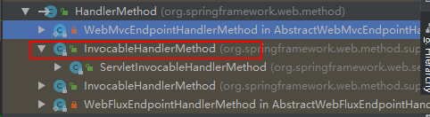

# HandlerInterceptor

记录在工作中关于spring相关的碎片学习内容

## 1.HandlerMethod

SpringMVC的拦截器中，`HandlerInterceptor`的拦截方法中的第三个参数`Object handler`,虽然是Object的，但是绝大情况下都会当做`HandlerMethod`来使用。

`HandlerMethod`它不是一个接口，也不是个抽象类，且还是public的。`HandlerMethod`封装了**很多属性**，在访问请求方法的时候可以**方便的访问到方法、方法参数、方法上的注解、所属类**等并且对方法参数封装处理，也可以方便的访问到方法参数的注解等信息。

```java
// @since 3.1
public class HandlerMethod {

    // Object类型，既可以是个Bean，也可以是个BeanName
    private final Object bean;
    // 如果是BeanName，拿就靠它拿出Bean实例了~
    @Nullable
    private final BeanFactory beanFactory;
    private final Class<?> beanType; // 该方法所属的类
    private final Method method; // 该方法本身
    private final Method bridgedMethod; // 被桥接的方法,如果method是原生的,它的值同method
    // 封装方法参数的类实例，**一个MethodParameter就是一个入参**
    // MethodParameter也是Spring抽象出来的一个非常重要的概念
    private final MethodParameter[] parameters;
    @Nullable
    private HttpStatus responseStatus; // http状态码（毕竟它要负责处理和返回）
    @Nullable
    private String responseStatusReason; // 如果状态码里还要复数原因，就是这个字段  可以为null


    // 通过createWithResolvedBean()解析此handlerMethod实例的handlerMethod。
    @Nullable
    private HandlerMethod resolvedFromHandlerMethod;
    // 标注在**接口入参**上的注解们（此处数据结构复杂，List+二维数组）
    @Nullable
    private volatile List<Annotation[][]> interfaceParameterAnnotations;

    // 它的构造方法众多  此处我只写出关键的步骤
    public HandlerMethod(Object bean, Method method) {
        ...
        this.beanType = ClassUtils.getUserClass(bean);
        this.bridgedMethod = BridgeMethodResolver.findBridgedMethod(method);
        this.parameters = initMethodParameters();
        ...
        evaluateResponseStatus();
    }
    // 这个构造方法抛出了一个异常NoSuchMethodException 
    public HandlerMethod(Object bean, String methodName, Class<?>... parameterTypes) throws NoSuchMethodException {
        ...
        this.method = bean.getClass().getMethod(methodName, parameterTypes);
        this.parameters = initMethodParameters();
        ...
        evaluateResponseStatus();
    }
    // 此处传的是BeanName
    public HandlerMethod(String beanName, BeanFactory beanFactory, Method method) {
        ...
        // 这部判断：这个BeanName是必须存在的
        Class<?> beanType = beanFactory.getType(beanName);
        if (beanType == null) {
            throw new IllegalStateException("Cannot resolve bean type for bean with name '" + beanName + "'");
        }
        this.parameters = initMethodParameters();
        ...
        evaluateResponseStatus();
    }

    // 供给子类copy使用的
    protected HandlerMethod(HandlerMethod handlerMethod) { ... }
    
    // 所有构造都执行了两个方法：initMethodParameters和evaluateResponseStatus

    // 初始化该方法所有的入参，此处使用的是内部类HandlerMethodParameter
    // 注意：处理了泛型的~~~
    private MethodParameter[] initMethodParameters() {
        int count = this.bridgedMethod.getParameterCount();
        MethodParameter[] result = new MethodParameter[count];
        for (int i = 0; i < count; i++) {
            HandlerMethodParameter parameter = new HandlerMethodParameter(i);
            GenericTypeResolver.resolveParameterType(parameter, this.beanType);
            result[i] = parameter;
        }
        return result;
    }

    // 看看方法上是否有标注了@ResponseStatus注解（接口上或者父类 组合注解上都行）
    // 若方法上没有，还会去所在的类上去看看有没有标注此注解
    // 主要只解析这个注解，把它的两个属性code和reason拿过来，最后就是返回它俩了~~~
    // code状态码默认是HttpStatus.INTERNAL_SERVER_ERROR-->(500, "Internal Server Error")
    private void evaluateResponseStatus() {
        ResponseStatus annotation = getMethodAnnotation(ResponseStatus.class);
        if (annotation == null) {
            annotation = AnnotatedElementUtils.findMergedAnnotation(getBeanType(), ResponseStatus.class);
        }
        if (annotation != null) {
            this.responseStatus = annotation.code();
            this.responseStatusReason = annotation.reason();
        }
    }
    ... // 省略所有属性的get方法（无set方法）

    // 返回方法返回值的类型  此处也使用的MethodParameter 
    public MethodParameter getReturnType() {
        return new HandlerMethodParameter(-1);
    }
    // 注意和上面的区别。举个列子：比如方法返回的是Object，但实际return “fsx”字符串
    // 那么上面返回永远是Object.class，下面你实际的值是什么类型就是什么类型
    public MethodParameter getReturnValueType(@Nullable Object returnValue) {
        return new ReturnValueMethodParameter(returnValue);
    }

    // 该方法的返回值是否是void
    public boolean isVoid() {
        return Void.TYPE.equals(getReturnType().getParameterType());
    }
    // 返回标注在方法上的指定类型的注解   父方法也成
    // 子类ServletInvocableHandlerMethod对下面两个方法都有复写~~~
    @Nullable
    public <A extends Annotation> A getMethodAnnotation(Class<A> annotationType) {
        return AnnotatedElementUtils.findMergedAnnotation(this.method, annotationType);
    }
    public <A extends Annotation> boolean hasMethodAnnotation(Class<A> annotationType) {
        return AnnotatedElementUtils.hasAnnotation(this.method, annotationType);
    }


    // resolvedFromHandlerMethod虽然它只能被构造进来，但是它实际是铜鼓调用下面方法赋值
    @Nullable
    public HandlerMethod getResolvedFromHandlerMethod() {
        return this.resolvedFromHandlerMethod;
    }
    // 根据string类型的BeanName把Bean拿出来，再new一个HandlerMethod出来~~~这才靠谱嘛
    public HandlerMethod createWithResolvedBean() {
        Object handler = this.bean;
        if (this.bean instanceof String) {
            Assert.state(this.beanFactory != null, "Cannot resolve bean name without BeanFactory");
            String beanName = (String) this.bean;
            handler = this.beanFactory.getBean(beanName);
        }
        return new HandlerMethod(this, handler);
    }

    public String getShortLogMessage() {
        return getBeanType().getName() + "#" + this.method.getName() + "[" + this.method.getParameterCount() + " args]";
    }


    // 这个方法是提供给内部类HandlerMethodParameter来使用的~~ 它使用的数据结构还是蛮复杂的
    private List<Annotation[][]> getInterfaceParameterAnnotations() {
        List<Annotation[][]> parameterAnnotations = this.interfaceParameterAnnotations;
        if (parameterAnnotations == null) {
            parameterAnnotations = new ArrayList<>();

            // 遍历该方法所在的类所有的实现的接口们（可以实现N个接口嘛）
            for (Class<?> ifc : this.method.getDeclaringClass().getInterfaces()) {
            
                // getMethods：拿到所有的public的方法，包括父接口的  接口里的私有方法可不会获取来
                for (Method candidate : ifc.getMethods()) {
                    // 判断这个接口方法是否正好是当前method复写的这个~~~
                    // 刚好是复写的方法，那就添加进来，标记为接口上的注解们~~~
                    if (isOverrideFor(candidate)) {
                        // getParameterAnnotations返回的是个二维数组~~~~
                        // 因为参数有多个，且每个参数前可以有多个注解
                        parameterAnnotations.add(candidate.getParameterAnnotations());
                    }
                }
            }
            this.interfaceParameterAnnotations = parameterAnnotations;
        }
        return parameterAnnotations;
    }

    
    // 看看内部类的关键步骤
    protected class HandlerMethodParameter extends SynthesizingMethodParameter {
        @Nullable
        private volatile Annotation[] combinedAnnotations;
        ...

        // 父类只会在本方法拿，这里支持到了接口级别~~~
        @Override
        public Annotation[] getParameterAnnotations() {
            Annotation[] anns = this.combinedAnnotations;
            if (anns == null) { // 都只需要解析一次
                anns = super.getParameterAnnotations();
                int index = getParameterIndex();
                if (index >= 0) { // 有入参才需要去分析嘛
                    for (Annotation[][] ifcAnns : getInterfaceParameterAnnotations()) {
                        if (index < ifcAnns.length) {
                            Annotation[] paramAnns = ifcAnns[index];
                            if (paramAnns.length > 0) {
                                List<Annotation> merged = new ArrayList<>(anns.length + paramAnns.length);
                                merged.addAll(Arrays.asList(anns));
                                for (Annotation paramAnn : paramAnns) {
                                    boolean existingType = false;
                                    for (Annotation ann : anns) {
                                        if (ann.annotationType() == paramAnn.annotationType()) {
                                            existingType = true;
                                            break;
                                        }
                                    }
                                    if (!existingType) {
                                        merged.add(adaptAnnotation(paramAnn));
                                    }
                                }
                                anns = merged.toArray(new Annotation[0]);
                            }
                        }
                    }
                }
                this.combinedAnnotations = anns;
            }
            return anns;
        }
    }

    // 返回值的真正类型~~~
    private class ReturnValueMethodParameter extends HandlerMethodParameter {
        @Nullable
        private final Object returnValue;
        public ReturnValueMethodParameter(@Nullable Object returnValue) {
            super(-1); // 此处传的-1哦~~~~ 比0小是很有意义的
            this.returnValue = returnValue;
        }
        ...
        // 返回值类型使用returnValue就行了~~~
        @Override
        public Class<?> getParameterType() {
            return (this.returnValue != null ? this.returnValue.getClass() : super.getParameterType());
        }
    }
}
```

可以看到`HandlerMethod`它持有的属性是非常多的，提供的能力也是很强的。
但是不知道小伙伴有没有发现，虽然它持有了目标的`Method`，但是它并没有提供`invoke`执行它的能力，如果你要执行它还得自己把`Method`拿去自己执行。

所以总的来说它的职责还是很单一的：`HandlerMethod`它只负责准备数据，封装数据，而而不提供具体使用的方式方法~

### InvocableHandlerMethod



它是对`HandlerMethod`的扩展，增加了调用能力。这个能力在`Spring MVC`可是非常非常重要的，它能够在调用的时候，把方法入参的参数都封装进来（从`HTTP request`里，当然借助的必然是`HandlerMethodArgumentResolver`）

```java
// @since 3.1
public class InvocableHandlerMethod extends HandlerMethod {
    private static final Object[] EMPTY_ARGS = new Object[0];

    // 它额外提供的几个属性，可以看到和数据绑定、数据校验就扯上关系了~~~

    // 用于产生数据绑定器、校验器
    @Nullable
    private WebDataBinderFactory dataBinderFactory;
    // HandlerMethodArgumentResolver用于入参的解析
    private HandlerMethodArgumentResolverComposite resolvers = new HandlerMethodArgumentResolverComposite();
    // 用于获取形参名
    private ParameterNameDiscoverer parameterNameDiscoverer = new DefaultParameterNameDiscoverer();
    
    ... // 省略构造函数 全部使用super的
    // 它自己的三大属性都使用set方法设置进来~~~并且没有提供get方法
    // 也就是说：它自己内部使用就行了~~~

    // 在给定请求的上下文中解析方法的参数值后调用该方法。 也就是说：方法入参里就能够自动使用请求域（包括path里的，requestParam里的、以及常规对象如HttpSession这种）
    // 解释下providedArgs作用：调用者可以传进来，然后直接doInvoke()的时候原封不动的使用它
    //（弥补了请求域没有所有对象的不足，毕竟有些对象是用户自定义的嘛~）
    @Nullable
    public Object invokeForRequest(NativeWebRequest request, @Nullable ModelAndViewContainer mavContainer, Object... providedArgs) throws Exception {
        // 虽然它是最重要的方法，但是此处不讲，因为核心原来还是`HandlerMethodArgumentResolver`
        // 它只是把解析好的放到对应位置里去~~~
        // 说明：这里传入了ParameterNameDiscoverer，它是能够获取到形参名的。
        // 这就是为何注解里我们不写value值，通过形参名字来匹配也是ok的核心原因~
        Object[] args = getMethodArgumentValues(request, mavContainer, providedArgs);
        if (logger.isTraceEnabled()) { // trace信息，否则日志也特多了~
            logger.trace("Arguments: " + Arrays.toString(args));
        }
        return doInvoke(args);
    }

    // doInvoke()方法就不说了，就是个普通的方法调用
    // ReflectionUtils.makeAccessible(getBridgedMethod());
    // return getBridgedMethod().invoke(getBean(), args); 
}
```

对于最后的`invoke()`，说明一点：**这里可是执行的目标方法getBean()**

这个子类主要提供的能力就是提供了`invoke`调用目标`Bean`的**目标方法**的能力，在这个调用过程中可大有文章可为，当然最为核心的逻辑可是各种各样的`HandlerMethodArgumentResolver`来完成的，详见下文有分晓。
`InvocableHandlerMethod`这个子类虽然它提供了调用了能力，但是它却依旧还没有和`Servlet`的API绑定起来，毕竟使用的是`Spring`自己通用的的`NativeWebRequest`，so很容易想到它还有一个子类就是干这事的~

### ServletInvocableHandlerMethod

它是对`InvocableHandlerMethod`的扩展，它增加了**返回值和响应状态码的处理**，另外在`ServletInvocableHandlerMethod`有个内部类`ConcurrentResultHandlerMethod`继承于它，支持**异常调用结果**处理，`Servlet`容器下`Controller`在查找适配器时发起调用的最终就是`ServletInvocableHandlerMethod`。

```java
public class ServletInvocableHandlerMethod extends InvocableHandlerMethod {
    private static final Method CALLABLE_METHOD = ClassUtils.getMethod(Callable.class, "call");

    // 处理方法返回值
    @Nullable
    private HandlerMethodReturnValueHandlerComposite returnValueHandlers;

    // 构造函数略
    
    // 设置处理返回值的HandlerMethodReturnValueHandler
    public void setHandlerMethodReturnValueHandlers(HandlerMethodReturnValueHandlerComposite returnValueHandlers) {
        this.returnValueHandlers = returnValueHandlers;
    }


    // 它不是复写，但是是对invokeForRequest方法的进一步增强  因为调用目标方法还是靠invokeForRequest
    // 本处是把方法的返回值拿来进一步处理~~~比如状态码之类的
    public void invokeAndHandle(ServletWebRequest webRequest, ModelAndViewContainer mavContainer, Object... providedArgs) throws Exception {
        Object returnValue = invokeForRequest(webRequest, mavContainer, providedArgs);
        // 设置HttpServletResponse返回状态码 这里面还是有点意思的  因为@ResponseStatus#code()在父类已经解析了  但是子类才用
        setResponseStatus(webRequest);


        // 重点是这一句话：mavContainer.setRequestHandled(true); 表示该请求已经被处理过了
        if (returnValue == null) {

            // Request的NotModified为true 有@ResponseStatus注解标注 RequestHandled=true 三个条件有一个成立,则设置请求处理完成并返回
            if (isRequestNotModified(webRequest) || getResponseStatus() != null || mavContainer.isRequestHandled()) {
                mavContainer.setRequestHandled(true);
                return;
            }
        // 返回值不为null,@ResponseStatus存在reason 同样设置请求处理完成并返回
        } else if (StringUtils.hasText(getResponseStatusReason())) {
            mavContainer.setRequestHandled(true);
            return;
        }

        // 前边都不成立,则设置RequestHandled=false即请求未完成
        // 继续交给HandlerMethodReturnValueHandlerComposite处理
        // 可见@ResponseStatus的优先级还是蛮高的~~~~~
        mavContainer.setRequestHandled(false);
        Assert.state(this.returnValueHandlers != null, "No return value handlers");
        try {
        
            // 关于对方法返回值的处理，参见：https://blog.csdn.net/f641385712/article/details/90370542
            this.returnValueHandlers.handleReturnValue(returnValue, getReturnValueType(returnValue), mavContainer, webRequest);
        } catch (Exception ex) {
            if (logger.isTraceEnabled()) {
                logger.trace(formatErrorForReturnValue(returnValue), ex);
            }
            throw ex;
        }
    }

    // 设置返回的状态码到HttpServletResponse 里面去
    private void setResponseStatus(ServletWebRequest webRequest) throws IOException {
        HttpStatus status = getResponseStatus();
        if (status == null) { // 如果调用者没有标注ResponseStatus.code()此注解  此处就忽略它
            return;
        }

        HttpServletResponse response = webRequest.getResponse();
        if (response != null) {
            String reason = getResponseStatusReason();

            // 此处务必注意：若有reason，那就是sendError  哪怕你是200哦~
            if (StringUtils.hasText(reason)) {
                response.sendError(status.value(), reason);
            } else {
                response.setStatus(status.value());
            }
        }

        // 设置到request的属性，把响应码给过去。为了在redirect中使用
        // To be picked up by RedirectView
        webRequest.getRequest().setAttribute(View.RESPONSE_STATUS_ATTRIBUTE, status);
    }

    private boolean isRequestNotModified(ServletWebRequest webRequest) {
        return webRequest.isNotModified();
    }


    // 这个方法RequestMappingHandlerAdapter里有调用
    ServletInvocableHandlerMethod wrapConcurrentResult(Object result) {
        return new ConcurrentResultHandlerMethod(result, new ConcurrentResultMethodParameter(result));
    }

    // 内部类们
    private class ConcurrentResultMethodParameter extends HandlerMethodParameter {
        @Nullable
        private final Object returnValue;
        private final ResolvableType returnType;
        public ConcurrentResultMethodParameter(Object returnValue) {
            super(-1);
            this.returnValue = returnValue;
            // 主要是这个解析 兼容到了泛型类型 比如你的返回值是List<Person> 它也能把你的类型拿出来
            this.returnType = (returnValue instanceof ReactiveTypeHandler.CollectedValuesList ?
                    ((ReactiveTypeHandler.CollectedValuesList) returnValue).getReturnType() :
                    ResolvableType.forType(super.getGenericParameterType()).getGeneric());
        }

        // 若返回的是List  这里就是List的类型哦  下面才是返回泛型类型
        @Override
        public Class<?> getParameterType() {
            if (this.returnValue != null) {
                return this.returnValue.getClass();
            }
            if (!ResolvableType.NONE.equals(this.returnType)) {
                return this.returnType.toClass();
            }
            return super.getParameterType();
        }

        // 返回泛型类型
        @Override
        public Type getGenericParameterType() {
            return this.returnType.getType();
        }


        // 即使实际返回类型为ResponseEntity<Flux<T>>，也要确保对@ResponseBody-style处理从reactive 类型中收集值
        // 是对reactive 的一种兼容
        @Override
        public <T extends Annotation> boolean hasMethodAnnotation(Class<T> annotationType) {
            // Ensure @ResponseBody-style handling for values collected from a reactive type
            // even if actual return type is ResponseEntity<Flux<T>>
            return (super.hasMethodAnnotation(annotationType) ||
                    (annotationType == ResponseBody.class && this.returnValue instanceof ReactiveTypeHandler.CollectedValuesList));
        }
    }


    // 这个非常有意思   内部类继承了自己（外部类） 进行增强
    private class ConcurrentResultHandlerMethod extends ServletInvocableHandlerMethod {
        // 返回值
        private final MethodParameter returnType;

        // 此构造最终传入的handler是个Callable
        // result方法返回值 它支持支持异常调用结果处理
        public ConcurrentResultHandlerMethod(final Object result, ConcurrentResultMethodParameter returnType) {
            super((Callable<Object>) () -> {
                if (result instanceof Exception) {
                    throw (Exception) result;
                } else if (result instanceof Throwable) {
                    throw new NestedServletException("Async processing failed", (Throwable) result);
                }
                return result;
            }, CALLABLE_METHOD);


            // 给外部类把值设置上  因为wrapConcurrentResult一般都先调用，是对本类的一个增强
            if (ServletInvocableHandlerMethod.this.returnValueHandlers != null) {
                setHandlerMethodReturnValueHandlers(ServletInvocableHandlerMethod.this.returnValueHandlers);
            }
            this.returnType = returnType;
        }
        ...
    }
}
```

`HandlerMethod`用于封装`Handler`和处理请求的`Method`；`InvocableHandlerMethod`增加了方法参数解析和调用方法的能力；`ServletInvocableHandlerMethod`在此基础上在增加了如下三个能力：

1. 对`@ResponseStatus`注解的支持

   ```
   1.当一个方法注释了`@ResponseStatus`后，**响应码就是注解上的响应码**。 **并且，并且如果returnValue=null或者reason不为空**（不为null且不为“”），将中断处理直接返回(不再渲染页面)
   ```

2. 对返回值`returnValue`的处理

   ```
   1. 对返回值的处理是使用`HandlerMethodReturnValueHandlerComposite`完成的
   ```

3. 对**异步处理结果**的处理