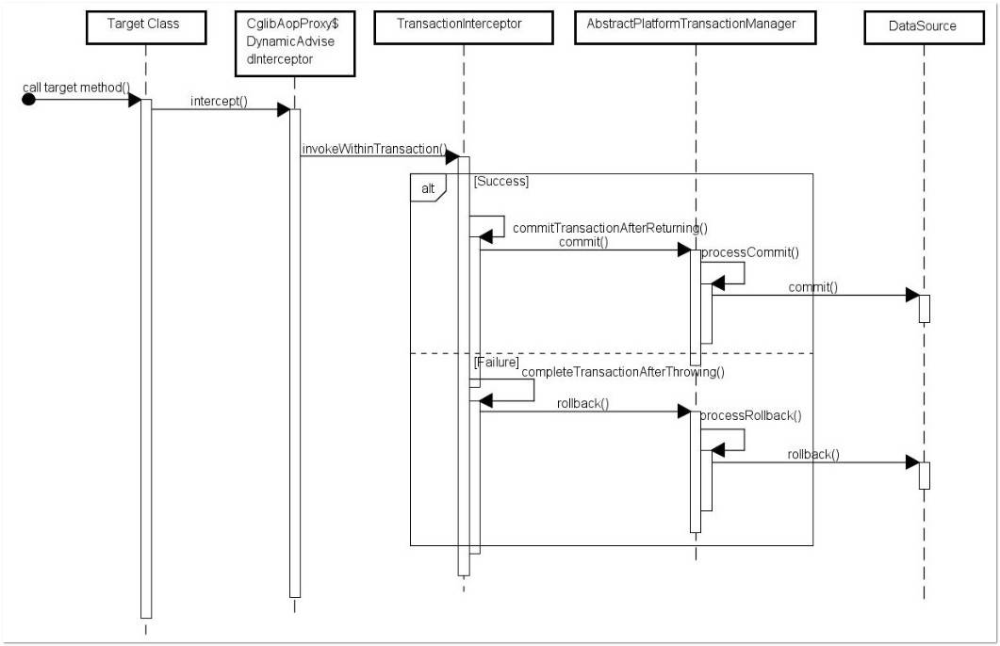
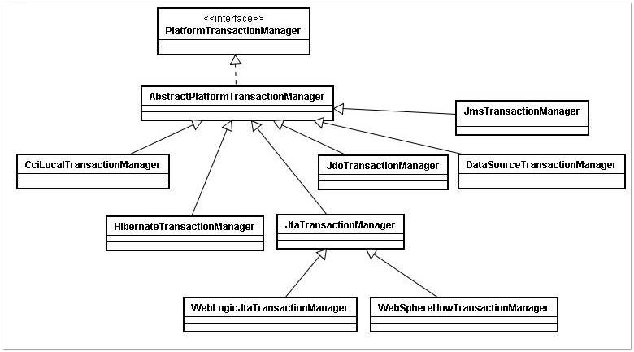

# Spring事务

## 一.使用

### 1.属性

| 属性名           | 说明                                                         |
| :--------------- | :----------------------------------------------------------- |
| name             | 当在配置文件中有多个 TransactionManager , 可以用该属性指定选择哪个事务管理器。 |
| propagation      | 事务的传播行为，默认值为 REQUIRED。                          |
| isolation        | 事务的隔离度，默认值采用 DEFAULT。                           |
| timeout          | 事务的超时时间，默认值为-1。如果超过该时间限制但事务还没有完成，则自动回滚事务。 |
| read-only        | 指定事务是否为只读事务，默认值为 false；为了忽略那些不需要事务的方法，比如读取数据，可以设置 read-only 为 true。 |
| rollback-for     | 用于指定能够触发事务回滚的异常类型，如果有多个异常类型需要指定，各类型之间可以通过逗号分隔。 |
| no-rollback- for | 抛出 no-rollback-for 指定的异常类型，不回滚事务。            |

-  REQUIRED

​        业务方法需要在一个事务中运行,如果方法运行时,已处在一个事务中,那么就加入该事务,否则自己创建一个新的事务.这是spring默认的传播行为.。 

-  SUPPORTS： 

​        如果业务方法在某个事务范围内被调用,则方法成为该事务的一部分,如果业务方法在事务范围外被调用,则方法在没有事务的环境下执行。

-  MANDATORY：

​        只能在一个已存在事务中执行,业务方法不能发起自己的事务,如果业务方法在没有事务的环境下调用,就抛异常

-  REQUIRES_NEW

​       业务方法总是会为自己发起一个新的事务,如果方法已运行在一个事务中,则原有事务被挂起,新的事务被创建,直到方法结束,新事务才结束,原先的事务才会恢复执行.

-  NOT_SUPPORTED

​      声明方法需要事务,如果方法没有关联到一个事务,容器不会为它开启事务.如果方法在一个事务中被调用,该事务会被挂起,在方法调用结束后,原先的事务便会恢复执行.

- NEVER：

​       声明方法绝对不能在事务范围内执行,如果方法在某个事务范围内执行,容器就抛异常.只有没关联到事务,才正常执行.

-  NESTED：

​     如果一个活动的事务存在,则运行在一个嵌套的事务中.如果没有活动的事务,则按REQUIRED属性执行.它使用了一个单独的事务, 这个事务拥有多个可以回滚的保证点.内部事务回滚不会对外部事务造成影响, 它只对DataSourceTransactionManager 事务管理器起效.

### 2.注意事项

需要注意下面三种 propagation 可以不启动事务。本来期望目标方法进行事务管理，但若是错误的配置这三种 propagation，事务将不会发生回滚。

1. TransactionDefinition.PROPAGATION_SUPPORTS：如果当前存在事务，则加入该事务；如果当前没有事务，则以非事务的方式继续运行。
2. TransactionDefinition.PROPAGATION_NOT_SUPPORTED：以非事务方式运行，如果当前存在事务，则把当前事务挂起。
3. TransactionDefinition.PROPAGATION_NEVER：以非事务方式运行，如果当前存在事务，则抛出异常。

默认情况下，如果在事务中抛出了未检查异常（继承自 RuntimeException 的异常）或者 Error，则 Spring 将回滚事务；除此之外，Spring 不会回滚事务。

如果在事务中抛出其他类型的异常，并期望 Spring 能够回滚事务，可以指定 rollbackFor。例：

@Transactional(propagation= Propagation.REQUIRED,rollbackFor= MyException.class)

通过分析 Spring 源码可以知道，若在目标方法中抛出的异常是 rollbackFor 指定的异常的子类，事务同样会回滚。

**只有@Transactional 注解应用到 public 方法，才能进行事务管理。**

在 Spring 的 AOP 代理下，只有目标方法由外部调用，目标方法才由 Spring 生成的代理对象来管理，这会造成自调用问题。若同一类中的其他没有@Transactional 注解的方法内部调用有@Transactional 注解的方法，有@Transactional 注解的方法的事务被忽略，不会发生回滚。

## 二.实现机制

在应用系统调用声明@Transactional 的目标方法时，Spring Framework 默认使用 AOP 代理，在代码运行时生成一个代理对象，根据@Transactional 的属性配置信息，这个代理对象决定该声明@Transactional 的目标方法是否由拦截器 TransactionInterceptor 来使用拦截，在 TransactionInterceptor 拦截时，会在在目标方法开始执行之前创建并加入事务，并执行目标方法的逻辑, 最后根据执行情况是否出现异常，利用抽象事务管理器AbstractPlatformTransactionManager 操作数据源 DataSource 提交或回滚事务

Spring AOP 代理有 CglibAopProxy 和 JdkDynamicAopProxy 两种，图是以 CglibAopProxy 为例，对于 CglibAopProxy，需要调用其内部类的 DynamicAdvisedInterceptor 的 intercept 方法。对于 JdkDynamicAopProxy，需要调用其 invoke 方法。

正如上文提到的，事务管理的框架是由抽象事务管理器 AbstractPlatformTransactionManager 来提供的，而具体的底层事务处理实现，由 PlatformTransactionManager 的具体实现类来实现，如事务管理器 DataSourceTransactionManager。不同的事务管理器管理不同的数据资源 DataSource，比如 DataSourceTransactionManager 管理 JDBC 的 Connection。

