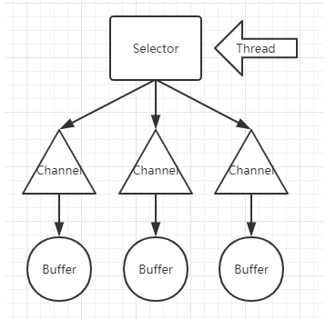

# NIO
- java.io中最为核心的一个概念是流(Stram),面试流的编程;Java中一个流要么是输入流,要么是输出流,不可能同时输入又是输出;
- java.nio中又有三个核心的概念:Selector,Channel,Buffer;在Java.nio中,我们是面向块(block)或者是缓冲区(buffer)编程的;

## NIO的常用对象属性与方法
### Buffer
&nbsp;&nbsp;&nbsp;&nbsp;Buffer本身就是一块内存,底层实现上,它实际就是一个数组,数据的读写都是通过Buffer来实现的;除了数组之外,Buffer还通过对于数据结构化访问的方式,并且可以追踪到到系统的读写过程;
Java中的7种原生数据类型都有各自对于的Buffer类型,如IntBuffer(没有Boolean)
### Channel
&nbsp;&nbsp;&nbsp;&nbsp;Channel指的是向其写入数据或者是从中读取的数据,他类似于java.io的Stram;所有数据的读写都是通过Buffer来来进行的,永远不会出现直接向Channel写入数据的情况,或者是直接从Channel读取数据的情况;
&nbsp;&nbsp;&nbsp;&nbsp;与Stream不同的是:Channel是双向的,一个流只可能是InputStream或者是OutputStream,Channel打开后可以进行读取,写入或者是读写;由于Channel是双向的,因此他能更好的反映出底层操作系统的真实情况;(在Linux中底层的通道就是双向的)
### Buffer和Channel关联
```java
public static void main(String[] args) throws Exception {
FileInputStream fileInputStream =new FileInputStream("D:\\workspace\\JavaStudy\\src\\NioTest.txt");
FileChannel fileChannel =fileInputStream.getChannel();
ByteBuffer byteBuffer=ByteBuffer.allocate(512);
//向缓存区中写入数据
fileChannel.read(byteBuffer);
//将缓冲区进行反转,让缓冲区中的数据可以被读取出
byteBuffer.flip();
while (byteBuffer.remaining()>0){
byte b=byteBuffer.get();
System.out.println("Character: "+(char)b);
}
fileInputStream.close();
}
```
### Buffer中的属性与方法
##### Capacity
 源码注解:is the number of elements it contains.  The   capacity of a buffer is never negative and never changes.
 翻译:Cpacity是包含元素的数量,Capacity在buffer中不可能为负数也不会改变;
 **理解:** 在buffer中在调用了allocate()方法后就会初始化出指定类型的buffer对象,传入的参数就为capacity的值,代表的就是这个buffer对象的容量大小,在被初始化了之后就不能改变了;
##### Posoition
源码注解:is the index of the next element to be   read or written.  A buffer's position is never negative and is never  greater than its limit. 
翻译:是要读取或写入的下一个元素的索引。缓冲区的position不能为负，也不能大于其极限。
**理解:** 就是指针的作用用于指向下一个要读取或者写入的索引;
##### Limit
源码注解:is the index of the first element that should  not be read or written.  A buffer's limit is never negative and is never greater than its capacity. 
翻译:是不能被读或者写的位置,(也就是操作的界限位置)缓冲区的limit永远不会为负，也永远不会大于它的容量。
**理解:** 在初始化时,limit的值就等于capacity,当buffer反转时limit会指向Posoition的位置,用于告诉外界现在buffer中有数据的界限在哪里;
#### buffer.flip()
反转方法中:将limit的位置改变,将position指向buffer的头;在flip翻转多次后buffer中能够存入的大小会不断的变小;
``` java
public final Buffer flip() {
        limit = position;
        position = 0;
        mark = -1;
        return this;
    }
```
#### buffer.clear()
清楚方法:将limit还原到最大值,而且将指针指定到头位置;
```java
public final Buffer clear() {
        position = 0;
        limit = capacity;
        mark = -1;
        return this;
    }
```
### Channel中的方法
#### channel.read()
在向buffer中写入数据时,正常写入则返回-1,异常返回0;
```java
public int read(ByteBuffer var1) throws IOException {
        this.ensureOpen();
        if (!this.readable) {
            throw new NonReadableChannelException();
        } else {
            synchronized(this.positionLock) {
                int var3 = 0;
                int var4 = -1;

                byte var5;
                try {
                    this.begin();
                    var4 = this.threads.add();
                    if (this.isOpen()) {
                        do {
                            var3 = IOUtil.read(this.fd, var1, -1L, this.nd);
                        } while(var3 == -3 && this.isOpen());
                        
                        //正常的返回 -1 
                        int var12 = IOStatus.normalize(var3);
                        return var12;
                    }

                    var5 = 0;
                } finally {
                    this.threads.remove(var4);
                    this.end(var3 > 0);

                    assert IOStatus.check(var3);

                }
                //异常返回0
                return var5;
            }
        }
    }
```
### Selector
#### 如何创建一个Selector
Selector 就是您注册对各种 I/O 事件兴趣的地方，而且当那些事件发生时，就是这个对象告诉您所发生的事件。
```java
Selector selector = Selector.open();
```
### 注册Channel到Selector
``` java
为了能让Channel和Selector配合使用，我们需要把Channel注册到Selector上。通过调用 channel.register（）方法来实现注册：channel.configureBlocking(false);
SelectionKey key =channel.register(selector,SelectionKey.OP_READ);
```
注意，注册的Channel 必须设置成异步模式 才可以,否则异步IO就无法工作，这就意味着我们不能把一个FileChannel注册到Selector，因为FileChannel没有异步模式，但是网络编程中的SocketChannel是可以的。
### 关于SelectionKey

请注意对register()的调用的返回值是一个SelectionKey。 SelectionKey 代表这个通道在此 Selector 上注册。当某个 Selector 通知您某个传入事件时，它是通过提供对应于该事件的 SelectionKey 来进行的。SelectionKey 还可以用于取消通道的注册。SelectionKey中包含如下属性：
The interest set
The ready setThe Channel
The SelectorAn attached object (optional)
（1）Interest set就像我们在前面讲到的把Channel注册到Selector来监听感兴趣的事件，interest set就是你要选择的感兴趣的事件的集合。你可以通过SelectionKey对象来读写interest set:
``` java
boolean isInterestedInAccept  = interestSet & SelectionKey.OP_ACCEPT;
boolean isInterestedInConnect = interestSet & SelectionKey.OP_CONNECT;
boolean isInterestedInRead    = interestSet & SelectionKey.OP_READ;
boolean isInterestedInWrite   = interestSet & SelectionKey.OP_WRITE;
```

（2）Ready Setready set
是通道已经准备就绪的操作的集合。在一次选Selection之后，你应该会首先访问这个ready set。Selection将在下一小节进行解释。可以这样访问ready集合：
``` java
selectionKey.isAcceptable(); 
selectionKey.isConnectable();
selectionKey.isReadable();
selectionKey.isWritable();
```
（3）Channel 和 Selector
我们可以通过SelectionKey获得Selector和注册的Channel：
``` java
Channel channel = selectionKey.channel(); 
Selector selector = selectionKey.selector();

还可以在用register()方法向Selector注册Channel的时候附加对象。如：
SelectionKey key = channel.register(selector, SelectionKey.OP_READ, theObject);
```
#### 关于SelectedKeys()
``` java

一旦调用了select()方法，它就会返回一个数值，表示一个或多个通道已经就绪，然后你就可以通过调用selector.selectedKeys()方法返回的SelectionKey集合来获得就绪的Channel。请看演示方法：
Set<SelectionKey> selectedKeys = selector.selectedKeys();
当你通过Selector注册一个Channel时，channel.register()方法会返回一个SelectionKey对象，这个对象就代表了你注册的Channel。这些对象可以通过selectedKeys()方法获得。你可以通过迭代这些selected key来获得就绪的Channel，下面是演示代码：
Set<SelectionKey> selectedKeys = selector.selectedKeys();
Iterator<SelectionKey> keyIterator = selectedKeys.iterator();
while(keyIterator.hasNext()) { 
SelectionKey key = keyIterator.next();
if(key.isAcceptable()) {
// a connection was accepted by a ServerSocketChannel.
} else if (key.isConnectable()) {
// a connection was established with a remote server.
} else if (key.isReadable()) {
// a channel is ready for reading
} else if (key.isWritable()) {
// a channel is ready for writing
}
keyIterator.remove();
}
```
## DirectByteBuffer
```java
ByteBuffer byteBuffer=ByteBuffer.allocateDirect(512);
```
&nbsp;&nbsp;&nbsp;&nbsp;DirectByteBuffer与HeapByteBuffer的区别,HeapByteBuffer是通过new出来的,是位于java虚拟机的堆上的,是一个纯正的java对象;
DirectByteBuffer:在它的顶层抽象方法中,Buffer中有一**long address**;
### address
真正表示的是堆外内存的地址,这样就可以操作到堆外的数据;
### 为什么要这样做?操作系统直接去操作jvm堆中的buffer不可以吗?:
&nbsp;&nbsp;&nbsp;&nbsp;如果当操作系统在操作jvm堆中的buffer的时候发生了GC的压缩等操作时,这个时候jvm中对象的内存地址就会发生改变,内存地址发生改变之后操作系统中操作的数据就会错乱;如果不让对象进行压缩和移动是不现实的,不让gc进行垃圾回收是更加不可能的,这个时候HeapByteBuffer的解决方法就是将堆中的数据拷贝一份到堆外的内存中,但是这样做的话操作系统进行操作数据时就多了一次操作中间步骤,会导致性能的降低;
### zero copy
因为DirectByteBuffer是通过address来操作堆外内存,这样的话就不需要拷贝一个数据到堆外了,这样的方式就叫做**零拷贝**;
## 内存映射文件
MapperbyteBuffer 是一种允许java直接从内存中直接访问的文件;