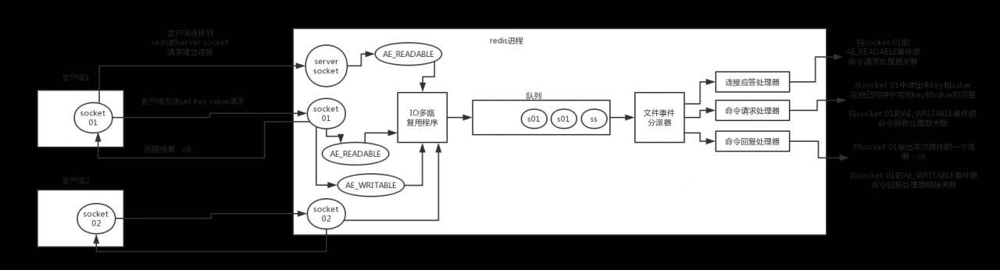

# Redis

## 1.Redis为什么这么快？

- 纯内存操作
- 核心是基于非阻塞的 IO 多路复用机制
- 单线程反而避免了多线程的频繁上下文切换问题

## 2.Redis线程模型有了解么？

### redis 的线程模型

redis 内部使用文件事件处理器 `file event handler`，这个文件事件处理器是单线程的，所以 redis 才叫做单线程的模型。它采用 IO 多路复用机制同时监听多个 socket，根据 socket 上的事件来选择对应的事件处理器进行处理。

文件事件处理器的结构包含 4 个部分：

- 多个 socket
- IO 多路复用程序
- 文件事件分派器
- 事件处理器（连接应答处理器、命令请求处理器、命令回复处理器）

多个 socket 可能会并发产生不同的操作，每个操作对应不同的文件事件，但是 IO 多路复用程序会监听多个 socket，会将 socket 产生的事件放入队列中排队，事件分派器每次从队列中取出一个事件，把该事件交给对应的事件处理器进行处理。

来看客户端与 redis 的一次通信过程：



客户端 socket01 向 redis 的 server socket 请求建立连接，此时 server socket 会产生一个 `AE_READABLE` 事件，IO 多路复用程序监听到 server socket 产生的事件后，将该事件压入队列中。文件事件分派器从队列中获取该事件，交给`连接应答处理器`。连接应答处理器会创建一个能与客户端通信的 socket01，并将该 socket01 的 `AE_READABLE` 事件与命令请求处理器关联。

假设此时客户端发送了一个 `set key value` 请求，此时 redis 中的 socket01 会产生 `AE_READABLE` 事件，IO 多路复用程序将事件压入队列，此时事件分派器从队列中获取到该事件，由于前面 socket01 的 `AE_READABLE` 事件已经与命令请求处理器关联，因此事件分派器将事件交给命令请求处理器来处理。命令请求处理器读取 socket01 的 `key value` 并在自己内存中完成 `key value` 的设置。操作完成后，它会将 socket01 的 `AE_WRITABLE` 事件与命令回复处理器关联。

如果此时客户端准备好接收返回结果了，那么 redis 中的 socket01 会产生一个 `AE_WRITABLE` 事件，同样压入队列中，事件分派器找到相关联的命令回复处理器，由命令回复处理器对 socket01 输入本次操作的一个结果，比如 `ok`，之后解除 socket01 的 `AE_WRITABLE` 事件与命令回复处理器的关联。

这样便完成了一次通信。

## 3.Redis的String类型底层原理什么？

https://www.cnblogs.com/MouseDong/p/11134039.html

## 4.Redis怎么一次性读取所有的key

官网对于KEYS命令有一个提示： KEYS 的速度非常快，例如，Redis在一个有1百万个key的数据库里面执行一次查询需要的时间是40毫秒 。但在一个大的数据库中使用它仍然可能造成性能问题，如果你需要从一个数据集中查找特定的 `KEYS`， 你最好还是用 Redis 的集合结构 [SETS](http://www.redis.cn/commands/sets.html) 来代替。

KEYS命令使用很简单。

但由于KEYS命令一次性返回所有匹配的key，所以，当redis中的key非常多时，对于内存的消耗和redis服务器都是一个隐患，

对于Redis 2.8以上版本给我们提供了一个更好的遍历key的命令 SCAN 该命令的基本格式：

 

```css
SCAN cursor [MATCH pattern] [COUNT count]
```


SCAN 每次执行都只会返回少量元素，所以可以用于生产环境，而不会出现像 [KEYS](http://www.redis.cn/commands/keys.html) 或者 [SMEMBERS](http://www.redis.cn/commands/smembers.html) 命令带来的可能会阻塞服务器的问题。

[SCAN](http://www.redis.cn/commands/scan.html)命令是一个基于游标的迭代器。这意味着命令每次被调用都需要使用上一次这个调用返回的游标作为该次调用的游标参数，以此来延续之前的迭代过程

当[SCAN](http://www.redis.cn/commands/scan.html)命令的游标参数（即cursor）被设置为 0 时， 服务器将开始一次新的迭代， 而当服务器向用户返回值为 0 的游标时， 表示迭代已结束。