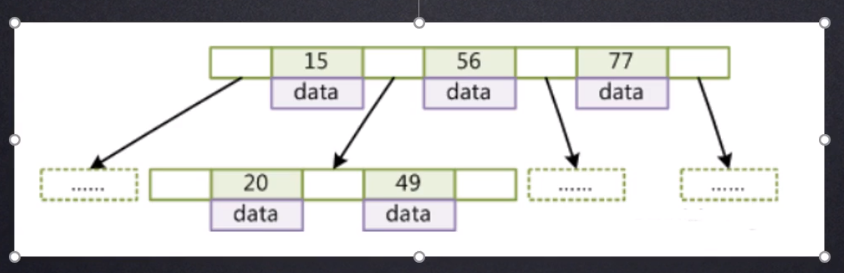
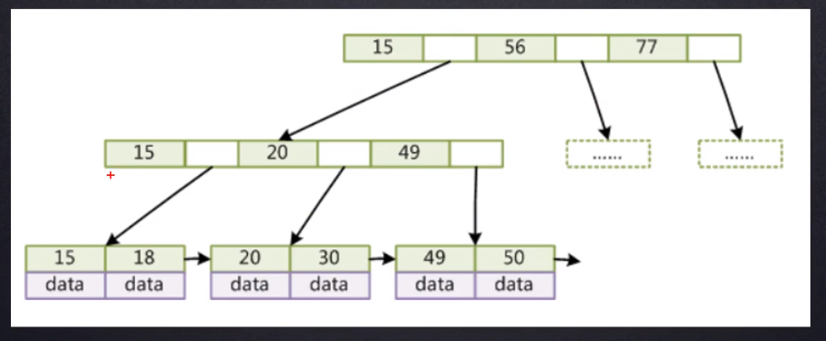

# 索引

## 一.索引是什么

索引是帮助MySQL高效获取数据的==排好序==的==数据结构==

## 二.索引的数据结构

* 二叉树
* 红黑树
* Hash表
* B-Tree

### B树

* 叶节点具有相同的深度，
* 叶节点的指针为空所有索引元素不重复
* 节点中的数据索引从左到右递增排列

### B+树

* 非叶子节点不存储data,只存储索引(冗余),可以放更多的索引  
* 叶子节点包含所有索引字段  
* 叶子节点用指针连接,提高区间访问的性能

指针的作用：可以在范围查找的时候（>n）快速的将后续的数据查询出来

## 三.联合索引

