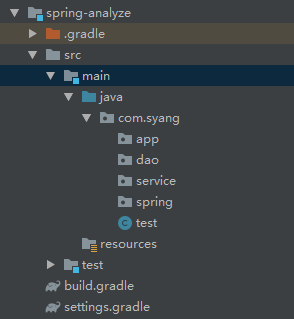
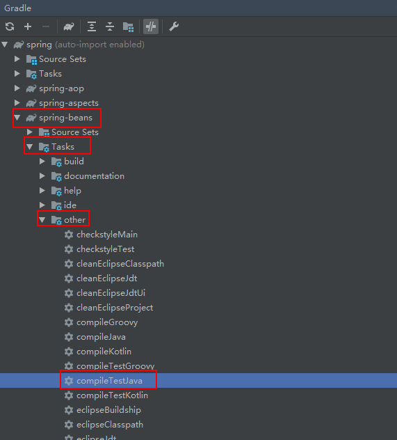
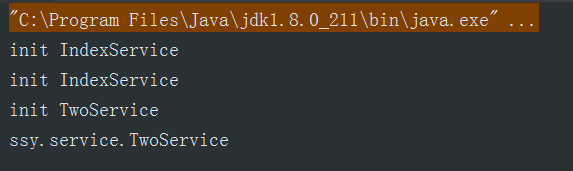
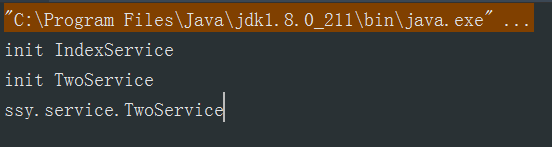
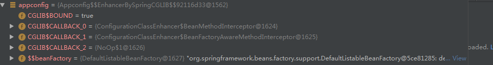

##  构建spring源码的阅读环境

#### 	1.下载spring

​		去git上搜索spring-framework下载下5.1.x版本的zip包后,选择路径将其解压;

#### 	2.安装gradle

​		去官网下载压缩包同样解压到指定的路径中,在环境变量中配置新建变量GRADLE_HOME值为gradle的根路径,在path中添加%GRADLE_HOME%\bin;在cmd中测试gradle -v安装是否成功;出现jvm版本信息代表安装成功;

#### 	3.使用gradle构建spring

​		在cmd中进入到spring-framework的路径中,输入命令 gradlew.bat运行该文件,出现安装耗时则构建成功;

#### 	4.在idea使用gradle中打开项目

​		在idea中open搭建好的项目,选择使用gradle的本地仓库路径.等待下载完成即可;

#### 	5.在spring-framework创建module

​		在spring-framwork项目中new一个module,选择最基本的java项目,在之后的gradle选择中选择自己已经安装好的gradle路径;创建出一个spring项目的包结构;



​	在构建出的项目中,在build.gradle中添加对spring-framework的依赖,从最为原始的spring-context开始;

``` gradle
dependencies {
    compile project('spring-context')
    testCompile group: 'junit', name: 'junit', version: '4.12'
}
```

#### 6.通常报错处理

​	在build是要先对core,oxm,beans进行编译,在出现jar缺失的异常时在,gradle工具箱中,找到对应的compileTestJava执行;重新下载jar包



## 													开始解析spring源码

### 一.springcglib

#### 1.Configuration 的作用

Configuration作用是保证spring在使用@bean注解方式实例化bean的时候保证其生命周期和作用域的,

``` java
Appconfig.java	
/*
	在一个bean引用另一个bean时没有Configuration注解时IndexService会实例化两次;
	 */

	@Bean
	public IndexService indexService(){
		return new IndexService();
	}
	@Bean
	public TwoService twoService(){
		indexService();
		return new TwoService();
	}
```

没有的时候:

​	

有的时候:

#### 2.为什么 Configuration能有如此作用

   在添加上Configuration注解时,通过getBean来获取到Appconfig,在debug模式下可以看到Appconfig已经不是原本的类了;

```java
Appconfig appconfig=annotationConfigApplicationContext.getBean(Appconfig.class);
```



​	在org/springframework/context/annotation/ConfigurationClassPostProcessor.java这个类中enhanceConfigurationClasses的方法中new了一个增强的配置class

``` java
ConfigurationClassEnhancer enhancer = new ConfigurationClassEnhancer();
```

在ConfigurationClassEnhancer中的new方法

``` java
private Enhancer newEnhancer(Class<?> configSuperClass, @Nullable ClassLoader classLoader) {
		Enhancer enhancer = new Enhancer();
		enhancer.setSuperclass(configSuperClass);
		enhancer.setInterfaces(new Class<?>[] {EnhancedConfiguration.class});
		enhancer.setUseFactory(false);
		enhancer.setNamingPolicy(SpringNamingPolicy.INSTANCE);
		enhancer.setStrategy(new BeanFactoryAwareGeneratorStrategy(classLoader));
		enhancer.setCallbackFilter(CALLBACK_FILTER);
		enhancer.setCallbackTypes(CALLBACK_FILTER.getCallbackTypes());
		return enhancer;
	}
```


