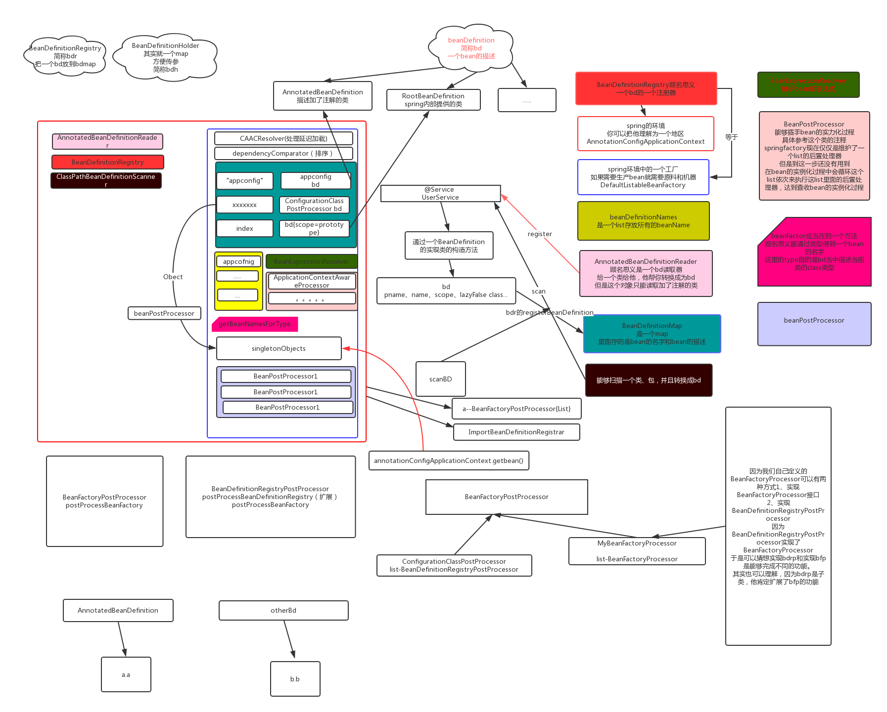

# spring环境

# refresh方法

## 一.prepareRefresh()

准备工作包括设置启动时间，是否激活标识位

## 二.ConfigurableListableBeanFactory beanFactory = obtainFreshBeanFactory()

返回一个factory为了在之后的流程对其初始化

## 三.prepareBeanFactory(beanFactory)

准备工厂

## 四.postProcessBeanFactory(beanFactory)

空方法

## 五.invokeBeanFactoryPostProcessors(beanFactory)

在spring的环境中去执行已经被注册的 factory processors//设置执行自定义的ProcessBeanFactory 和spring内部自己定义的

