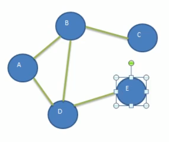
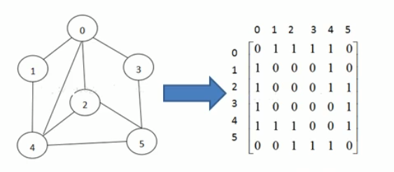
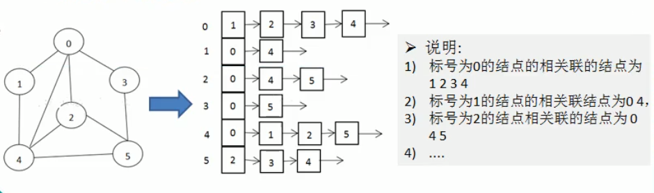

# 图

## 一.图得基本介绍

### 1.为什么要有图

* 线性表局限于一个直接前驱和一个直接后继的关系（一对一）
* 树也只能有一个直接前驱也就是父节点（一对多）
* 当我们需要表示多对多的关系时，这里我们就用到了图（多对多）

### 2.图的基本结构

图是一种数据结构,其中结点可以具有零个或多个相邻元素。两个结点之间的连接  称为边。结点也可以称为项点。

### 3.图的常用概念

1. 顶点
2. 边
3. 路径
4. 无向图
5. 有向图
6. 带权图

### 4.图的表现方式

图的表示方式有两种:二维数组表示(邻接矩阵);链表表示(邻接表)。 

#### a.邻接矩阵  

邻接矩阵是表示图形中顶点之间相邻关系的矩阵,对于n个顶点的图而言,矩阵是  的row和co表示的是1n个点

#### b.邻接表 

邻接矩阵需要为每个顶点都分配n个边的空间,其实有很多边都是不存在会造成空间的一定损失 

邻接表只关心存在的边,不关心不存在的边。因此没有空间浪费,邻接表的实现由数组+链表组成

## 二.图的遍历

### 1.图遍历介绍

所谓图的遍历,即是对结点的访问。一个图有那么多个结点,如何遍历这些结点,  需要特定策略,一般有两种访问策略:(1)深度优先遍历(2)广度优先遍历  深度优先遍历基本思想  

### 2.图的深度优先搜索( Depth First Search)。

1. 深度优先遍历，从初始访问结点出发，初始访问结点可能有多个邻接结点，深度优先遍历的策略就是首先访问第一个邻接结点，然后再以这个被访问的邻接结点作为初始结点，访问它的第一个邻接结点，==可以这样理解:==每次都在访问完**当前结点**后首先访问当前结点的**第一个邻接结点**。
2. 我们可以看到，这样的访问策略是优先往纵向挖掘深入，而不是对一个结点的所有邻接结点进行横向访问。
3. 显然，深度优先搜索是一个递归的过程

#### a.深度优先的算法步骤

1. 访问初始结点v,并标记结点v为已访问。
2. 查找结点v的第一个邻接结点w。  
3. 若w存在,则继续执行4,如果w不存在,则回到第1步,将从v的下一个结点继续。
4. 若w未被访问,对w进行深度优先遍历递归(即把w当做另一个v,然后进行步骤123)。  
5. 查找结点v的w邻接结点的下一个邻接结点,转到步骤3

### 3.图的广度优先搜索(Broad First Search)  

类似于一个分层搜索的过程,广度优先遍历需要使用一个队列以保持访问过的结点的顺序,  以便按这个顺序来访问这些结点的邻接结点

#### a.广度优先的算法步骤

1. 访问初始结点v并标记结点v为已访问。  
2. 结点v入队列  
3. 当队列非空时,继续执行,否则算法结束。  
4. 出队列,取得队头结点u  
5. 查找结点u的第一个邻接结点w
6. 若结点u的邻接结点w不存在,则转到步骤3;否则循环执行以下三个步骤
   * 若结点w尚未被访问，则访问结点w并标记为已访问。
   * 结点w入队列
   * 查找结点u的继w邻接结点后的下一个邻接结点w，转到步骤6。

