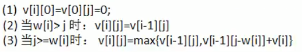
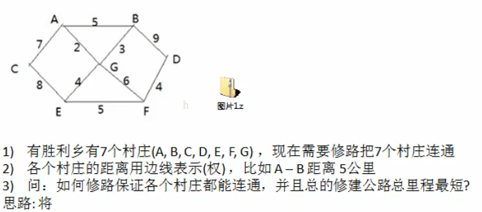
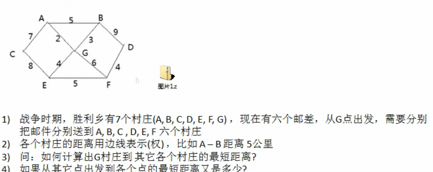

# 常用的十种算法

## 一.分治算法

### 1.分治算法的介绍

分治法是一种很重要的算法。字面上的解释是“分而治之”,就是把一个复杂的问题分  成两个或更多的相同或相似的子问题,再把子问题分成更小的子问题直到最后子问题  可以简单的直接求解,原问题的解即子问题的解的合并。这个技巧是很多高效算法的基础,如排序算法(快速排序,归并排序)傅立叶变换(快速傅立叶变换

### 2.分治算法的基本步骤

1. 分解:将原问题分解为若干个规模较小,相互独立,与原问题形式相同的子问题  
2. 解决:若子问题规模较小而容易被解决则直接解,否则递归地解各个子问题  
3. 合并:将各个子问题的解合并为原问题的解。

## 二.动态规划算法

### 1.动态规划算法的介绍

1. 动态规划(Dynamic Programming)算法的核心思想是:将大问题划分为小问题进  行解决,从而一步步获取最优解的处理算法    
2. 动态规划算法与分治算法类似,其基本思想也是将待求解问题分解成若干个子  问题,先求解子问题,然后从这些子问题的解得到原问题的解。    
3. 与分治法不同的是,适合于用动态规求解的问题,经分解得到子问题往往不  是互相独立的。(即下一个子阶段的求解是建立在上一个子阶段的解的基础上,  进行进一步的求解)    
4. 动态规划可以通过填表的方式来逐步推进,得到最优解

### 2.动态规划算法最佳实践背包问题

​    背包问题:有一个背包,容量为4磅,现有如下物品

| 物品    | 重里 | 价格 |
| ------- | ---- | ---- |
| 吉他(G  | 1    | 1500 |
| 音响(S) | 4    | 3000 |
| 电脑(L) | 3    | 2000 |

1. 要求达到的目标为装入的背包的总价值最大,并且重量不超出  
2. 要求装入的物品不能重复
3. 思路分析和图解  
   * 背包问题主要是指一个给定容量的背包若干具有一定价值和重量的物品,如何选择物品放入背包使物品的价值最大。其中又分01背包和完全背包(完全背包指的是:  每种物品都有无限件可用)  
   * 这里的问题属于01背包,即每个物品最多放一个。而无限背包可以转化为01背包。
   * 算法的主要思想，利用动态规划来解决。每次遍历到的第i个物品，根据w[i]和v[i]来确定是否需要将该物品放入背包中。即对于给定的n个物品，设vi]、w]分别为第个物品的价值和重量，C为背包的容量。再令vi]i]表示在前i个物品中能够装入容量为j的背包中的最大价值。则我们有下面的结果：
              

## 三.KMP算法

### 1.应用场景

有一个字符串str1="硅硅谷尚硅谷你尚硅尚硅谷你尚硅谷你尚硅你好",和  一个子串str2=尚硅谷你尚硅你  现在要判断str1是否含有str2,如果存在,就返回第一次出现的位置,如果没有,  则返回-1

#### a.暴力匹配

如果用暴力匹配的思路，并假设现在str1匹配到i位置，子串str2匹配到j位置，则有：

1. 如果当前字符匹配成功（即str1i]==str2])，则i++，j++，继续匹配下一个字
       符
2. 如果失配（即str1[i]!=str2j])，令i=i-(j-1)，j=0。相当于每次匹配失败时，i
       回溯，j被置为0。
3. 用暴力方法解决的话就会有大量的回溯，每次只移动一位，若是不匹配，移动到下一位接着判断，浪费了大量的时间。（不可行！）
4. 暴力匹配算法实现

### 2.KMP介绍

1. KMP是一个解决模式串在文本串是否出现过,如果出现过,最早出现的位置的  经典算法  
2. Knuth-Morris-Pratt--字符串查找算法,简称为“KMP算法”,常用于在一个文本  串S内查找一个模式串P的出现位置,这个算法由 Donald Knuth、 Vaughan Pratt  James. Morris三人于1977年联合发表,故取这3人的姓氏命名此算法  
3. KMP方法算法就利用之前判断过信息,通过一个next数组,保存模式串中前后  最长公共子序列的长度,每次回溯时,通过next数组找到,前面匹配过的位置,  省去了大量的计算时间（
4. https://blog.csdn.net/v_JULY_v/article/details/7041827

#### a.next数组的生成

```
 public static int[] getNext(String dest){
        int[] next=new int[dest.length()];
        //给第一个元素时的重合值赋值为0
        next[0]=0;
        for (int i = 1,j=0; i <next.length ; i++) {
            /*
            生成流程如下，从第二个元素开始，当与第i个字符相等时，j++将j值赋值到相对于的next中
            但是在j>0也就是前面已经找到了重合部分时候，当现在的第i字符不相等时，将next前一个值赋给j
            并且循环直到j=0或者找到字符相等；
             */
            while (j>0&& dest.charAt(i)!=dest.charAt(j)){
                j=next[j-1];
            }
            if (dest.charAt(i)==dest.charAt(j)){
                j++;
            }
            next[i]=j;
        }
        return next;
    }
```

## 四.贪心算法

### 1.应用场景

假设存在下面需要付费的广播台,以及广播台信号可以覆盖的地区。如何选择最  少的广播台,让所有的地区都可以接收到信号

| 广播台 | 覆盖地区           |
| ------ | ------------------ |
| k1     | 北京,"上海","天津" |
| k2     | 广州,北京","深圳   |
| k3     | 成都,"上海","杭州  |
| k4     | 上海","天津        |
| k5     | 杭州,"大连         |

### 2.贪心算法介绍

1. 贪婪算法(贪心算法)是指在对问题进行求解时,在每一步选择中都采取最好或  者最优(即最有利)的选择,从而希望能够导致结果是最好或者最优的算法    
2. 贪婪算法所得到的结果不一定是最优的结果有时候会是最优解),但是都是相  对近似(接近)最优解的结果

### 3.算法步骤

1. 遍历所有的广播电台,找到一个覆盖了最多未覆盖的地区的电台(此电台可能包 含一些已覆盖的地区,但没有关系) 
2. 将这个电台加入到一个集合中(比如ArrayList)想办法把该电台覆盖的地区在下  次比较时去掉。  
3. 重复第1步直到覆盖了全部的地区

## 五.普里姆算法

### 1.应用场景



### 2.最小生成树

修路问题本质就是就是最小生成树问题,先介绍一下最小生成树(Minimum Cost  Spanning Tree),简称MST  

1. 给定一个带权的无向连通图,如何选取一棵生成树,使树上所有边上权的总和为最小这叫最小生成树
2. N个顶点,一定有N-1条边
3. 包含全部顶点 
4. N-1条边都在图中

### 3.普里姆算法介绍

普利姆（Prim）算法求最小生成树，也就是在包含n个顶点的连通图中，找出只有（n-1)条边包含所有n个顶点的连通子图，也就是所谓的极小连通子图

普利姆的算法如下：

1. 设G=（V，E）是连通网，T=（U,D）是最小生成树，V,U是顶点集合，E,D是边的集合
2. 若从顶点u开始构造最小生成树，则从集合V中取出顶点u放入集合U中，标记顶点v的
   visited[u]=1
3. 若集合U中顶点山与集合V-U中的顶点vj之间存在边，则寻找这些边中权值最小的边，但不能构成回路，将顶点j加入集合U中，将边（uivj）加入集合D中，标记visited[vj]=1
4. 重复步骤②，直到U与V相等，即所有顶点都被标记为访问过，此时D中有n-1条边

## 六.克鲁斯卡尔算法

同普里姆算法一类似都是求最小生成树的算法

#### 1.克鲁斯卡尔算法介绍

克鲁斯卡尔(Kruskal)算法,是用来求加权连通图的最小生成树的算法。 

 基本思想:

1. 按照权值从小到大的顺序选择n-1条边,并保证这n1条边不构成回路  
2. 具体做法:首先构造一个只含n个顶点的森林,然后依权值从小到大从连通网  中选择边加入到森林中,并使森林中不产生回路,直至森林变成一棵树为止

#### 2.实现解决

根据前面介绍的克鲁斯卡尔算法的基本思想和做法,我们能够了解到,克鲁斯卡  尔算法重点需要解决的以下两个问题  

问题一对图的所有边按照权值大小进行排序。  

问题二将边添加到最小生成树中时,怎么样判断是否形成了回路。

解决方案：排序使用任意排序算法即可，如何判断形成了回路。判断要添加的边的两个顶点的终点在添加前和添加后是否有不同。

## 七.迪杰斯特拉算法

#### 1.应用场景



#### 2.迪杰斯特拉算法介绍

迪杰斯特拉(Dijkstra)算法是典型最短路径算法,用于计算一个结点到其他结点的最  短路径。它的主要特点是以起始点为中心向外层层扩展广度优先搜索思想),直到  扩展到终点为止。

#### 3.算法过程

设置出发顶点为v,顶点集合i{v1,v2,vi.},V到V中各顶点的距离构成距离集合Dis,  Dis{d1,d2,di.},Dis集合记录着v到图中各顶点的距离(到自身可以看作0,v到距离  对应为di

1. 从Dis中选择值最小的d并移出Dis集合,同时移出V集合中对应的顶点v,此时的  V到ⅵ即为最短路径    
2. 更新Dis集合,更新规则为:比较v到V集合中顶点的距离值,与V通过ⅵ到V集合中顶点的距离值,保留值较小的一个(同时也应该更新顶点的前驱节点为v,表  明是通过v到达的)  
3. 重复执行两步骤,直到最短路径顶点为目标顶点即可结束

