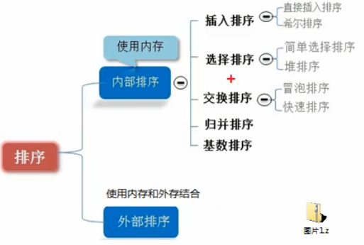
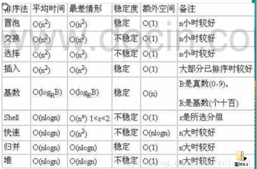
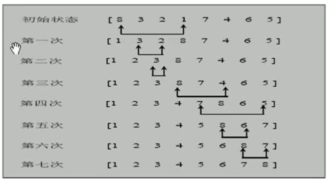
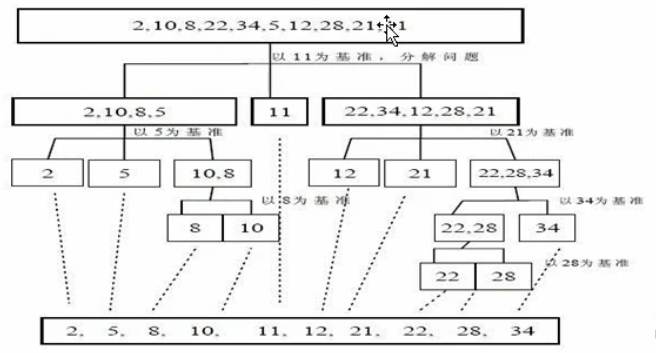
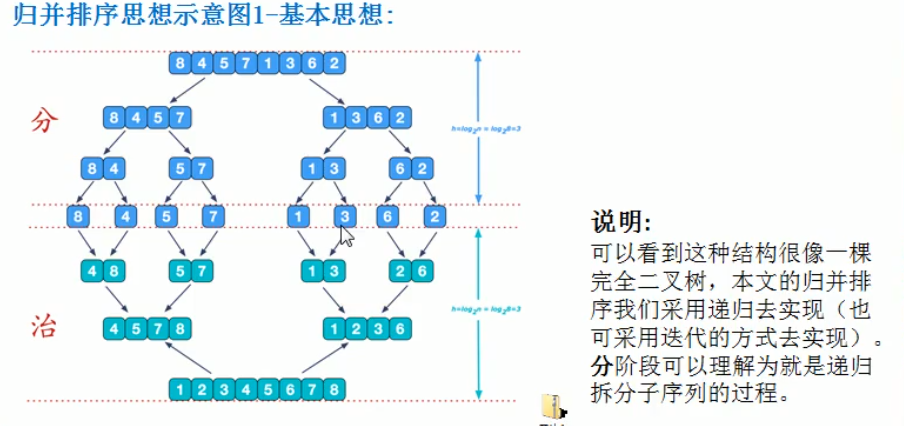
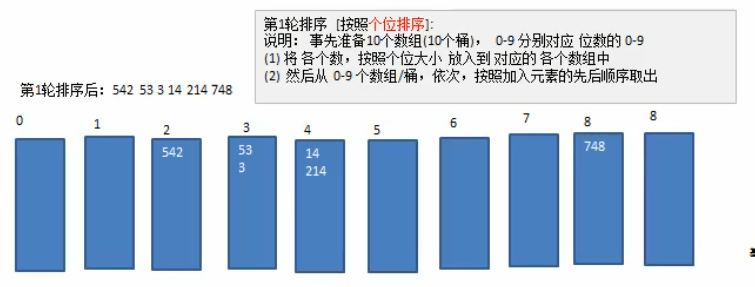

# 排序

****



## 一.冒泡排序

### 太过简单略
## 二.选择排序
### 思想
选择排序( select sorting)也是一种简单的排序方法。它的基本思想是:第一次从arm이}~anr[n-1]1中选取最小值,与ar이交换,第二次anl~anr{n-l]中选取最小值,与an1交换,第三次从ar[2]ar[n-]中选取最小值,与ar[2交换,…,第i次从arli-]ann-1]中选取最小值,与ari-1]交换,…第n-1次从arn-2ar[n-]1中选取最小值,与armn-기交换,总共通过n1次,得到一个按排序码从小到大排列的有序序列。
###  图解
!
### 代码
``` java
/**
     * 嵌套循环,外层循环控制从第几个开始进行排序
     * 内层循环通过遍历得到最小的值和他的索引
     * 在内层循环结束后将得到的最小值进行排放和交换
     * 时间复杂度为0(n^2)
     * @param args
     */
    public static void sort(int [] args){
        for(int i=0;i< args.length-1;i++){
            int minIndex=i;
            int min=args[i];
            for(int j=i+1;j<args.length;j++){
                if(min>args[j]){
                    min=args[j];
                    minIndex=j;
                }
            }
            if(minIndex!=i){
                args[minIndex]=args[i];
                args[i]=min;
            }
        }
    }
```
## 三.插入排序
### 思想
插入排序( Insertion Sorting)的基本思想是:把n个待排序的元素看成为个有序表和一个无序表,开始时有序表中只包含一个元素,无序表中包有n-1个元素,排序过程中每次从无序表中取出第一个元素,把它的排序码依次与有序表元素的排序码进行比较,将它插入到有序表中的适当位置,使之成为新的有序表
### 图解

### 代码
``` java
/**
     * 外层循环控制需要排序的数
     * 内存循环进行递归判断大小,直到符合要求后将后一个数后移,然后将本次数插入;
     * @param arr
     */
    public static void sort(int[] arr){
        for(int i=1;i<arr.length;i++){
            int insertVal=arr[i];
            int insertIndex=i-1;
            while (insertIndex>=0&&insertVal<arr[insertIndex]){
                arr[insertIndex+1]=arr[insertIndex];
                insertIndex--;
            }
            arr[insertIndex+1]=insertVal;
        }
    }
```
## 四.希尔排序
### 思想
希尔排序是把记录按下标的一定增量分组,对每组使用直接插入排序算法排序;随着增量逐渐减少,每组包含的关键词越来越多,当增量减至1时,整个文件恰被分成一组,算法便终止
### 图解
### 
```java
 //交换式
    public static void sort(int [] arr){
        int temp=0;
        for(int gap=arr.length/2;gap>0;gap/=2){
            for(int i=gap;i<arr.length;i++){
                for(int j=i-gap;j>=0;j-=gap){
                    if(arr[j]>arr[j+gap]){
                        temp=arr[j];
                        arr[j]=arr[j+gap];
                        arr[j+gap]=temp;
                    }
                }
            }
        }
    }
    //移位式
    public static void sort2(int [] arr){
        for (int gap=arr.length/2;gap>0;gap/=2){
            for(int i=gap;i<arr.length;i++){
                int j=i;
                int temp=arr[j];
                if(arr[j]<arr[j-gap]){
                    while (j-gap>=0&&temp<arr[j-gap]){
                        arr[j]=arr[j-gap];
                        j-=gap;
                    }
                    arr[j]=temp;
                }
            }
        }
    }
```
## 五.快速排序
### 思想
快速排序( quicksort)是对冒泡排序的一种改进。基本思想是:通过一趙排序将要排序的数据分割成独立的两部分,其中一部分的所有数据都比另外一部分的所有数据都要小,然后再按此方法对这两部分数据分别进行快速排序,整个排序过程可以递归进行,以此达到整个数据变成有序序列

### 图解




## 六.归并排序

### 思想



## 基数排序

### 简介

* 基数排序(radix sort)属于“分配式排序(distribution sort),又称“桶  子法”( bucket sort)或 bin sort,顾名思义,它是通过键值的各个位的值,  将要排序的元素分配至某些“桶”中,达到排序的作用    

* 基数排序法是属于稳定性的排序,基数排序法的是效率高的稳定性排序法    
* 基数排序(Radix Sort是桶排序的扩展    
* 基数排序是1887年赫尔曼何乐礼发明的。它是这样实现的:将整数按位数切  割成不同的数字,然后按每个位数分别比较

### 思想

将所有待比较数值统一为同样的数位长度，数位较短的数前面补零。然后，从最低位开始，依次进行一次排序。这样从最低位排序一直到最高位排序完以后，数列就变成一个有序序列。

### 图解



### 实现

在实现过程中从桶子中返回的到原数组的过程中时注意先进先出，推荐使用队列；

基数排序是经典的用空间换时间的排序算法