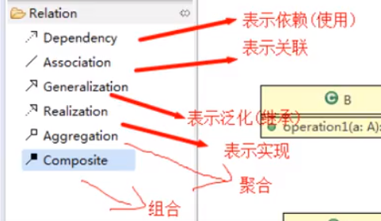

# 设计模式

## 一.简介

### 1.设计模式说明

编写软件过程中，程序员面临着来自耦合性，内聚性以及可维护性，可扩展性，重用性，灵活性等多方面的挑战，设计模式是为了让程序（软件），具有更好

1. 代码重用性
2. 可读性
3. 可扩展性
4. 可靠性
5. 使程序呈现高内聚，低耦合的特性

### 2.设计模式七大原则

设计模式原则，其实就是程序员在编程时，应当遵守的原则，也是各种设计模式的基础（即：设计模式为什么这样设计的依据）
设计模式常用的七大原则有

#### 1).单一职责原则

##### 基本介绍

对类来说的，即一个类应该只负责一项职责。如类A负责两个不同职责：职责1，职责2。当职责1需求变更而改变A时，可能造成职责2执行错误，所以需要将类A的粒度分解为A1，A2

##### 注意事项

1. 降低类的复杂度，一个类只负责一项职责。
2. 提高类的可读性，可维护性
3. 降低变更引起的风险
4. 通常情况下，我们应当遵守单一职责原则，只有逻辑足够简单，才可以在代码级违反单一职责原则；只有类中方法数量足够少，可以在方法级别保持单一职责原则

#### 2).接口隔离原则

##### 基本介绍

客户端不应该依赖它不需要的接口，即一个类对另一个类的依赖应该建立在最小的接口上

#### 3).依赖倒转原则

##### 基本介绍

1. 高层模块不应该依赖低层模块，二者都应该依赖其抽象
2. 抽象不应该依赖细节，细节应该依赖抽象
3. 依赖倒转（倒置）的中心思想是面向接口编程
4. 依赖倒转原则是基于这样的设计理念：相对于细节的多变性，抽象的东西要稳定的多。以抽象为基础搭建的架构比以细节为基础的架构要稳定的多。在java中，抽象指的是接口或抽象类，细节就是具体的实现类
5. 使用接口或抽象类的目的是制定好规范，而不涉及任何具体的操作，把展现细节的任务交给他们的实现类去完成

##### 注意事项

1. 低层模块尽量都要有抽象类或接口，或者两者都有，程序稳定性更好。
2. 变量的声明类型尽量是抽象类或接口，这样我们的变量引用和实际对象间，就存在个缓冲层，利于程序扩展和优化
3. 继承时遵循里氏替换原则

#### 4).里氏替换原则

##### oo中的继承性的思考和说明

1. 继承包含这样一层含义：父类中凡是已经实现好的方法，实际上是在设定规范和契约，虽然它不强制要求所有的子类必须遵循这些契约，但是如果子类对这些已经实现的方法任意修改，就会对整个继承体系造成破坏。
2. 继承在给程序设计带来便利的同时，也带来了弊端。比如使用继承会给程序带来侵入性，程序的可移植性降低，增加对象间的耦合性，如果一个类被其他的类所继承，则当这个类需要修改时，必须考虑到所有的子类，并且父类修改后，所有涉及到子类的功能都有可能产生故障
3. 问题提出：在编程中，如何正确的使用继承？=>里氏替换原则

##### 基本介绍

1. 里氏替换原则（ Liskov Substitution Principle）在1988年，由麻省理工学院的以为姓里的女士提出的。
2. 如果对每个类型为T的对象o1，都有类型为T2的对象o2，使得以T1定义的所有程序P在所有的对象01都代换成02时，程序P的行为没有发生变化，那么类型T2是类型T1的子类型。换句话说，所有引用基类的地方必须能透明地使用其子类的对象。
3. 在使用继承时，遵循里氏替换原则，在子类中尽量不要重写父类的方法
4. 里氏替换原则告诉我们，继承实际上让两个类耦合性增强了，在适当的情况下，可以通过聚合，组合，依赖来解决问题

#### 5).开闭原则

##### 基本介绍

1. 开闭原则（ Open Closed Principle）是编程中最基础、最重要的设计原则
2. 一个软件实体如类，模块和函数应该对扩展开放，对修改关闭。用抽象构建框架，用实现扩展细节。
3. 当软件需要变化时，尽量通过扩展软件实体的行为来实现变化，而不是通过修改已有的代码来实现变化。
4. 编程中遵循其它原则，以及使用设计模式的目的就是遵循开闭原则。

#### 6).迪米特法则

##### 基本介绍

1. 一个对象应该对其他对象保持最少的了解
2. 类与类关系越密切，耦合度越大
3. 迪米特法则（ Demeter Principle）又叫最少知道原则，即一个类对自己依赖的类知道的越少越好。也就是说，对于被依赖的类不管多么复杂，都尽量将逻辑封装在类的内部。对外除了提供的 public方法，不对外泄露任何信息
4. 迪米特法则还有个更简单的定义：只与直接的朋友通信
5. 直接的朋友：每个对象都会与其他对象由耦合关系，只要两个对象之间有耦合关系我们就说这两个对象之间是朋友关系。耦合的方式很多，依赖，关联，组合，聚合等。其中，我们称出现成员变量，方法参数，方法返回值中的类为直接的朋友，而出现在局部变量中的类不是直接的朋友。也就是说，陌生的类最好不要以局部变量的形式出现在类的内部。

##### 注意事项和

1. 迪米特法则的核心是降低类之间的耦合
2. 但是注意：由于每个类都减少了不必要的依赖，因此迪米特法则只是要求降低类间（对象间）耦合关系，并不是要求完全没有依赖关系

#### 7).合成复用原则

##### 基本介绍

原则是尽量使用合成/聚合的方式，而不是使用继承

## 二.UML

### 1.UML基本介绍

1. UML--Unified modeling language UML
   （统一建模语言），是一种用于软件系统分析和设计的语言工具，它用于帮助软件开发人员进行思考和记录思路的结果
2. UML本身是一套符号的规定，就像数学符号和化学符号一样，这些符号用于描述软件模型中的各个元素和他们之间的关系，比如类、接口、实现、泛化、依赖、组合、聚合等，如右图：
3. 使用UML来建模，常用的工具有 Rational Rose，也可以使用一些插件来建模

https://plantuml.com/zh/class-diagram

### 2.UML图

画UML图与写文章差不多，都是把自己的思想描述给别人看，关键在于思路和条理， 

UML图分类

1. 用例图 （use case）

2. 静态结构图：类图、对象图、包图、组件图、部署图

3. 动态行为图：交互图（时序图与协作图）、状态图、活动图

   #### 1).类图

   1. 用于描述系统中的类（对象）本身的组成和类（对象）之间的各种静态关系。

   2. 类之间的关系：依赖、泛化（继承）、实现、关联、聚合与组合

      

## 三.设计模式类型

设计模式分为3种类型，共23种

1. 创建型模式：单例模式、抽象工厂模式、原型模式、建造者模式、工厂模式。
2. 结构型模式：适配器模式、桥接模式、装饰模式、组合模式、外观模式、享元模式、代理模式。
3. 行为型模式：模版方法模式、命令模式、访问者模式、迭代器模式、观察者模式、中介者模式、备忘录模式、解释器模式（ Interpreter模式）、状态模式、策略模式、职责链模式（责任链模式）。

### 

