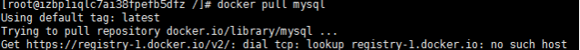
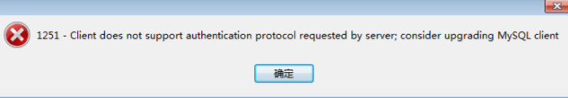

#### 2019.8.21
##### 错误:在拉取mysql时报错(docker pull mysql)
具体情况:

解决:因为配置的阿里的镜像加速未生效,.重启docker使用下面两命令后解决;
systemctl daemon-reload
systemctl restart docker
##### 客户端连接报错
具体情况:
解决:客户端版本过低,在服务器上降低了mysql的版本为5.7

#### 2019.8.22
##### redis客户端连接不上
具体情况:在docker中直接pull后指定端口就run了,客户端无法连接
解决:1. 为redis建立文件夹
mkdir /redis /redis/data

2. 新建并编辑redis.conf文件
创建redis.conf文件
```shell
vi /redis/data/redis.conf
```

redis.conf文件内容
``` shell
#修改为守护模式
daemonize yes
#设置进程锁文件
pidfile /redis/redis.pid
#端口
port 6379
#客户端超时时间
timeout 300
#日志级别
loglevel debug
#日志文件位置
logfile /redis/log-redis.log
#设置数据库的数量，默认数据库为0，可以使用SELECT <dbid>命令在连接上指定数据库id
databases 8
##指定在多长时间内，有多少次更新操作，就将数据同步到数据文件，可以多个条件配合
#save <seconds> <changes>
#Redis默认配置文件中提供了三个条件：
save 900 1
save 300 10
save 60 10000
#指定存储至本地数据库时是否压缩数据，默认为yes，Redis采用LZF压缩，如果为了节省CPU时间，
#可以关闭该#选项，但会导致数据库文件变的巨大
rdbcompression yes
#指定本地数据库文件名
dbfilename dump.rdb
#指定本地数据库路径
dir /redis/db/
#指定是否在每次更新操作后进行日志记录，Redis在默认情况下是异步的把数据写入磁盘，如果不开启，可能
#会在断电时导致一段时间内的数据丢失。因为 redis本身同步数据文件是按上面save条件来同步的，所以有
#的数据会在一段时间内只存在于内存中
appendonly no
#指定更新日志条件，共有3个可选值：
#no：表示等操作系统进行数据缓存同步到磁盘（快）
#always：表示每次更新操作后手动调用fsync()将数据写到磁盘（慢，安全）
#everysec：表示每秒同步一次（折衷，默认值）
appendfsync everysec
#redis配置外网访问：
protected-mode no
#配置密码
requirepass root
```

3. 拉取镜像
docker pull redis
4. 运行镜像
docker run -p 6379:6379 --name myredis -v $PWD/redis.conf:/redis/redis.conf -v $PWD/data:/data -d redis redis-server /redis/redis.conf